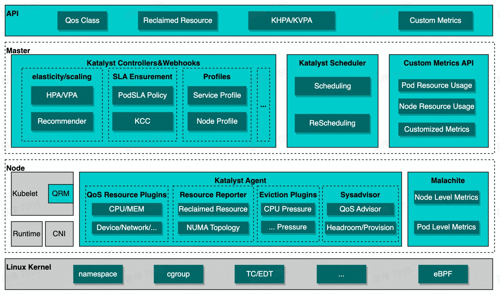

<h1 align="center">
  
Katalyst-core

</h1>

English | [简体中文](./README.zh.md)

## Overview

Katalyst aims to provide a universal solution to improve resource utilization and reduce overall costs in the cloud. The main features include:
- QoS-based Resource Model: Katalyst provides a pre-defined QoS model along with multiple enhancements to meet the QoS requirements of various workloads; 
- Elastic Resource Management: Katalyst provides both horizontal and vertical scaling implementations, along with an extensible mechanism for out-of-tree algorithms;
- Topology-aware Scheduling and Allocation: Katalyst extends the capabilities of the native scheduler and kubelet to be aware of the NUMA and device topology when scheduling Pods and allocating resources to them, thereby improving the performance of workloads;
- Fine-grained Resource Isolation: Katalyst provides real-time and fine-grained resource over-commitment, allocation and isolation strategies for each QoS through auto-tuned workload profiling.

Katalyst contains three main projects:
- [Katalyst-API](https://github.com/kubewharf/katalyst-api.git): API definitions for the Katalyst project, including CRDs, protocols, the QoS model, and more;
- [Katalyst-Core](https://github.com/kubewharf/katalyst-core.git): Katalyst core implementations;
- [Charts](https://github.com/kubewharf/charts.git): Helm charts for all projects in KubeWharf;

A more detailed introduction will be presented in the future.

  <picture>
    
  </picture>

## Prerequisites

Katalyst runs on a KubeWharf enhanced kubernetes cluster. Please refer to [kubewharf-enhanced-kubernetes](./docs/install-enhanced-k8s.md) for detailed deployment instructions.

## Deploying

Please refer to [Charts](https://github.com/kubewharf/charts.git) for detailed helm charts. 
Since KubeWharf enhanced kubernetes is developed based on specific versions of upstream Kubernetes and maintains API compatibility with corresponding Kubernetes versions, if you wish to run other components (e.g. operators), please note its compatibility with the corresponding Kubernetes API version.

## Getting started

Katalyst provides several example yaml to demonstrate the common use cases. For more information, please refer to [tutorials](./docs/tutorial/colocation.md).

## Community

### Meeting

We currently have a tentative bi-weekly meeting to discuss proposals, review milestones, do Q&As and so forth.
- Bi-weekly, Thursday at 19:30 UTC+8
- [Meeting Link(Lark)](https://vc.feishu.cn/j/414822034)
- [Meeting Agenda](https://bytedance.feishu.cn/docx/VXGfdiddUoemoQx54uacwSHonPd)

### Contact

If you have any questions or wish to contribute, you are welcome to communicate via GitHub issues or pull requests.
Alternatively, you may reach out to us via
- [Email](./MAINTAINERS.md)
- [Lark(Chinese)](https://applink.feishu.cn/client/chat/chatter/add_by_link?link_token=d2eo5b1d-87e0-428e-8625-15326353bcd4)

  

- [Slack(English)](https://kubewharf.slack.com/archives/C0522F1HRGW)

### Contributing

If you are willing to be a contributor of the Katalyst project, please refer to our [CONTRIBUTING](CONTRIBUTING.md) document for details.

## License

Katalyst is under the Apache 2.0 license. See the [LICENSE](LICENSE) file for details.
Certain implementations in Katalyst rely on the existing code from Kubernetes and the credits go to the original Kubernetes authors.
