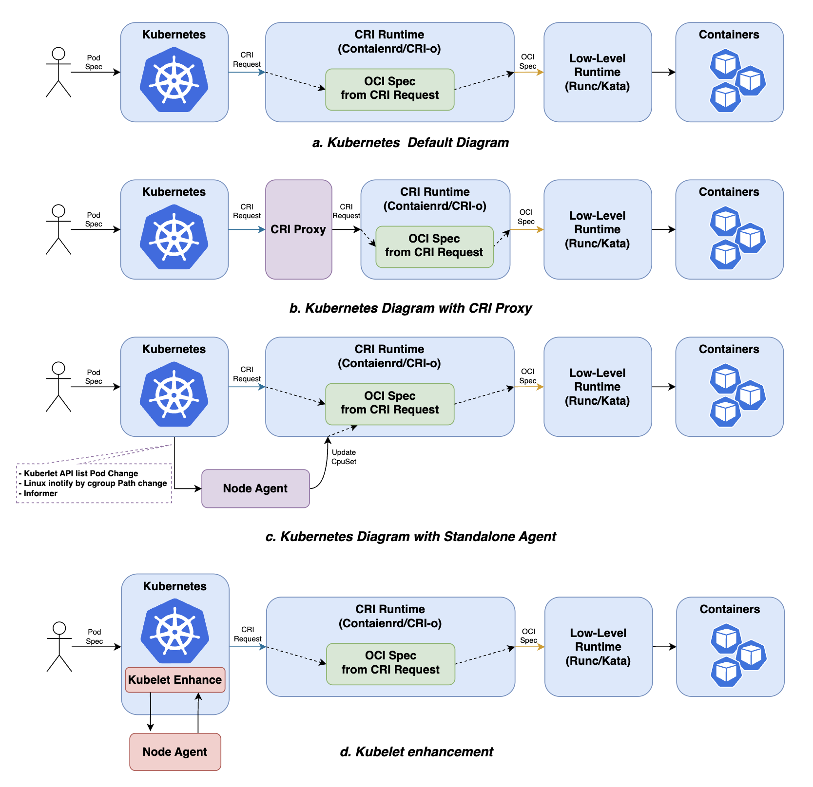
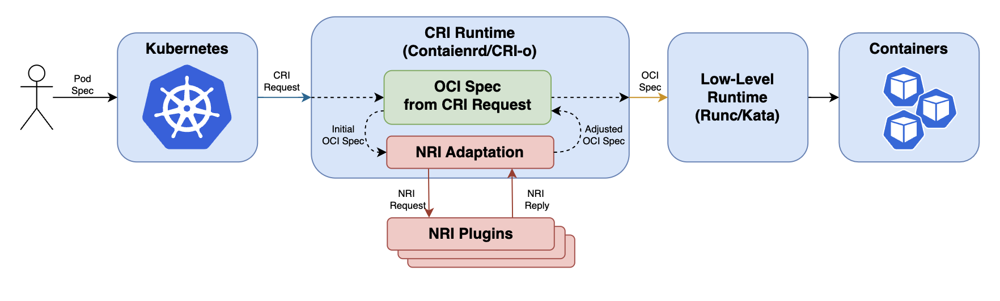
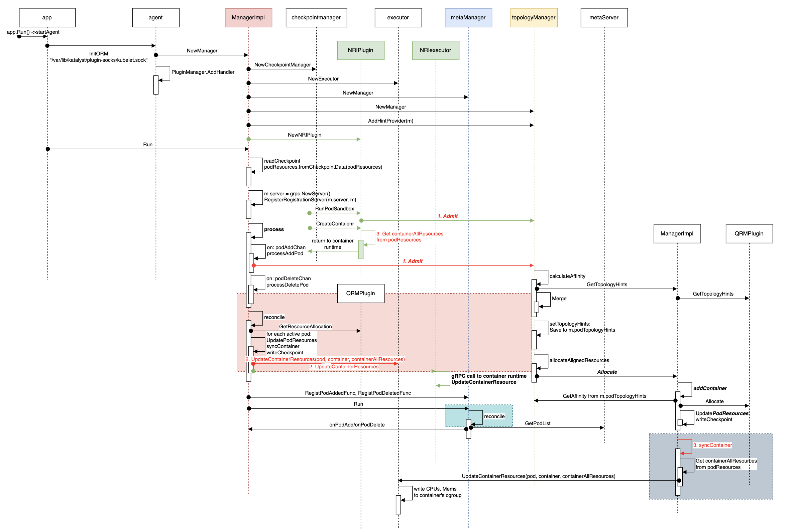

# Enhance ORM by NRI

<!--ts-->
* [Enhance ORM by NRI](#enhance-orm-by-nri)
   * [Summary](#summary)
   * [Motivation](#motivation)
      * [Goals](#goals)
      * [Non-Goals/Future Work](#non-goalsfuture-work)
   * [Proposal](#proposal)
      * [User Stories](#user-stories)
         * [Story1: Use origin kubernetes without  intrusive modifications](#story1-use-origin-kubernetes-without--intrusive-modifications)
         * [Story2: Synchronous configuration of QoS policies and injection of environment variables](#story2-synchronous-configuration-of-qos-policies-and-injection-of-environment-variables)
      * [Requirements](#requirements)
         * [Functional Requirements](#functional-requirements)
         * [Non-Functional Requirements](#non-functional-requirements)
      * [Design Details](#design-details)
         * [Detailed working flow](#detailed-working-flow)
         * [Addon](#addon)
         * [Modification](#modification)
         * [Test Plan](#test-plan)
   * [Production Readiness Review Questionnaire](#production-readiness-review-questionnaire)
      * [Feature Enablement and Rollback](#feature-enablement-and-rollback)
         * [How can this feature be enabled / disabled in a live cluster?](#how-can-this-feature-be-enabled--disabled-in-a-live-cluster)
      * [Troubleshooting](#troubleshooting)
         * [How does this feature react if the NRI not supported?](#how-does-this-feature-react-if-the-nri-not-supported)
         * [How to handle resource allocation failures?](#how-to-handle-resource-allocation-failures)
         * [What happens if the NRI stub times out or if the socket connection fails?](#what-happens-if-the-nri-stub-times-out-or-if-the-socket-connection-fails)
   * [Appendix](#appendix)
   * [Implementation History](#implementation-history)

<!-- Created by https://github.com/ekalinin/github-markdown-toc -->
<!-- Added by: airren, at: Wed Mar 27 14:55:54 CST 2024 -->

<!--te-->

## Summary

To meet the needs of various business application scenarios, ensuring sufficient 
resource guarantees for latency-sensitive services is necessary, especially when 
online and offline tasks are mixed. This requires Kubernetes to provide more 
granular resource management capabilities, enhance container isolation, and reduce 
interference between containers.

As of now, Kubernetes does not offer a fully comprehensive resource management 
solution. Many open-source projects in the Kubernetes ecosystem have devised 
their methods to modify the deployment and management processes of pods, enabling 
fine-grained resource allocation.

There are various approaches to extending Kubernetes, which we have summarized 
as follows.



All the methods listed above can enhance Kubernetes, but except for the standalone 
approach, they unavoidably involve  intrusive modifications to the upstream Kubernetes 
components, making it difficult for users to stay synchronized with upstream 
components. Although the standalone approach avoids modifications to upstream 
components, this asynchronous update method also has numerous drawbacks.

To address the need for intrusive modifications to Kubernetes and changes to the 
default process, enabling developers to have a more unified implementation 
approach, NRI has emerged.

[NRI](https://github.com/containerd/nri) is a plugin-based node resource management approach introduced by 
the upstream community. Using NRI, Kubernetes' node resource management capabilities 
can be enhanced through plugins without  intrusive modifications to the upstream 
Kubernetes components.

> NRI allows plugging domain- or vendor-specific custom logic into OCI- compatible 
> runtimes. This logic can make controlled changes to containers or perform extra 
> actions outside the scope of OCI at certain points in a containers lifecycle. 
> This can be used, for instance, for improved allocation and management of devices 
> and other container resources.



This proposal introduces how to enhance Katalyst using NRI, allowing Katalyst to 
be deployed based on origin Kubernetes and making it easier to maintain and use.

## Motivation

Katalyst enhances Kubernetes resource management policies on a single node through 
the QoS Resource Manager (QRM). However, the current QRM mode involves  intrusive 
modifications to the Kubelet, which makes it inconvenient for some users who use 
the origin Kubernetes but not the distribution Kubewharf. To address this, Katalyst 
proposes the ORM architecture, which provides a decoupled solution from Kubelet as 
a supplement to the QRM solution.

In the ORM architecture, there are two implementation approaches. The first approach 
is named Bypass, which polls Kubelet's API for pod events on the current node and 
updates pod resources. This approach is asynchronous and cannot inject parameters 
such as environment variables. The other approach is based on NRI. NRI (Node 
Resource Interface) is a general framework for CRI-compatible container runtime 
plugin extensions. It offers a mechanism for extensions to monitor pod/container 
states and make limited configuration modifications. Using NRI, Katalyst can 
synchronously modify resources and inject other information, such as environment 
variables, during pod events.

### Goals

- Expand Katalyst‘s ORM mode using NRI to enhance the Resource management capabilities 
of Kubernetes。
- Support for fine-grained resource control when containerd is used as the CRI runtime.

### Non-Goals/Future Work

- Support for other runtimes besides containerd, such as cri-o and docker.

## Proposal

Diverging from  QRM or ORM's Bypass Mode, the Katalyst-agent will work as an NRI 
plugin to subscribe pod/container lifecycle events from CRI runtime (in this 
proposal, it is containerd), and then the Katalyst-agent will return an adjusted 
Container spec in the hook events, or update the container spec by an active update.

- Get pod/container lifecycle events and pod or container information from NRI.
- Transform the NRI format information into CRI format to reuse existing admit 
implementation by QRM Plugins.
- Update the NRI format container spec to the CRI runtime.
- While reconciling use NRI UpdateContainter to reconfigure resources.

**NRI Enhanced ORM(Along with kubelet polling)**


### User Stories

#### Story1: Use origin kubernetes without  intrusive modifications 

Extending and enhancing Kubernetes' resource management capabilities is a common 
requirement in many business scenarios. However, while enhancing Kubernetes, it's 
a common requirement to ensure that all Kubernetes components remain consistent 
with the upstream community and avoid making any  intrusive modifications to the 
original Kubernetes components. After enabling NRI mode, deploying Katalyst on 
existing clusters does not require restarting the original cluster. Enhancements 
to the original Kubernetes can be achieved through a plugin-based approach.

#### Story2: Synchronous configuration of QoS policies and injection of environment variables

When enhancing QoS policies in Kubernetes, synchronous modification is the most 
efficient method. With NRI Mode enabled, Katalyst plugins can synchronously modify 
pod resources during pod creation, ensuring QoS policy allocation before pod 
execution. Additionally, through NRI Mode, dynamic updates to pod resources 
are possible. During pod creation, adjustments to pod resources, device binding, 
RDT, and environment variable injection can be achieved via NRI Mode.

### Requirements

- Need to upgrade containerd to >= v1.7.0

#### Functional Requirements

- Support all functionalities corresponding to Bypass Mode under the existing ORM 
architecture. This includes: adjusting container's cpuset / cfsquota, memory QoS.
- Support injecting environment variables into containers

#### Non-Functional Requirements

- It can achieve synchronous configuration of QoS policies, improving the 
responsiveness of QoS policy configuration.
- Fully compatible with upstream native Kubernetes components, requiring no 
 intrusive modifications.

### Design Details

#### Detailed working flow



In this part, the method based on the Kubelet API polling is referred to as 
**_Bypass_** Mode, while another method based on NRI is referred to as **_NRI_** Mode.

#### Addon

- The ORM support two operational modes: Bypass or NRI. Only one mode can be active 
at any given time. When creating a new ORM Manger, the current operational mode can 
be determined by reading the configuration, and it does not support changing the 
mode during runtime.
    
    ```go
        type workMode string
        const (
            workModeNri    workMode = "nri"
            workModeBypass workMode = "bypass"
        )


        type ManagerImpl struct {
            ctx context.Context
            ....
            // ORM run mode: bypass or nri.
            // Bypass mode is triggered by polling kubelet api to get the pod event.
            // NRI mode is required containerd version >= 1.7.0 and NRI enabled. 
            mode workMode
            ....
        }
        
        func NewManger(... config *config.Configuration){
            // init orm work mode with essential components 
            m.initORMWorkMode(config, metaServer, emitter)
        }
        
        func (m *ManagerImpl) initORMWorkMode(config *config.Configuration, metaServer *metaserver.MetaServer, emitter metrics.MetricEmitter) { 
            // init ORM work node according to the configuration and NRI status
        }
    ```
    
- The ORM ManagerImpl functions as an NRI stub, implementing processing logic 
within the corresponding hook event functions.
    
    ```go
        import "github.com/containerd/nri/pkg/stub"
        
        type ManagerImpl struct {
            ctx context.Context
            ....
            // nriStub is the implementtion of NRI events handlers
            nriStub stub.Stub
            // nriMask stores the specific events that need to be hooked
            nriMask stub.EventMask
            nriOptions []stub.Option
            nriConf nriConfig
            ....
        }
    ```
    
- In enhancing the ORM implementation, three hook functions are required: 
`RunPodSandbox()`, `CreateContainer()`, and `RemovePodSandbox()`.
    
  **Step 1**, during `RunPodSanbox()`, the `Admit()` function is triggered. 
If `Admit()` succeeds, resources are allocated for the container, and the pod 
creation process continues. If `Admit()` fails, pod creation also fails.
    ```go
        func (m *MangerImpl) RunPodSandbox(podSandbox *api.PodSandbox) error {
          	err := m.processAddPod(pod.Uid)
        	if err != nil {
        		klog.Errorf("[ORM] RunPodSandbox processAddPod fail, pod: %s/%s/%s, err: %v",
        			pod.Namespace, pod.Name, pod.Uid, err)
        	}
        	return err
        }
    ```

  **Step 2**, after a successful `Admit()`, the process proceeds to the 
`CreateContainer()` event. At this point, resources have been allocated for the 
container by `Admit()`. The corresponding resources are updated in the container's 
spec and returned.
    ```go
        func (m *MangerImpl) CreateContainer(pod *api.PodSandbox, container *api.Container) (*api.ContainerAdjustment, []*api.ContainerUpdate, error) {
            // Update Container Spec from the podResources
            adjust, err:= m.updateContainer(pod, container)
            return adjust, nil, err
        }
    ```

  **Step 3**, During `RemovePodSandbox()`, all resource allocations related to 
the pod are returned.

    ```go
        func (p *plugin) RemovePodSandbox(pod *api.PodSandbox) error {
        err := m.processDeletePod(pod.Uid)
        if err != nil {
        	klog.Errorf("[ORM] RemovePodSandbox processDeletePod fail, pod: %s/%s/%s, err: %v",
        		pod.Namespace, pod.Name, pod.Uid, err)
        }
        return err
        }
    ```

#### Modification

- If using the NRI Mode, after the allocation of resources is completed in the 
`Admit()` , the `Allocate()` does not need to execute `syncContainer()`; it should 
simply return after the resources have been allocated.
    
    ```go
        func (m *ManagerImpl) Allocate(pod *v1.Pod, container *v1.Container) error {
            ....
            err := m.addContainer(pod, container)
            // return after resource allocate when run in NRIMode
	    	if err != nil || m.mode == workModeNri {
            	  return err
            }
            err = m.syncContainer(pod, container)
            return err
        }
    ```
    
- In NRI Mode, the executer in `syncContainer()` can be implemented through NRI's 
`updateContainer()` .
    
    ```go
        if m.mode == workModeNri {
            m.updateContainerByNRI(pod, container)
	    } else {
            m.syncContainer(pod, &container)
        }
    ```
    
- The `metaServer` as a member variable of the ORM `ManagerImpl` because it is 
used in both Bypass and NRI modes.
- During NRI mode, halt the MetaManager's Reconcile, user NRI to hook the Pod/Container events.
- During NRI mode, the executor is conduct by NRI, do not need to create an Executor.

#### Test Plan

We will test the enhancement of ORM by NRI in a real cluster by deploying simulated 
task invocation resource management plugins to configure QoS policies, which will 
cover key points listed below:

- ORM completes registration to Containerd as an NRI plugin and establishes a connection.
- ORM can configure the correct LinuxContainerResources configuration with allocation 
results for containers through NRI.
- ORM can add environment variables to containers through NRI.
- Validate that reconcileState() of ORM will update the cgroup configs for containers 
by the latest resource allocation results.

## Production Readiness Review Questionnaire

### Feature Enablement and Rollback

#### How can this feature be enabled / disabled in a live cluster?

This feature is disable by default, you can enable it by configuration.   
If a failure is detected in the NRI runtime environment while NRI mode enables, 
it will fall back to Bypass Mode.

### Troubleshooting

#### How does this feature react if the NRI not supported?

It will fall back to Bypass mode of ORM.

#### How to handle resource allocation failures?

If encounter admit failure, the pod will enter a retry loop.

#### What happens if the NRI stub times out or if the socket connection fails?

Currently, if the NRI plugin times out, it leads to Containerd no longer invoking 
this plugin. To address this, the following strategy needs to be adopted.

While timeout, in `OnClose()` invoke `stub.Restart`  to re-create connection to containerd

And, do `Admit()` with a timeout (configured) context, if timeout try to create again.

## Appendix

NRI : [https://github.com/containerd/nri](https://github.com/containerd/nri)

ORM PR: [#406](https://github.com/kubewharf/katalyst-core/pull/406) [#430](https://github.com/kubewharf/katalyst-core/issues/430)

## Implementation History
- [x] 01/16/2024 Proposed idea in community meeting
- [x] 03/12/2024 Compile a document following the proposal template
- [x] 03/19/2024 Present proposal at a community meeting
- [x] 04/20/2024 Complete the basic functionalities of NRI as covered in the detailed 
design 
- [ ] 05/10/2024 commence the first round of testing
- [ ] 05/20/2024 open proposal PR for code