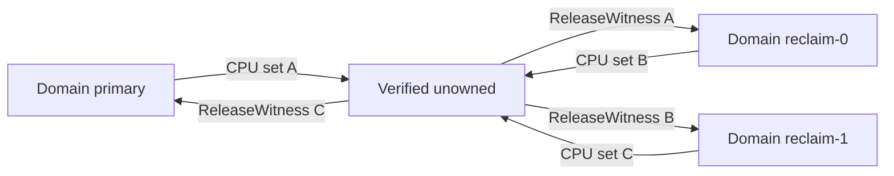
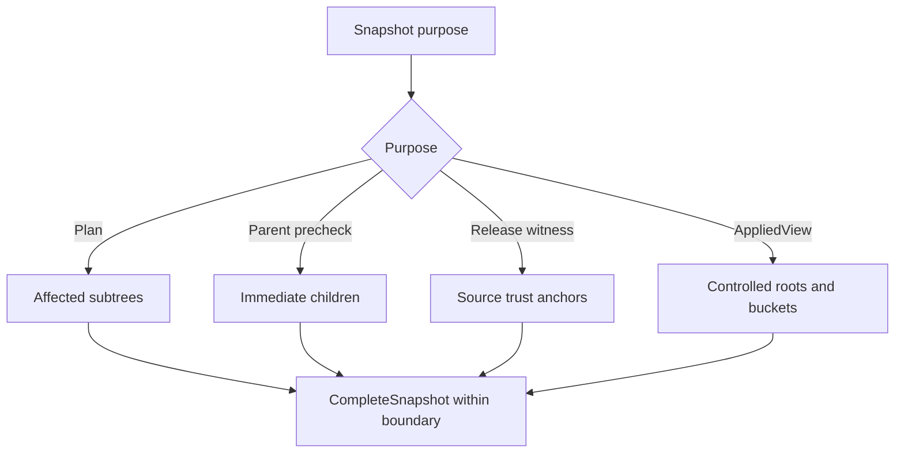
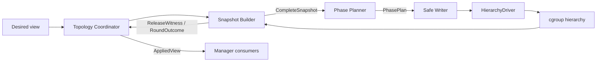
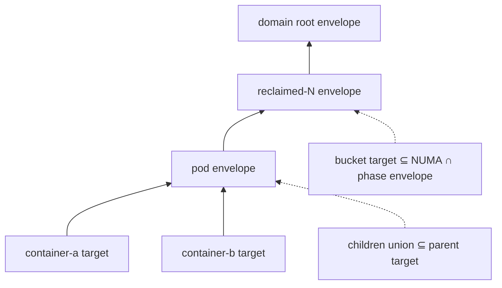
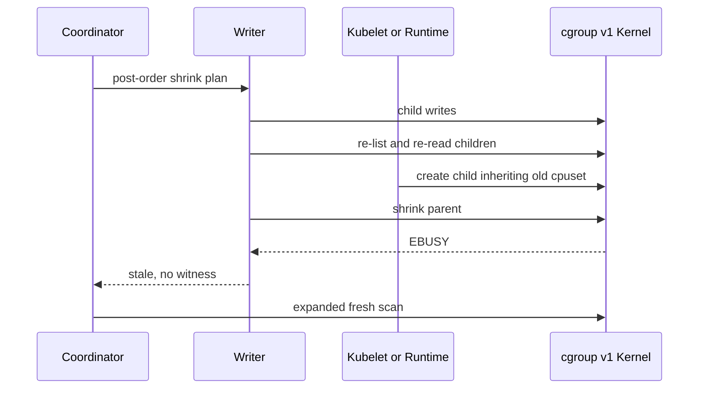
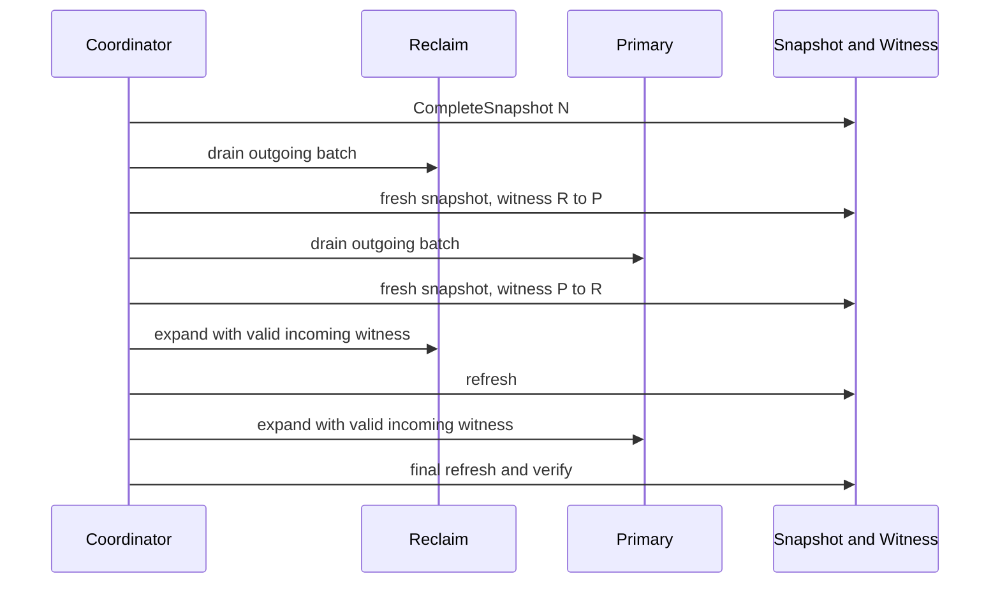
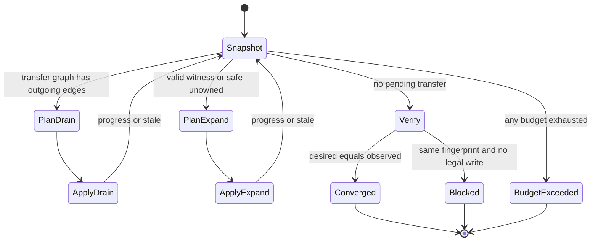
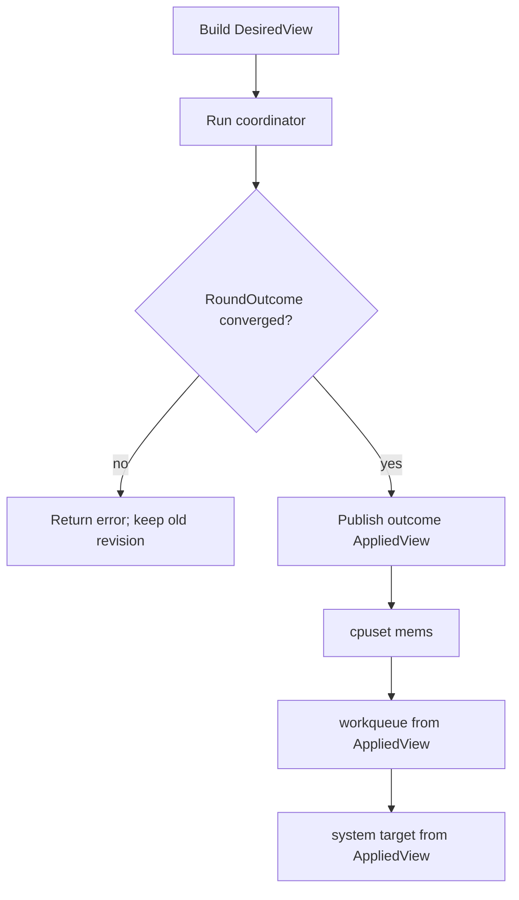

# Bulkhead cpuset 分阶段收敛方案

## 文档状态

- 状态：设计评审稿
- 范围：cgroup v1 下 Bulkhead cpuset 的跨 domain 迁移、动态层级写入和下游视图一致性
- 目标代码：`pkg/agent/qrm-plugins/cpu/dynamicpolicy/bulkhead`
- 不包含：CPU Advisor 分配算法、NUMA hint 计算、cgroup v2 空 cpuset 语义重构

本文档基于真实节点 high-churn 验证、50ms cpuset 文件采样和当前代码审查。文中的“现状”已由代码或日志确认；“目标设计”尚未实现。

## 问题与目标

双向 swap 的目标可能是：

```text
primary: A -> B
reclaim: B -> A
```

cgroup v1 只强制 `child cpuset ⊆ parent cpuset`，不强制 sibling domain 互斥。任一 destination 在 source 真正释放 CPU 前扩张，都会产生文件层 overlap；parent 过早 shrink 会返回 `EBUSY`，child 在 parent 尚未 widen 时 grow 会返回 `EACCES`。当前 drain、generic converge、dynamic leaf、workqueue 和 system cpuset 分别推导中间目标，因而会观察或写入不同版本的 partition。

目标设计由 Topology Coordinator 单独生成阶段计划并传播写后事实，满足：

1. 每次可观察写入后，任意两个互斥 domain 都不重叠。
2. 每个已发现 child 的 target 都被 immediate parent target 覆盖。
3. drain 只移除 CPU；expand 只加入已由写后证据授权的 CPU。
4. controlled nodes 与 dynamic descendants 使用同一层级 envelope。
5. topology、workqueue 和 system cpuset 消费同一写后版本。
6. 单次调用收敛或返回明确错误，不使用 writer-level defer。
7. normal transfer 与 reset 分离；reset 不绕过层级写序。

不以 sleep、固定 grace window、`/proc/schedstat` 稳定或 writer 局部补写替代上述约束，也不假设 cgroup v1 提供 DAG 原子事务。

## 安全模型

### 写后不变量

每次 syscall 后都必须成立：

```text
∀ mutually-exclusive (a, b): Observed(a) ∩ Observed(b) = ∅
∀ discovered edge parent -> child: Applied(child) ⊆ Applied(parent)
DrainTarget(rel) ⊆ ObservedBefore(rel)
ExpandTarget(rel) - ObservedBefore(rel) ⊆ AuthorizedEntering(domain(rel))
```

`Observed(domain)` 包括 controlled root、controlled NUMA bucket 和已发现的 dynamic descendants，不能只检查 root 或静态 DAG。`AuthorizedEntering` 只能来自有效 `ReleaseWitness` 或经完整 snapshot 证明的 safe-unowned CPU，不能直接来自 final desired target。

### Fail-closed snapshot

ownership、release、safe-unowned、收敛判定和下游 applied view 只能基于 `CompleteSnapshot`。以下任一条件失败都不得生成“空”结果：

- ownership-critical `ReadCPUSet`、`ReadMems` 或 `ListChildren` 失败；
- entry identity 在读取前后变化；
- child 在枚举和 stat 之间消失；
- 计划中的 cgroup identity 已失效；
- 节点数、层级深度、syscall 数或 deadline 超出预算。

保守规则是 `unknown ownership = still owned by source domain`。失败时不计算 release/safe-unowned，不 expand，不发布 applied view；stale 可在剩余预算内重扫，invalid 或 budget exceeded 立即返回 typed error。

| 场景 | 分类 | 行为 |
| --- | --- | --- |
| controlled rel `ENOENT` | stale | 重建扫描边界和 snapshot |
| dynamic rel `ENOENT`/`ENOTDIR` | stale | 重新枚举其最近稳定祖先 |
| identity/children fingerprint 改变 | stale | 丢弃本 round |
| `EACCES`/`EPERM`/`EIO`、解析错误 | invalid | 禁止写入和发布 |
| context canceled/deadline | budget/invalid | 返回 context error |
| node/depth/syscall budget exhausted | budget | 返回对应 budget error |

### Identity、ABA 与缓存

rel path 不能区分同名删除重建。每个 entry 使用 cpuset cgroup 目录的 `(device, inode)` 或等价稳定 cgroup id；读取顺序为：

```text
identity-before -> cpuset.cpus -> cpuset.mems -> identity-after
```

前后 identity 不同返回 `ErrCgroupIdentityChanged`。children 按 name 稳定排序并记录 `(name, identity)`。identity 能力不支持时，reset/诊断可以运行，normal cross-domain transfer 以 `ErrCgroupIdentityUnsupported` fail-closed；mtime 或前后 fingerprint 不能被宣称为 ABA 完整证明。

identity、children 和 ownership snapshot 不跨 round 缓存。write-if-changed cache 的 key 至少包含 `(rel, identity, file)`；identity 改变、`ENOENT`、`ENOTDIR` 或 identity-changed 会失效该 rel 及 descendants。写缓存不能替代 publish 前的 fresh read。

### 单 writer 边界

Topology Coordinator 是 controlled domain roots 和 controlled reclaim buckets 的唯一 cpuset writer。kubelet/runtime 可以创建、删除和修改 dynamic descendants，但不能直接改写 controlled roots/buckets。normal mode 禁用 pipeline 后的 generic converge、writer final-target 补写、periodical topology 修正和其他 handler 的 controlled write。

Coordinator 以独立 mode guard 互斥 `normal`、`reset`，不能只依赖 Manager mutex。所有 controlled write 统一校验 plan membership、identity 和 operation expected state，写后 fresh-read 并记录 journal。发现非本 round 的 controlled identity/CPUs/Mems 改变时：

- 当前 round stale，清空未消费 witness；
- 不 expand，不发布 applied view；
- 记录 expected/observed/identity；连续出现时 healthz 失败。

如果无法建立 controlled rel 的单 writer 契约，只能保证本 coordinator 的写序安全，不能承诺外部 writer 存在时 sibling 永不 overlap。

## 四个核心对象

实现只在协调层传递 `CompleteSnapshot`、`PhasePlan`、`ReleaseWitness`、`RoundOutcome` 四个聚合对象。枚举、标量值和只读输入 view 不形成第五个生命周期对象；原有 `PhaseRoundPlan`、`DomainSnapshot`、`ReleasedCPUSet`、`WriteResult`、`TopologyApplyStatus` 和 `AppliedPartitionView` 的职责分别并入四对象。

```go
type DomainID string
type SnapshotID [32]byte

type CompleteSnapshot struct {
    ID SnapshotID
    CapturedAt time.Time
    Entries map[string]EntryState
    Children map[string][]ChildRef
    DomainUnion map[DomainID]machine.CPUSet
    ScanBoundary ScanBoundary
    Cost BudgetUsage
}

type PhasePlan struct {
    ID string
    Base *CompleteSnapshot
    Kind PhaseKind
    TransferGraph map[DomainID]map[DomainID]machine.CPUSet
    TargetByRel map[string]CPUSetTarget
    AllowedEntering map[DomainID]machine.CPUSet
    DrainBatch map[DomainID]machine.CPUSet
    Operations []PlanOperation
    CostUpperBound BudgetUsage
}

type PlanOperation struct {
    Rel string
    ExpectedIdentity CgroupIdentity
    Target CPUSetTarget
    Direction WriteDirection
}

type ReleaseWitness struct {
    PlanID string
    Source DomainID
    Destination DomainID
    CPUs machine.CPUSet
    SourceSnapshotID SnapshotID
    SourceBoundaryFingerprint string
}

type RoundOutcome struct {
    Status RoundStatus
    Snapshot *CompleteSnapshot
    Witnesses []ReleaseWitness
    ChangedRels []string
    StaleRels []string
    BlockedRels []string
    AppliedView *CPUSetPartitionView
    Cost BudgetUsage
}
```

`CompleteSnapshot` 的类型名即完整性承诺：builder 只能返回完整值或 error，不允许携带 partial status。诊断信息只放入函数返回的 typed error，`RoundOutcome` 不重复保存 error。`PhasePlan` 引用不可变 base snapshot，不复制 identity/children fingerprint；每个 `PlanOperation` 只携带自身必要的 expected identity 和 parent precondition。`RoundOutcome.AppliedView` 仅在最终 fresh snapshot 与 desired 收敛且 snapshot ID 仍为 current 时非空。

### DomainID transfer graph

迁移不再硬编码 primary/reclaim 两个方向，而以有向图表达：

```text
TransferGraph[source][destination] = CPUs requested to move
```

构图规则：

```text
edge(a -> b) =
    (Observed(a) - Desired(a))
    ∩ (Desired(b) - Observed(b))
    - protectedPending
    - protectedByRel
```

图必须满足：

- `source != destination`，每个 CPU 在同一 round 最多属于一条 outgoing edge；
- source/destination 必须属于同一 exclusivity group；
- 所有 outgoing edge 先 drain 并分别产生 witness，任意 incoming edge 后 expand；
- cycle 不原地轮转，先把 cycle 上的 CPU drain 到 verified-unowned，再按固定 DomainID 顺序 expand；
- witness 绑定一条 edge、source `SnapshotID` 和扫描边界摘要，不可跨 edge 或跨 snapshot 复用；
- 图外 safe-unowned 只有在完整 snapshot 证明不属于任何互斥 domain 且 DesiredView 唯一指定 destination 时才可授权。
- domain 和 edge 数受预算限制，planner 构图复杂度为 `O(D² × CPUSetOps)`，其中 `D` 是 exclusivity group 内 domain 数；超过 `MaxDomains` 或 `MaxTransferEdges` 返回配置/资源错误，不生成部分图。



图 1：cycle 通过 verified-unowned 中间态拆开；边上的 CPU 只有在 source 写后 snapshot 中消失后才获得 witness。

## 扫描边界与预算

### 按证据范围扫描

第一版不跨 round 复用 dynamic ownership。parent children fingerprint 只能发现 child create/delete，不能发现既有 child 的 `cpuset.cpus` 被 kubelet/runtime 改写；在没有可靠 change journal 时，把 clean subtree 从上一 snapshot 复用会破坏 fail-closed。

扫描按用途限定范围：

| 用途 | 必须扫描的边界 |
| --- | --- |
| 生成 shrink/grow plan | transfer 涉及的 controlled roots/buckets、相关 dynamic descendants 和 ancestors |
| parent shrink precheck | 当前 parent identity、immediate children identity/cpuset |
| release witness | source ownership trust anchors 的 fresh identity/cpuset；必要时扫描其 controlled buckets |
| witness 消费 | source trust anchors 再次 fresh-read并比较 witness boundary |
| final convergence/AppliedView | 所有 controlled roots/buckets；只在报告 dynamic mismatch 时展开相关子树 |

在 cgroup v1 中，source controlled root 不包含 CPU `X` 时，内核 containment 保证 descendants 也不能包含 `X`。因此 root shrink 成功后的 release 证明不必每次重扫整个 dynamic subtree；它验证 source root identity、cpuset 和 controlled bucket 边界即可。若 domain 没有单一 ownership root，driver capability 必须提供该 domain 的完整 trust-anchor 集合。

扫描不能跨 mount、越过配置 controlled root或跟随 symlink。未来若引入可靠 change journal/inotify：

- 只能作为 dirty hint；
- watcher overflow、丢事件或重启后强制全量 affected-subtree scan；
- 未覆盖 `cpuset.cpus` 内容变化的 watcher不能支持 ownership 复用；
- publish witness 前仍需 fresh trust-anchor read。



图 2：按证据用途选择最小充分扫描范围；第一版不复用跨 round dynamic ownership。

### 四类预算

每次 coordinator 调用共享一个 deadline，并按真实开销扣减：

```go
type ConvergenceBudget struct {
    MaxRounds int
    MaxSyscallsPerApply int
    MaxSnapshotNodes int
    MaxSnapshotDepth int
    MaxDomains int
    MaxTransferEdges int
    MaxPlanOperations int
    Deadline time.Time
}
```

- syscall 预算覆盖 stat、list、read、write 和写后验证，重试同样计数；
- 节点预算按本次访问的 `(rel, identity)` 计数，删除重建后的 identity 重新计数；
- 深度预算在入栈前检查，超限不截断扫描，而是返回 `ErrHierarchyDepthBudget`;
- deadline 在每个 driver 调用前检查，并通过 context 传到实现；
- planner 必须估算 `PhasePlan.CostUpperBound`，剩余预算不足时不得开始可能写到一半的 plan；
- domain、edge 和 operation 预算在分配大 map/slice 前检查，防止异常 DesiredView 导致内存放大；
- budget error 不发布新 witness/applied view，保留上一已发布 revision；
- `MaxRounds` 只是防御上限，不是 defer 到 periodical tick 的机制。

复杂度记 `N` 为 affected subtree 节点数，`E` 为边数，`W` 为本轮写入数，`A` 为 source trust-anchor 数：

```text
planning scan: O(N + E)
parent precheck: O(immediate children of written parents)
release proof: O(A)
write and verify: O(W)
transfer graph: O(D² × CPUSetOps)
memory: O(N + E + T + W)
```

其中 `T` 是 transfer edge 数。严禁把一次 phase 实现为“每写一个 leaf 就全树扫描”，否则会退化为 `O(W × (N + E))`。默认值由配置给出并通过目标节点规模 benchmark 校准，测试使用小预算覆盖边界；生产日志记录 limit、used、remaining 和触发 rel。

## HierarchyDriver

planner/coordinator 只依赖可扩展层级接口，cgroup v1、fake 和未来只读诊断实现共享契约：

```go
type HierarchyDriver interface {
    Roots(ctx context.Context) ([]RootRef, error)
    StatIdentity(ctx context.Context, rel string) (CgroupIdentity, error)
    ReadEntry(ctx context.Context, rel string) (EntryState, error)
    ListChildren(ctx context.Context, rel string) ([]ChildRef, error)
    WriteCPUs(ctx context.Context, rel string, expected CgroupIdentity, cpus machine.CPUSet) error
    WriteMems(ctx context.Context, rel string, expected CgroupIdentity, mems string) error
    Classify(err error, op HierarchyOperation) HierarchyErrorClass
    Capabilities() HierarchyCapabilities
}
```

扩展约束：

- read/list 必须直读 backing hierarchy；driver 不隐藏 stale、partial list 或 identity change；
- write 使用 expected identity，且不得自行选择 bridge、final target、重试 CPU 或改变 ownership；
- driver 可提供批量读取优化，但语义必须等价于逐项 identity-before/after；
- capability 显式声明 stable identity、CPU/mems 文件和内核 containment，不支持 stable identity 时 normal transfer fail-closed；
- budget decorator 统一计费，fake driver 可注入 identity revision、TOCTOU 和 syscall 错误；
- 新层级实现必须先证明其 parent-child 与 sibling exclusivity 语义，不能仅因接口可编译就启用写路径。

planner 不直接判断 cgroup 版本。driver capability 封装：

```go
type HierarchyCapabilities struct {
    StableIdentity bool
    EmptyConfiguredCPUSet bool
    EffectiveCPUSet bool
    KernelParentContainment bool
    PartitionRoots bool
}
```

cgroup v1 driver 负责配置 cpuset、非空限制和 `EBUSY/EACCES` 分类；未来 cgroup v2 driver 负责 `cpuset.cpus.effective`、继承空值、`cgroup.subtree_control` 和 partition root 状态。新 backend 未通过同一 invariant suite 前只能启用 read-only diagnostic mode。

NUMA/reclaim 特例不从 rel 名称解析，而由 DAG metadata 提供通用约束：

```go
type TopologyConstraint struct {
    CPUUpperBound machine.CPUSet
    MemUpperBound NodeSet
    Scope TopologyScope
}
```

当前 `reclaimed-<numa>` 映射为 `ScopeNUMANode`；未来 socket、memory tier、多 NUMA bucket 或其他 domain 复用同一约束检查。planner 只计算：

```text
node target ⊆ CPUUpperBound
node mems ⊆ MemUpperBound
child target ⊆ parent phase envelope
```

不把 bucket 命名规则扩散到 gate、writer 或 driver。



图 3：四对象贯穿协调过程；driver 只暴露层级事实和 identity-checked 写入。

## 计划生成

### Drain

每条 transfer edge 的候选 CPU 完全由 DesiredView 决定。planner 不能重跑 Advisor allocation/NUMA hint、从 final target 换核、为凑数量选择无迁移需求的 CPU，writer 也不能在失败后临时改选。

```text
leaving(source) = Observed(source) - Desired(source)
edgeCandidate(source, destination) =
    leaving(source)
    ∩ Desired(destination)
    - protectedPending
    - protectedByRel
DrainBatch = StableSelect(edgeCandidate, policy)
```

选择策略接口保持独立：

```go
type DrainSelectionPolicy struct {
    MaxPhysicalCoresPerDrainRound int
    PreserveSMTSiblings bool
    GroupByNUMA bool
    RequirePairedSwapProgress bool
}
```

`MaxPhysicalCoresPerDrainRound == 0` 表示选择全部合法候选。第一版使用该默认值；后续可按 NUMA 和 physical core group 限步。`PreserveSMTSiblings` 与 `GroupByNUMA` 默认开启，稳定排序键为 `(NUMA ID, physical core ID, min logical CPU ID)`。topology 缺失时可按 logical CPU 稳定排序并记录 degraded metric，但不得声称保持 physical core 完整性。步长只改变 round 数，不得改变最终 partition。

每个 reclaimed NUMA bucket 只能处理 `DrainBatch ∩ CPUsOfNUMA(bucket)`。不得跨 bucket 借核、拆跨 NUMA core group 或改变 DesiredView 的 NUMA 归属。仍被 dynamic child 持有的 CPU 可以留在 candidate 中，但必须经 leaf-to-root 写序真实释放；写后仍被观察到时不会产生 witness。

dynamic descendant 的 drain target 默认为 observed；若持有 leaving CPU，则在当前 phase envelope 内移除对应 CPU，绝不加入 entering CPU。cgroup v1 不允许空 target 时保持合法当前值并将 rel 标为 blocked，不能用整个 bucket target 代替空交集。

### Expand

每个 destination 的授权集合是：

```text
AllowedEntering(destination) =
    union(valid ReleaseWitness for incoming edges)
    ∪ safeUnowned(destination)

ExpandTarget(rel) =
    DesiredTarget(rel)
    ∩ (Observed(rel) ∪ AllowedEntering(domain(rel)))
    - pendingFromSource
```

destination expand 前 fresh-read source 边界，只有 source `SnapshotID` 对应的 root/bucket identity、children 摘要和 ownership 均与 witness 一致时才可消费。任一变化都会使 witness 失效；已释放 CPU 可以继续保持 unowned，但必须重新 snapshot/plan。

带 `ScopeNUMANode` 约束的 reclaimed bucket `b` 还受双重上界：

```text
BucketUpperBound(b) = CPUsOfNUMA(b) ∩ ReclaimDomainPhaseEnvelope
DesiredBucket(b) ⊆ CPUsOfNUMA(b)
DesiredBucket(b) ⊆ DesiredReclaimDomain
BucketExpandTarget(b) =
    ObservedBucket
    ∪ ((DesiredBucket - ObservedBucket) ∩ AllowedEntering ∩ BucketUpperBound)
```

DesiredView 越过 NUMA 或 desired reclaim domain 时返回 `ErrInvalidReclaimBucketTarget`，不能静默 intersection。ObservedBucket 已越界时先生成 drain/repair plan；无法安全修复则 blocked。执行前断言 bucket target 同时是 NUMA mask、phase envelope 和 reclaim root target 的子集，dynamic descendants 继续受 bucket target 收紧。

### 层级闭包和写序

`PhasePlan.TargetByRel` 在执行前完成 leaf-to-root union 闭包：

```text
leaf target
  ⊆ dynamic parent envelope
  ⊆ controlled bucket envelope
  ⊆ domain root envelope
```



图 4：writer 接收的 target 已完成闭包，不在写失败后发明 bridge。

shrink 按 post-order：dynamic leaves、dynamic intermediate parents、controlled buckets、domain root。grow 按 pre-order：domain root、controlled buckets、dynamic intermediate parents、dynamic leaves。禁止使用 `observed ∪ finalTarget` 作为通用 bridge。

每次 parent 写前执行：

1. 校验 parent identity；
2. 重列 immediate children 并校验 `(name, identity)` fingerprint；
3. 重读 immediate child CPUs/Mems；
4. 断言 child union 是 parent planned target 的子集；
5. 任一变化返回 stale，不修改 plan 外 child。

最后一次检查与 parent syscall 之间仍有 TOCTOU。新 child 继承旧 cpuset 且超出 shrink target 时，内核应以 `EBUSY` 拒绝；writer 将其分类为 stale，coordinator 重新扫描。parent shrink 成功后、witness 发布前仍需 fresh snapshot，新 child 持有的 CPU 会继续计入 source ownership。



图 5：precheck 缩小窗口，内核拒绝非法 shrink，fresh snapshot 决定 release。

### CPUs 与 Mems

`cpuset.cpus` 和 `cpuset.mems` 是两个非事务文件。normal CPU transfer 把 mems 当作 precondition：

- snapshot 和 child fingerprint 同时包含 mems；
- mems 不满足时先生成独立 `PhasePlan` repair phase；
- mems grow parent-first，shrink child-first；
- repair 写后 fresh-read 成功后才开始 CPU expand；
- CPU transfer 默认只写 CPUs，不依赖一次 `ApplyCPUSet` 的部分成功或回滚；
- mems write 失败会阻止 ownership witness 和 applied view 发布。

Manager mutex 避免进程内 mems plugin 与 topology 并发写，但不能替代对 runtime/外部 writer 的 identity 和 expected-state 检查。

## Round 协调

### Drain、证明、Expand

所有 outgoing edge 先 drain；每个 batch 独立完成 `apply -> fresh snapshot -> witness`，不能连续写多个 batch 后统一验证。双向 swap 的固定顺序是：

```text
drain reclaim -> refresh/witness
drain primary -> refresh/witness
expand reclaim with incoming witnesses -> refresh
expand primary with incoming witnesses -> refresh/verify
```

两个方向的 batch 不要求大小相等。某侧没有合法 batch 时，另一侧已释放 CPU 可保持 unowned；不相关且已授权的单向迁移可以继续。`RequirePairedSwapProgress=true` 可暂停本轮 cycle expand，但不能放宽 gate。



图 6：两个 source 都先由写后事实证明 release，destination 才能获得 CPU。

`ActuallyReleased` 的定义保持为：

```text
ReleaseCandidate - ObservedSourceDomainAfterWrite
```

writer 成功仅证明 syscall 合法，不证明 ownership 已释放。

### 状态机与停止条件



图 7：没有 deferred success。安全中间态在同一次调用继续；无进展或预算耗尽返回错误。

成功条件：

```text
observedByRel == desiredByRel
and all exclusivity groups are disjoint
and every child is subset of parent
and final SnapshotID is current
```

本轮 rel 变化、生成新 witness、发现 dynamic rel 或 stale 后得到不同 plan 时继续。连续两轮 snapshot fingerprint、witness set 和 desired mismatch 均相同且无合法写入，返回 `ErrTopologyConvergenceBlocked`。达到 round/syscall/node/depth/deadline 任一上限，返回对应 typed error；不得返回 `nil` 等待下一次 periodical。

`RoundOutcome` 对 progress/stale/blocked 保留相关 rel、transfer edges、witness 和预算；fatal/budget 的底层原因只通过函数 `error` 返回，避免在 outcome 中复制 error。只有成功 outcome 携带本次新 `AppliedView`。

## Safe writer 契约

writer 只执行 `PhasePlan`：

```go
ApplyShrink(ctx context.Context, plan PhasePlan) (RoundOutcome, error)
ApplyGrow(ctx context.Context, plan PhasePlan) (RoundOutcome, error)
```

它不持有 final desired target，不调用 gate，不计算 release，不把 dynamic rel resolve 到 final bucket，不返回 `errDeferConvergence`，也不运行第二套 generic converge。writer 只可校验 plan membership/identity、按序写 target、执行 parent precheck，并对错误做有限只读诊断。

校验 owner 固定，禁止为了“更安全”在多层重复全量校验：

| 校验 | 唯一 owner |
| --- | --- |
| snapshot read/list/identity 完整性 | Snapshot Builder |
| transfer graph、NUMA/SMT、protected、层级闭包 | Phase Planner |
| operation identity、immediate parent/children freshness | Safe Writer |
| cgroup 版本机制、expected-identity write、内核错误分类 | Hierarchy Driver |
| stale retry、budget、witness 发布/消费、AppliedView | Coordinator |

writer precheck 只针对即将写入的 parent/operation，不重新扫描整个 phase subtree。driver 不重新构建 snapshot；gate 只接收 `CompleteSnapshot` 和 `ReleaseWitness`，不重复读取 cgroup。

| syscall 场景 | 分类 |
| --- | --- |
| parent identity、children 或 child union 改变后的 `EBUSY` | stale |
| identity/children 不变但 child 持续无法收敛 | blocked |
| containment 合法但内核持续 `EBUSY` | fatal，附 subtree |
| child grow 时 parent identity/target 改变 | stale |
| containment 合法但权限、mount 或 LSM 返回 `EACCES` | fatal |
| plan rel 消失或同名重建 | stale，不按空 ownership 发布 |

write 仅在 `operation in plan && currentIdentity == operation.ExpectedIdentity` 时允许。发现 plan 外 child 只能 stale；不得写 final target、不得用空交集触发 whole-bucket fallback、不得在 drain 中加 CPU、不得把读取失败视为删除。

normal mode 只运行 coordinator 到 fixed point 或明确失败；`buildConvergenceReport` 保留只读验证，`convergeControlledNodesWithBridgeConstraint` 不再写 controlled nodes。reset 保留独立 expand-only path，仍按 parent-first、identity check 和 budget 执行，但不使用 cross-domain witness。

## 下游一致性

Manager 先构建 DesiredView，再运行 coordinator。仅 `RoundOutcome.Status == Converged` 且其 final `SnapshotID` 仍为 current 时，原子替换共享 AppliedView 并递增 `AppliedViewRevision`；失败保留上一已发布 revision，并停止本次调用中依赖 partition 的后续插件。



图 8：workqueue/system 不读取 DesiredView 或自行采样重建中间态。

- workqueue 使用 `AppliedView.ReclaimEffective`；
- system service periodical handler 只迁 PID，target 等于最近 applied reclaim union 或其安全子集；
- topology 失败时 Manager 不执行后续 partition consumer；
- `cpuset.mems` 可独立 reconcile，但不能改变 CPU ownership phase；
- 每个插件分别读 cgroup 会重新引入多个 applied-state owner，因此禁止。

## 实施顺序

依赖顺序如下，前置安全能力未完成时不得启用 normal cross-domain transfer：

1. 扩展 `HierarchyDriver` stable identity、fake identity revision 和 budget decorator。
2. 实现 fail-closed `CompleteSnapshot` 与按证据范围扫描。
3. 实现 DomainID transfer graph、层级闭包和只读 `PhasePlan`。
4. 实现 `ReleaseWitness` SnapshotID/boundary 门禁。
5. 让 writer 只接收 plan，加入 precheck 和 typed error classification。
6. 收敛 controlled write wrapper、mode guard、phase journal，删除重复 writer。
7. 将 drain/witness/expand/verify 收入 coordinator loop并发布 `RoundOutcome.AppliedView`。
8. 基础全量 drain 通过后，再启用 NUMA/physical-core 步长。

清理项包括：

- normal mode 后置 generic converge 和 constrained-target 二次写；
- `withConstrainBridgeGrowth` 及分散的 `keep_parent_bridge_*`；
- dynamic rel 对 final bucket target 的隐式 resolve；
- `empty intersection -> whole bucket target` fallback；
- writer-level final target、gate、release 计算和 `errDeferConvergence`；
- workqueue/system 对 DesiredView 或 topology 中间态的独立推导。

步长上线前后，相同输入的最终 partition 必须一致，只允许 round 数和延迟不同。

## 测试矩阵

测试必须在 fake hierarchy 的每次写后检查中间状态，不能只断言最终值：

```text
every child cpuset is subset of parent
all mutually-exclusive domains are disjoint
drain adds no CPU
expand adds only CPUs authorized by a valid witness
reclaim bucket is within NUMA and phase envelope
publish uses a CompleteSnapshot
writer touches identity-matched plan members only
budget usage never exceeds configured limits
```

### 核心迁移与拓扑

| 场景 | 关键断言 |
| --- | --- |
| reclaim → primary | reclaim 实际 release 前 primary 不 grow |
| primary → reclaim | primary 实际 release 前 reclaim 不 grow |
| 双向/多 domain cycle | 所有 outgoing edge drain 并生成 witness 后才 expand |
| disjoint swap | 不使用 `old ∪ final` child bridge |
| 同 NUMA bucket | dynamic descendants 使用 phase envelope |
| 跨 NUMA bucket | CPU 不进入错误 bucket |
| bucket desired 越过 NUMA/domain | `ErrInvalidReclaimBucketTarget`，不静默裁剪 |
| bucket gate 不足 | 只加入 witness 授权且在双重上界内的 CPU |
| bucket observed 已越界 | 先 repair/drain，否则 blocked |
| protected pending/rel | protected CPU 不进入 DrainBatch |
| fixed step | 每 domain 每轮 physical core group 不超配置 |
| SMT sibling | 默认整组迁移，不拆 physical core |
| topology 缺失 | logical CPU 稳定排序并记录 degraded metric |
| stable selection | 同 snapshot、desired、policy 得到相同 batch |
| 不对称双向 batch | 数量不等仍按各 edge witness 推进 |
| paired swap enabled | 任一 cycle edge 无 batch 时不开始 cycle expand |
| cgroup v1 empty target | 保持合法状态；无进展最终报 blocked |
| reset mode | parent-first expand，不消费 cross-domain witness |

### Snapshot、范围扫描与 TOCTOU

| 场景 | 关键断言 |
| --- | --- |
| `ReadCPUSet`/`ReadMems` 返回 `EACCES` | snapshot 构建失败，无 witness/expand/publish |
| `ListChildren` 返回 `EIO` | subtree 不按空处理 |
| CPU/mems parse error | invalid typed error |
| controlled rel `ENOENT` | 从 controlled boundary 重建 |
| dynamic rel `ENOENT` | 从最近稳定祖先重新枚举 |
| child 删除后同名重建 | identity 改变，旧 plan/witness/cache 失效 |
| read 中途重建 | `ErrCgroupIdentityChanged` |
| child 在 list 后 stat 前删除 | stale，不跳过 |
| snapshot 后新 child | plan stale，不写 final target |
| parent precheck 前 children 摘要变化 | 当前 plan stale，重扫相关 parent/subtree |
| precheck 后、parent write 前创建 child | 内核 `EBUSY` 转 stale，无 witness |
| parent write 后、publish 前创建 child | fresh snapshot 重新计入 source ownership |
| publish 后、expand 前 source 变化 | SnapshotID/boundary 不匹配，witness 失效 |
| release witness 扫描 | 只读 source trust anchors，不遍历无关 domain |
| final AppliedView 扫描 | fresh-read 所有 controlled roots/buckets |
| symlink/跨 mount child | 不跟随并返回边界错误 |
| stable identity unsupported | normal transfer fail-closed，reset/diagnostic 可用 |

### Writer、Mems 与单 owner

| 场景 | 关键断言 |
| --- | --- |
| plan 外 child | writer 不写，返回 stale |
| child 与 drain target 无交集 | 不注入 whole bucket，source ownership 保留 |
| parent shrink `EBUSY` | 重读 identity/children 后区分 stale/blocked/fatal |
| child grow containment `EACCES` | stale parent envelope，重新 plan |
| 真实权限/LSM `EACCES` | fatal，不误报 stale |
| dynamic child 重新继承 parent | 不生成 witness，下一 round 重 drain |
| mems precondition 不满足 | 先独立 repair 并 fresh-read |
| mems write 部分失败 | 不继续 CPU expand，不发布 |
| normal 与 reset 并发 | mode guard 使一方明确失败 |
| generic converge | 不产生 controlled write |
| workqueue/system | 不写 controlled cpuset |
| 外部改写 source/destination root | round stale，witness 失效 |
| 外部改写 controlled bucket | metric/healthz 触发 |
| dynamic descendant 合法变化 | 不误报 controlled external write |

### 预算与收敛

| 场景 | 关键断言 |
| --- | --- |
| syscall 恰好达到上限 | 已完成操作可验证；下一调用前返回 budget error |
| plan 估算超过剩余 syscall | 不开始部分写入 |
| visited node 超限 | 不截断成 complete snapshot |
| hierarchy depth 超限 | 入栈前 `ErrHierarchyDepthBudget` |
| deadline 在 scan/write 前到期 | 返回 `context.DeadlineExceeded` |
| stale 重试 | 每次重扫继续扣 syscall/node/deadline |
| max rounds | 返回错误，不返回 deferred success |
| no progress | `ErrTopologyConvergenceBlocked`，包含 rel/edge/fingerprint |
| budget error 后 | 保留旧 AppliedView revision，无新 witness |

### 性能与规模

microbenchmark 至少覆盖：

| 规模/状态 | 观测项 |
| --- | --- |
| 100、1k、10k dynamic nodes | wall time、syscalls、allocs、peak memory |
| depth 4、8、16 | traversal time 和 depth budget |
| 1、2、8 个 DomainID | transfer graph 构图成本 |
| 1%、10%、100% affected subtree | scoped plan scan 成本 |
| idle desired、无 controlled root 变化 | 不写文件，不扫描无关 dynamic subtree |
| parent TOCTOU 持续 stale | stale retry 成本受 round/deadline 限制 |
| full drain 与小步长 | handler latency、round 数、handoff latency |

结构性性能门槛：

- planning scan 的 syscall/内存随 affected `N+E` 线性增长；
- release witness 成本随 source trust-anchor 数 `A` 增长，不随无关 dynamic node 数增长；
- 不允许出现每个 write 后全树扫描的 `O(W × (N+E))` 路径；
- budget 检查发生在大分配、递归入栈和 plan 写入前；
- desired 与最近 AppliedView 相同且 controlled anchors 未变化时，不产生 cgroup write；
- watcher/batch-read 优化关闭时仍满足正确性，避免性能组件成为安全依赖。

上线阈值不在设计文档中硬编码毫秒数。实现阶段以目标节点真实规模测得当前 handler p50/p99、syscall 数和内存为 baseline，再为 `ConvergenceBudget` 配置默认值；默认 deadline 必须低于调用方超时，且 high-churn p99 不得频繁触发 slow-handler 告警或 budget exhaustion。

### Manager 集成

| 场景 | 关键断言 |
| --- | --- |
| topology error | workqueue/system 等后续 consumer 不执行 |
| topology success | consumer 使用 outcome 的 AppliedView |
| DesiredView != AppliedView | consumer 不读取 DesiredView |
| system target | 等于 applied reclaim union 或安全子集 |
| plugin order | topology、mems、workqueue、system，版本传播明确 |
| SnapshotID 发布竞态 | SnapshotID 非 current 时拒绝替换 AppliedView |

### 真实节点验收

standard E2E 运行 3 轮，high-churn 运行 5 轮，并覆盖 reset → target 初始收敛、final reset、topology/bulkhead manager 相关单测和可运行范围内的 race detector。每轮必须满足：

```text
CPUSET_FILE_STATE=OVERLAP count=0
SCHED_DOMAIN_STATE=OVERLAP count=0
SCHEDSTAT_STATE=OVERLAP count=0
permission denied count=0
device or resource busy count=0
children_not_ready count=0
NODE_CHECK_FAIL count=0
FAILED_DETECTED count=0
UnexpectedAdmission count=0
50ms sampler lines=0
HIGH_CHURN_DONE count=1
```

## 可观测性

正常路径每次 apply 输出一条摘要；round 级详情仅在状态变化、stale/blocked 或高 verbosity 下输出，避免 high-churn 日志本身成为热点。摘要包含计数和摘要值，不默认展开大 CPUSet、rel list 或 subtree：

```text
round count, final status, plan ID, final SnapshotID
scan nodes/syscalls/depth/time by purpose
domain/edge count and CPU counts
drain batch physical-core/logical-CPU count
witness count and handoff latency
changed/stale/blocked rel count
budget limit/used/remaining
```

建议 metric：

```text
bulkhead_topology_round_total{phase,status}
bulkhead_topology_rounds_per_apply
bulkhead_topology_stale_round_total
bulkhead_topology_blocked_total{reason}
bulkhead_topology_applied_view_changed
bulkhead_topology_drain_batch_logical_cpus
bulkhead_topology_drain_batch_physical_cores
bulkhead_topology_drain_selection_degraded_total{reason}
bulkhead_topology_handoff_latency_seconds{source,destination}
bulkhead_topology_snapshot_invalid_total{operation,reason}
bulkhead_topology_identity_changed_total{role}
bulkhead_topology_external_controlled_write_total{role,domain}
bulkhead_topology_bucket_target_invalid_total{reason}
bulkhead_topology_mems_precondition_failed_total{role}
bulkhead_topology_budget_exhausted_total{kind}
bulkhead_topology_scan_nodes{mode}
bulkhead_topology_scan_depth
```

metric label 只能使用受控有限枚举；禁止使用 rel、pod UID、container ID、plan ID 或完整 DomainID 作为无界标签。source/destination 指标在导出前映射为有限 domain role；未知扩展 domain 归入 `other`，具体 ID 只进日志。

错误日志保留 rel identity、observed/phase/desired target、parent actual、child union、pending witness、source SnapshotID、scan boundary、snapshot read/list error 和受限 subtree。subtree 受节点/深度/字段长度上限约束，相同 `(error class, rel identity)` 在时间窗口内限频。

## 风险与约束

- coordinator 内循环会增加 admission 延迟，因此只写必要变化、先估算 plan cost，并同时限制 round/syscall/node/depth/deadline；超限明确失败。
- 小步长会增加 snapshot 和 unowned handoff 次数。上线同时观察 rounds-per-apply、handoff latency、stale rate、每轮 physical core 数和 handler latency。
- dynamic child 持续 churn 时不保证有限时间内成功，但完整扫描、precheck、内核 containment 和 budget error保证失败安全且可诊断。
- stable identity 是 normal transfer 的前置能力；mtime/fingerprint 降级不能发布不确定 release。
- 外部 controlled writer 会破坏 sibling exclusivity，必须静态移除重复入口并运行时检测。
- CPUs/Mems 多文件写非原子，mems repair 与 CPU ownership transfer 分开验证。
- shared AppliedView 会影响 Manager/plugin 接口和测试，但不能通过各插件独立采样规避。
- reset 与 normal 语义不同，必须保持独立 mode 和路径。
- 第一版不跨 round 复用 dynamic ownership；性能优化依赖按证据范围扫描和 driver 批量读取，不能降低 completeness 标准。

## 验收判定

实现完成必须同时满足：

1. 四个核心对象覆盖 snapshot、plan、release proof 和 round result，不保留并行状态 owner。
2. normal mode 只有 coordinator 一个 controlled ownership writer，reset 与 normal 互斥。
3. CompleteSnapshot 对读取、枚举、identity、边界和预算 fail-closed。
4. DomainID transfer graph 支持单向、双向和 cycle，CPU 不跨 edge复用 witness。
5. drain 单调缩小，expand 只消费 SnapshotID/boundary 有效的 ReleaseWitness。
6. dynamic descendants 纳入 plan；parent-child envelope 在执行前闭包。
7. parent TOCTOU 由 precheck、内核 `EBUSY` 和 publish 前 fresh snapshot共同处理。
8. reclaimed NUMA bucket 不越过 NUMA、phase 和 parent 上界；SMT/protected 约束不被步长破坏。
9. normal CPU transfer 不依赖 CPUs/Mems 原子写。
10. writer 不持有 final target、不补写 plan 外 rel、不 defer、不计算 release。
11. syscall/节点/深度/deadline/round 预算均有错误路径和测试，超限不发布新状态。
12. plan、precheck、witness、AppliedView 使用各自最小充分扫描边界，且不跨 round 复用 dynamic ownership。
13. AppliedView 只来自 current final snapshot，partition consumers 不追逐 DesiredView。
14. write-trace、单元、Manager 集成、standard/high-churn/final-reset 验收全部通过。
15. affected-subtree scan、trust-anchor witness 和 plan operation 满足文档复杂度边界，10k-node benchmark 不出现 `O(W×N)` 放大。
16. metric 无无界 label，正常路径日志不展开完整 subtree/rel list。
17. planner 不含 cgroup 版本分支；新 DomainID、TopologyConstraint 或 HierarchyDriver 通过同一 invariant suite 后可接入。

任一项缺失，即使单轮 high-churn overlap 为 0，也不能认定问题完整修复。
