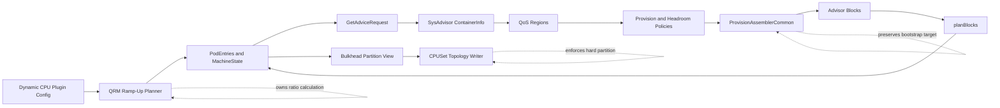
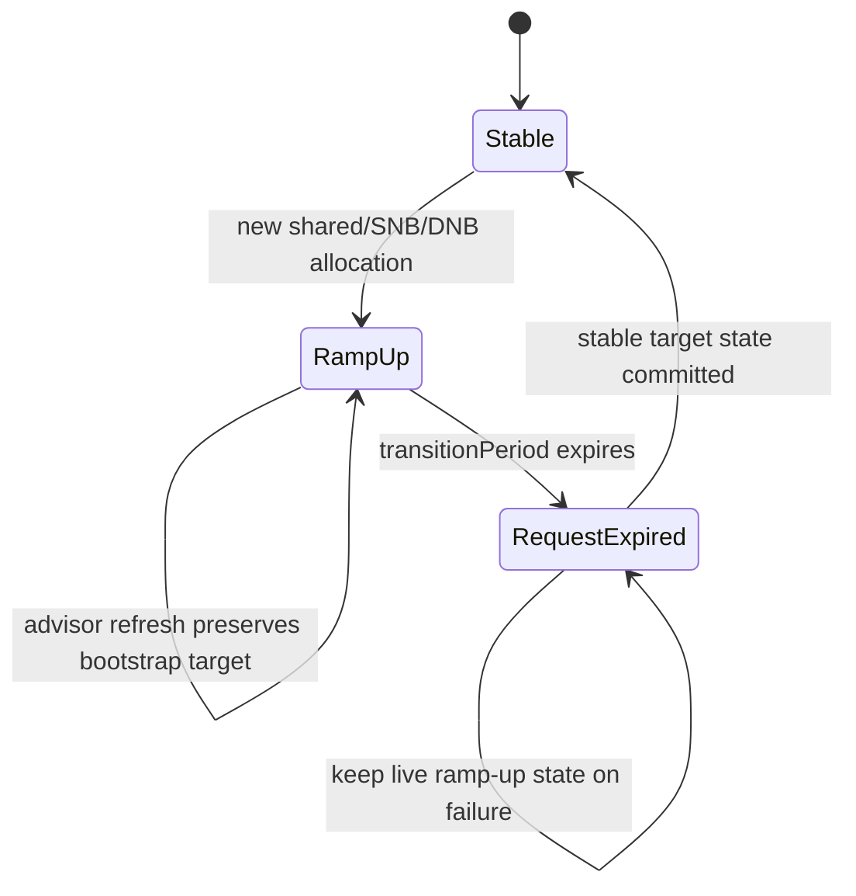
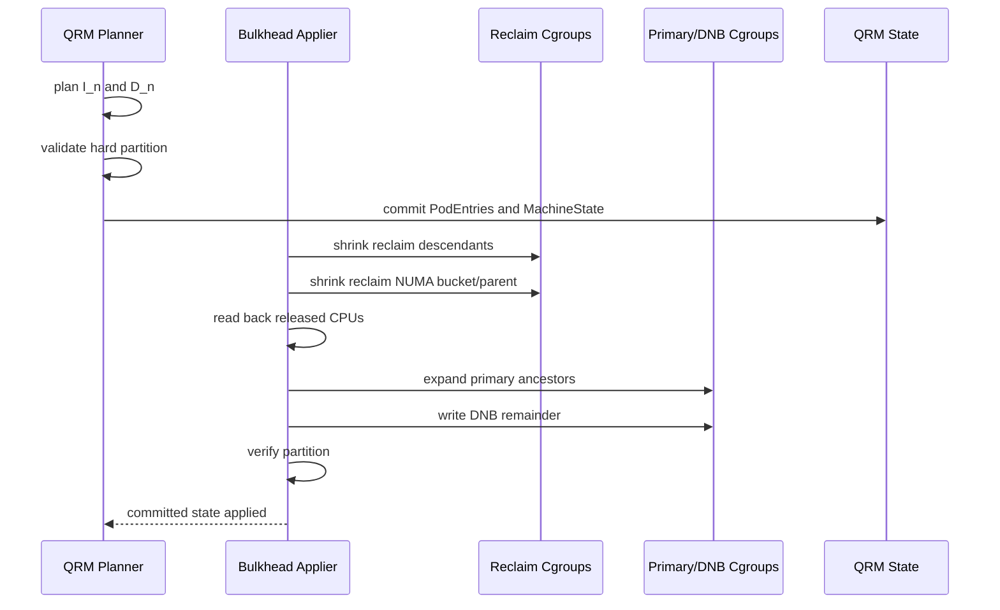
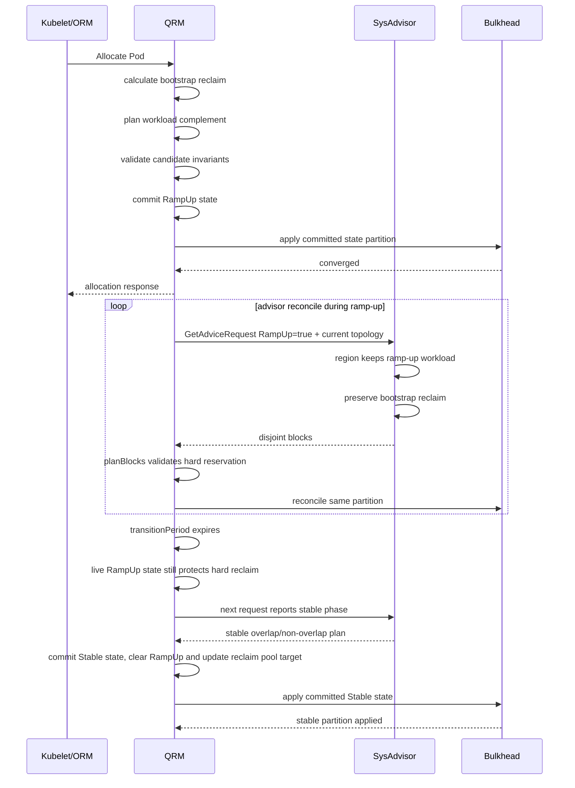

# Ramp-Up Reclaim CPUSet 完整方案

## 文档状态

- 目标分支：`feat/disable-dedicated-cores-overlap-refactor`
- 评审基线：`09fc028c0`
- 配置名称：`InitialRampUpReclaimCPUSetRatio`
- 核心目标：让 shared、SNB、非独占 DNB、独占 DNB 在 ramp-up 阶段使用一致的 reclaim reservation 语义，并满足 bulkhead 调度域隔离要求
- 本文替代此前仅覆盖 QRM 初始分配的局部设计

## 核心结论

`InitialRampUpReclaimCPUSetRatio` 不能只实现为 QRM 首次分配时的一次 CPUSet 裁剪。`AllocationInfo.RampUp` 已经跨越 QRM checkpoint、advisor request、SysAdvisor `ContainerInfo`、region、provision/headroom、assembler、advisor response 和 bulkhead cgroup 写入，因此新语义必须覆盖整条状态链。

独占 DNB 是本次改造的首要验收场景。启用新配置后，Pod 进入 ramp-up，绑定 NUMA 必须被分成两个非空、互斥的调度域：

```text
reclaimCPUSet != ∅
dedicatedCPUSet != ∅
reclaimCPUSet ∩ dedicatedCPUSet = ∅
reclaimCPUSet ∪ dedicatedCPUSet = eligibleNUMACPUSet
```

如果 reclaim 为空，cgroup v1 无法可靠清空旧 reclaim cpuset；如果 reclaim 与 dedicated 相交，bulkhead 的 primary/reclaim partition 会失去隔离。两种情况都不能通过 writer 的 normalization 静默修复，必须在规划阶段拒绝。

## 当前代码评审

### RampUp 状态不统一

当前四类 workload 的行为并不一致：

| 类型 | 当前行为 | 主要问题 |
|---|---|---|
| 普通 shared | 根据 Pod 状态进入 ramp-up，使用宽 CPUSet | 宽 CPUSet 包含 reclaim，没有 initial reservation |
| SNB | 创建 `AllocationInfo` 时没有设置 `RampUp` | 完全绕过 shared ramp-up 生命周期 |
| 非独占 DNB | 创建时固定 `RampUp=true`，分配 request 大小 | 只优先避开当前 reclaim，不认识 initial target |
| 独占 DNB | 创建时固定 `RampUp=true`，绑定整个可用 NUMA | 与 reclaim 重叠，无法满足 bulkhead 隔离 |

`planBlocks` 还包含 dedicated 第一次成功应用 advice 后立即清除 `RampUp` 的逻辑：

```go
if allocationInfo.OwnerPoolName == commonstate.PoolNameDedicated {
    if allocationInfo.RampUp {
        allocationInfo.RampUp = false
    }
}
```

这会使 DNB ramp-up 的持续时间取决于 advisor 第一帧响应，而普通 shared 由 `transitionPeriod` 控制。该分支必须删除，所有 workload 应使用同一时间型生命周期。

### `GetResourcesAllocation` 同时读写状态

当前 `GetResourcesAllocation` 在一次无序 map 遍历中完成：

- main 到 sidecar 的同步；
- timestamp 修复；
- ramp-up 到期判断；
- `RampUp=false` 持久化；
- shared pool 重算；
- response 组装。

它只把 shared 加入 ramp-up 完成后的 pool 重算，dedicated 只翻转 bool。main 与 sidecar 的遍历顺序又不稳定，sidecar 可能先复制旧状态，main 随后才结束 ramp-up。

### SysAdvisor 只识别普通 shared 的旧语义

`assignShareContainerToRegions` 当前直接跳过普通 shared ramp-up：

```go
if ci.RampUp {
    return nil, nil
}
```

DNB 会进入 dedicated region，但 region、RAMA、DynamicQuota、HeadroomPolicy 和 `ProvisionAssemblerCommon` 没有统一的 ramp-up phase。Canonical provision policy 只有局部 request-based 估算，无法保证 initial reclaim layout。

### bulkhead 会吞掉错误 target

`BuildCPUSetPartitionView` 在非 overlap 模式下计算：

```text
ReclaimEffective =
    (Machine - NonReclaimPool - Reserve) ∩ ReclaimRaw
```

如果 exclusive DNB 的 state 仍包含整个 NUMA，reclaim target 会被 dedicated 从 complement 中扣掉。后续 topology normalization 也会执行：

```text
reclaimTarget -= primaryTarget
```

这对普通 transient overlap 是修复手段，但对 initial ramp-up reclaim 是错误行为，因为 hard reservation 会被静默扣空。

## 目标语义

### 名词

对 NUMA `n` 定义：

```text
A_n = NUMA n 内本次规划可使用的 eligible allocatable CPUSet
R_n = NUMA n 的 reserveForReclaim floor
r   = InitialRampUpReclaimCPUSetRatio
I_n = NUMA n 的 initial ramp-up reclaim CPUSet
D_n = NUMA n 的 ramp-up DNB CPUSet
```

`A_n` 必须在扣除以下 CPU 后计算：

- QRM reserve/system CPU；
- forbidden/system pool；
- resource package pinned 且不允许本 workload 使用的 CPU；
- 其他 NUMA-exclusive owner；
- 当前请求作用域之外的 NUMA。

### ratio 生效规则

```text
EnableReclaim = false:
  target = reserveForReclaim

EnableReclaim = true:
  target = max(reserveForReclaim, ceil(ratio × allocatable))
```

普通 shared 的 ratio 计算域是整机：

```text
machineTarget =
  max(
    sum(reserveForReclaim[n]),
    ceil(ratio × machineEligibleAllocatableCPUCount),
  )
```

选择实际 CPUSet 时，每个 NUMA 仍必须满足本地 `R_n`，不能只满足整机总量。

SNB 和 DNB 按每个绑定 NUMA 独立计算：

```text
target[n] =
  max(
    reserveForReclaim[n],
    ceil(ratio × eligibleAllocatableCPUCount[n]),
  )
```

任一 NUMA 无法满足时拒绝整次规划，不允许从其他 NUMA 转移缺额。

### reserve floor 来源

QRM 和 SysAdvisor 必须使用同一份每 NUMA `reserveForReclaim` 计算，不能让 QRM 使用固定 `reservedReclaimedCPUSet`、SysAdvisor 使用动态配置后分别得出不同 floor。

建议抽取共享纯函数，保持现有 SysAdvisor reserve 语义：

```go
func CalculateReserveForReclaimByNUMA(
    conf *dynamicconfig.DynamicAgentConfiguration,
    topology *machine.CPUTopology,
) (map[int]int, error)
```

现有 NUMA reserve ratio 继续以物理 NUMA CPU 数为分母，避免顺带改变旧配置含义；`InitialRampUpReclaimCPUSetRatio` 以实际 eligible allocatable CPU 数为分母。QRM 根据共享 helper 得到 floor size，再从 eligible CPUSet 中选取具体 CPU。若 floor 大于 eligible capacity，直接拒绝。

### hard partition 开关与 ratio 配置

API 字段放在 `QRMPluginConfig.CPUPluginConfig`：

```go
EnableRampUpReclaimHardPartition *bool
InitialRampUpReclaimCPUSetRatio *float64
```

开关语义：

```text
EnableRampUpReclaimHardPartition != true:
  不启用新的 hard ramp-up partition，完全沿用旧行为

EnableRampUpReclaimHardPartition == true:
  启用 hard partition planner
```

ratio 语义：

```text
InitialRampUpReclaimCPUSetRatio == nil:
  动态配置未覆盖，使用启动 flag 或默认配置中的 ratio

InitialRampUpReclaimCPUSetRatio == 0:
  只使用 reserveForReclaim floor

InitialRampUpReclaimCPUSetRatio in (0, 1]:
  使用 max(reserveForReclaim floor, ceil(ratio * eligibleCPUCount))
```

这样可以避免“配置了 ratio=0”与“未启用新语义”混在一起，也保留动态配置缺省时回退到 flag/default 的能力。本文的非空、互斥 hard partition 不变量只在 `EnableRampUpReclaimHardPartition == true` 时生效；启用前已有 checkpoint 不能直接套用新不变量。CRD 和 CLI 都要校验 ratio 在 `[0, 1]`。

### ramp-up overlap 规则

两个 overlap 开关只决定稳定态行为：

- `AllowSharedCoresOverlapReclaimedCores`
- `DisableDedicatedCoresOverlapReclaimedCores`

Ramp-up initial reservation 始终是显式分区：

```text
initialReclaim ∩ rampUpShared = ∅
initialReclaim ∩ rampUpDNB = ∅
```

稳定态允许 overlap 也不能削弱 ramp-up reservation。

## workload 行为

### 普通 shared

仅当 `DisableSharedCoresRampUp=false` 时启用新 ratio planner。

```text
initial reclaim = 满足 machineTarget 和各 NUMA floor 的 CPUSet
shared ramp-up   = machine eligible CPUs - initial reclaim - 其他硬排除 CPU
```

`DisableSharedCoresRampUp=true` 时保持当前直接进入目标 pool 的行为，不应用 ratio。

### SNB

SNB 必须显式进入 ramp-up：

```go
RampUp:        true
InitTimestamp: now
```

每个绑定 NUMA 独立保留 `I_n`，SNB 使用该 NUMA 内的 complement。未绑定 NUMA 不因该 SNB 改变。

SNB 的 advisor request 必须保留 NUMA scope。现有 proto 已支持 topology assignments，不需要增加 wire 字段，但 `createGetAdviceRequest` 不能再对所有 shared 容器无条件省略 topology。

### 非独占 DNB

每个绑定 NUMA 同时规划 reclaim 和 request：

```text
|D_n| = requestInNUMA[n]
D_n ∩ I_n = ∅
```

分配候选必须是：

```text
A_n - I_n
```

不能再使用“preferred reclaim-free 不够时 fallback 到 reclaim”的语义。任一 NUMA request 与 initial target 无法同时满足时，整次分配失败。

### 独占 DNB

独占 DNB ramp-up 时，绑定 NUMA 内只有两个 owner：

```text
I_n = selected initial reclaim CPUSet
D_n = A_n - I_n
```

DNB 绑定整个 remainder，不只绑定 request：

```text
|D_n| >= requestInNUMA[n]
I_n != ∅
D_n != ∅
I_n ∩ D_n = ∅
I_n ∪ D_n = A_n
```

如果 ratio 和 reserve 都计算为 0，不能隐式制造一个 CPU。应拒绝 exclusive DNB admission，并提示配置无法产生非空 reclaim 调度域。生产默认配置应保证 exclusive DNB 场景下 `reserveForReclaim > 0` 或 ratio 大于 0。

## 组件职责



职责必须保持单一：

- QRM 读取 ratio，选择具体 initial reclaim CPUSet，并持久化；
- SysAdvisor 读取 `RampUp` 和当前 reclaim topology，保持 bootstrap target，不重复计算 ratio；
- bulkhead 校验 hard partition 并安全写 cgroup，不修正错误 target。

## QRM 设计

### 配置

字段放在 `QRMPluginConfig.CPUPluginConfig`，与 `DisableSharedCoresRampUp` 同层。

涉及文件：

- `pkg/config/agent/dynamic/adminqos/qrm/cpu_plugin.go`
- `cmd/katalyst-agent/app/options/dynamic/adminqos/qrm/cpu_plugin.go`
- 对应的 katalyst-api `CPUPluginConfig`
- generated deepcopy 和 CRD schema

ratio 本身不需要加入 advisor proto，也不需要单独写入 CPU checkpoint。首期同步 `GetAdvice` 通过完整 request snapshot 比较证明 response 基于当前 QRM state；只有后续兼容 legacy `ListAndWatch` 时才需要给 request/response 增加 generation ACK，详见 advisor request 章节。

### AllocationInfo

不新增 main container 字段。现有 `AllocationInfo` 已经有两类语义：

```go
type AllocationInfo struct {
    // existing fields

    RampUp                       bool
    InitTimestamp                string
    AllocationResult             machine.CPUSet
    TopologyAwareAssignments     map[int]machine.CPUSet
}
```

复用方式：

- main container 的 `AllocationResult` 继续表达 workload 可用 CPUSet，不能拿来存 reclaim；
- `PoolNameReclaim/FakedContainerName` 的 `AllocationResult` 表达已提交的具体 reclaim pool CPUSet；
- initial ramp-up planner 直接更新 reclaim pool entry 的 `AllocationResult` 和 `TopologyAwareAssignments`，使 bootstrap reclaim 成为 QRM state 的一部分；
- ratio 动态变化不重写已提交的 reclaim pool concrete CPUSet；
- 节点重启后通过 reclaim pool entry 恢复相同 bootstrap layout；
- 稳定态 candidate 提交时更新 reclaim pool entry 到 stable target，bulkhead 随后基于已提交 stable state 收敛。

`RampUp` 的职责：

```text
RampUp=true:
  live state 仍处于 ramp-up ownership；advisor request phase 由 transitionPeriod 决定

transitionPeriod 到期:
  不直接改 live state；下一次 advisor request 报告 stable phase

stable candidate 提交:
  candidate 中清除 RampUp，并把 reclaim pool AllocationResult 更新为 stable target
```

sidecar复制 `RampUp`、`InitTimestamp` 和 workload allocation，但不作为 reservation owner重复计数。hard reclaim ownership 只来自已提交的 reclaim pool entry，不来自 sidecar。

旧 checkpoint 不需要迁移新增字段；`EnableRampUpReclaimHardPartition == true` 后如果发现 `RampUp=true` 但 reclaim pool entry 不能证明满足 hard partition invariant，应 fail closed 并保持旧布局，不从零值推断 bootstrap target。

### 统一 planner

建议新增纯规划入口：

```go
type RampUpAllocationPlan struct {
    PodEntries   state.PodEntries
    MachineState state.NUMANodeMap

    ReclaimCPUSet  machine.CPUSet
    WorkloadCPUSet machine.CPUSet
}

func (p *DynamicPolicy) planRampUpAllocation(
    entries state.PodEntries,
    machineState state.NUMANodeMap,
    req *pluginapi.ResourceRequest,
    effectiveRatio float64,
    reserveForReclaimByNUMA map[int]int,
) (*RampUpAllocationPlan, error)
```

planner 只接受 snapshot，不读取 live `p.state`，不调 hook，不写 checkpoint，不写 cgroup。

规划步骤：

1. 判断 workload 类型和 scope。
2. 计算 eligible allocatable CPUSet。
3. 计算 ratio target 和 NUMA floor。
4. 优先复用当前 reclaim CPUSet，必要时按 topology 缩减或补齐。
5. 聚合其他 active ramp-up main container 的 reservation。
6. 从 complement 中计算 workload CPUSet。
7. 校验所有集合不变量。
8. 生成完整 `PodEntries` 和 `MachineState`。

只有完整计划成功后才能提交。

### CPUSet 选择

每个 scope 优先复用当前 reclaim，减少 CPUSet 抖动：

```text
current = currentReclaim ∩ domain

current.size >= target:
  从 current 中按 topology 选择 target

current.size < target:
  保留 current
  从 domain - current 中补齐
```

选择完成后，再从 `domain - initialReclaim` 分配 shared/SNB/DNB。

### allocation handlers

需要适配：

- `sharedCoresWithoutNUMABindingAllocationHandler`
- `sharedCoresWithNUMABindingAllocationHandler`
- `allocateSharedNumaBindingCPUs`
- `dedicatedCoresWithNUMABindingAllocationHandler`
- `allocateNumaBindingCPUs`

`allocateNumaBindingCPUs` 的关键变化：

```text
numaExclusive=false:
  request from A_n - I_n

numaExclusive=true:
  result = A_n - I_n
```

不能再让 exclusive 分支执行：

```go
alignedCPUs = alignedAvailableCPUs.Clone()
```

### `applyPoolsAndIsolatedInfo`

当前单一全局 `rampUpCPUs` 不能继续承担四类 workload 的语义。应把计算部分拆成 planner，并让本地 pool 重算复用同一组 helper。

必须做到：

- 普通 shared 使用 machine scope；
- SNB 使用 bound NUMA scope；
- DNB 保留已规划的 workload CPUSet；
- reclaim pool 等于所有 active reservation 与稳定态 target 的合法组合；
- `DisableDedicatedCoresOverlapReclaimedCores=true` 时 stable 和 ramp-up DNB 都不得被加入 reclaim overlap；
- fallback 到 `reservedReclaimedCPUSet` 前验证其不与 dedicated 相交。

提交前统一校验：

```text
rampUpRequiredReclaim ⊆ reclaimPool
rampUpDedicated ∩ reclaimPool = ∅
```

### `planBlocks` 和 `applyBlocks`

`planBlocks` 必须删除 dedicated advice 立即清除 `RampUp` 的逻辑。

当前 state 中存在 active ramp-up workload 时，advisor response 必须通过同一个 validator：

```text
required reclaim reservation 仍存在
ramp-up dedicated 与 reclaim 不相交
exclusive DNB/reclaim 覆盖 eligible NUMA
每 NUMA floor 未被缩小
```

response flag 应直接参与本轮规划，不能等待 `syncAdvisorOverlapFlags` 写入 state 后才影响行为。

`applyBlocks` 应支持 candidate-state apply，但提交顺序不是“bulkhead 先 preflight/apply，成功后再替换 live state”。正确顺序是：先在 clone state 上完成规划和校验，随后先写入 QRM state，使该 state 成为 bulkhead 的唯一输入，再由 bulkhead 基于已写入的 state 按安全阶段应用 cgroup：

```text
plan
→ validate
→ run pure/controlled hooks
→ regenerate MachineState
→ validate again
→ commit PodEntries and MachineState
→ StoreState
→ bulkhead apply(committed state)
→ read-back and verify
→ headroom/cgroup/flag follow-up
```

如果 bulkhead apply 失败，QRM state 不回滚到旧值；它继续表达目标状态，后续 reconcile 基于同一 state 重试应用。`StoreState` 失败仍遵循当前分支“不回滚内存 state”的语义，此时内存 state 与 bulkhead 目标一致，但重启可能回到旧 checkpoint，需要监控和 checkpoint 重试。

`CPUSetAdjustmentHandlerCtx` 需要支持基于指定 state 应用，而不是从 handler 内部重新读取 live state：

```go
type CPUSetAdjustmentHandlerCtx struct {
    State state.ReadonlyState
    // ...
}
```

candidate snapshot 至少包含 `PodEntries`、`MachineState`、本轮 overlap flags 和 hard reservations，并实现 `state.ReadonlyState`。普通 allocation 与 advisor response 必须共用同一个 plan/validate/commit/apply 框架，保证写入 state 后 bulkhead 看到的就是已提交目标。

### `GetResourcesAllocation`

保留时间型 ramp-up：



`GetResourcesAllocation` 应分三阶段：

1. 只遍历 main container，识别本轮到期的 ramp-up。
2. 基于所有 main 的最终生命周期状态规划完整 target。
3. 同步 sidecar，并一次提交 state。

到期后：

- shared/SNB 进入稳定 shared pool；
- DNB 将 `RampUp=false` 发送给 SysAdvisor；
- 在稳定 advice 到达前继续保持当前安全 bootstrap partition；
- live state 仍保持 `RampUp=true`，reclaim pool `AllocationResult` 继续作为 hard minimum；
- 不允许只翻 bool 后立即释放 reclaim reservation。

sidecar 不独立解析 timestamp，不独立结束 ramp-up。

### advisor request

现有 proto 已有：

```proto
bool ramp_up = 1;
map<uint64, string> topology_aware_assignments = 3;
```

无需增加 ratio 字段。首期若只支持同步 `GetAdvice`，也不需要新增 generation 字段；通过完整 request snapshot 比较拒绝 stale response 即可。

若必须支持 legacy `ListAndWatch`，再新增 state generation：

```proto
message GetAdviceRequest {
  // existing fields
  uint64 state_generation = 4;
}

message GetAdviceResponse {
  // existing fields
  uint64 base_state_generation = 6;
}

message ListAndWatchResponse {
  // existing fields
  uint64 base_state_generation = 5;
}

message GetCheckpointResponse {
  // existing fields
  uint64 state_generation = 2;
}
```

首期若强制使用同步 `GetAdvice`，不需要新增 generation proto；QRM 在锁内重建当前规范化 request，并与 response 对应的原 request 做完整比较即可拒绝 stale response。只有必须支持 legacy `ListAndWatch` 时，才需要 QRM checkpoint/state 持久化单调递增的 `StateGeneration`，并在每次完整 candidate commit 后加一。

- 同步 `GetAdvice`：QRM 保存发出时的完整 request snapshot，response 返回后在锁内重建当前 request并做完整比较。
- 异步 `ListAndWatch`：后续兼容时，`GetCheckpointResponse` 必须在同一锁和同一快照中返回 entries 与 generation；SysAdvisor 保存该 generation，并在基于该 snapshot生成的 `ListAndWatchResponse` 中原样回传。

transitionPeriod 到期后，QRM 对外发送 stable phase request；legacy `ListAndWatch` 模式只接受：

```text
response.base_state_generation ==
发送 stable phase request 时对应的当前 state generation
```

旧 `RampUp=true` response 即使内容仍满足 bootstrap invariant，也不能触发 stable candidate 提交。

`createGetAdviceRequest` 需要保证：

- 普通 shared main 发送正确 `RampUp`；
- SNB ramp-up 发送 NUMA scope；
- DNB ramp-up 发送 workload topology；
- reclaim pool entry 发送当前 bootstrap topology；
- sidecar `RampUp` 与 main 一致；
- sidecar不重复成为 reservation owner。
- 同步模式要求 request/response 完整快照匹配；legacy ListAndWatch 模式要求 generation 匹配，并且只接受基于当前稳定态请求生成的 response。
- legacy ListAndWatch基于同一checkpoint snapshot回传generation，不能猜测或使用当前最新值替代。

## SysAdvisor 设计

### ContainerInfo 和 metacache

`ContainerInfo.RampUp` 已经从 QRM request 正确写入，无需新字段。SysAdvisor 还需要能读取当前 reclaim pool topology，把它视为 QRM 已选定的 bootstrap target。

`RampUp true → false` 必须覆盖 metacache 旧值，不能只在 AddContainer 时更新 metadata。

### region 分配

普通 shared ramp-up 不再被排除：

```go
if ci.RampUp {
    return nil, nil
}
```

该分支必须删除。

region identity 不应依赖临时空 `OwnerPoolName`。普通 shared 使用 `OriginOwnerPoolName` 或目标 pool 建 region；SNB 使用 owner/origin pool 和绑定 NUMA；DNB 继续按绑定 NUMA建立 dedicated region。

### region 抽象

`QoSRegion` 增加：

```go
HasRampUpContainer() bool
GetRampUpContainers() types.PodSet
```

`QoSRegionBase` 在 `Clear()` 和 `AddContainer()` 时重建 ramp-up container set。

不能只增加一个 `RampUp bool`，因为同一个 shared region 可能同时包含稳定容器和 ramp-up 容器。

### ProvisionPolicy

region 含 ramp-up container 时，initial layout 必须保持确定性：

- Canonical 使用 request 作为 non-reclaim requirement；
- RAMA 不运行 PID 调整，或返回 unavailable 让 region回退到 Canonical；
- DynamicQuota 不扩大或缩小 initial reclaim target；
- ramp-up 结束后恢复原 policy priority 和算法。

`MaxRampUpStep` 是控制器步进参数，与 container `RampUp` 无关，不能复用。

### HeadroomPolicy

HeadroomPolicy 可以继续计算观测值，但不得改变 bootstrap CPUSet。

建议：

- ramp-up 时 usage estimator 使用 request，不使用瞬时 usage；
- assembler 对最终 reclaim size应用 bootstrap override；
- headroom 只用于 metrics 和稳定态候选，不覆盖当前 initial target。

### ProvisionAssemblerCommon

Assembler 不再独立读取 ratio。它从 metacache/当前 pool topology 获取 QRM 已提交的 bootstrap reclaim target。

`reclaimPoolCalculationData` 增加 ramp-up上下文：

```go
type reclaimPoolCalculationData struct {
    // existing fields

    hasSharedRampUp          bool
    hasSNBRampUp             bool
    hasNonExclusiveDNBRampUp bool
    hasExclusiveDNBRampUp    bool

    bootstrapReclaimByNUMA map[int]machine.CPUSet
}
```

Ramp-up phase 优先于 stable overlap 公式。

#### 普通 shared

保持 QRM 已选定的整机 bootstrap target和每 NUMA floor，不因 provision/headroom 临时变化而扩大或缩小。

#### SNB

只保持绑定 NUMA 的 bootstrap target，其他 NUMA走当前稳定态计算。

#### 非独占 DNB

输出：

```text
PoolEntries[podUID][numa].Size = requestInNUMA
PoolEntries[reclaim][numa].Size = bootstrapTarget[numa]
```

不生成 dedicated overlap metadata。

#### 独占 DNB

输出：

```text
PoolEntries[podUID][numa].Size =
    eligibleNUMASize - bootstrapTargetSize

PoolEntries[reclaim][numa].Size =
    bootstrapTargetSize
```

并验证：

```text
bootstrapTargetSize > 0
dedicatedRemainderSize > 0
dedicatedRemainderSize >= requestInNUMA
```

Ramp-up exclusive DNB 不能走当前“dedicated NUMA-exclusive 没有 reclaim capacity”的稳定态拒绝分支。

### cpu_server block 编码

现有 block 的 size/ID/overlap 表达足够，不需要在 block 中传具体 CPU ID。为了保持 QRM checkpoint 中已选定的 bootstrap CPU，QRM materialization 顺序必须调整。

`assembleDedicatedNUMABindingPodEntries` 已支持通过 `PoolEntries[podUID][numa]` 覆盖 dedicated block size。Assembler 只要输出正确大小即可。

独占 DNB ramp-up 的 response 必须满足：

```text
dedicated block result = eligible - bootstrap reclaim
reclaim block result   = bootstrap reclaim
dedicated block id != reclaim block id
两侧 overlap targets 为空
```

禁止生成指向该 DNB 的 `PoolOverlapPodContainerInfo`。

### QRM block materialization

`generateBlockCPUSet` 不能继续“先 dedicated/share，最后 reclaim”后再随机选 reclaim CPU。它应先从当前 state 聚合每 NUMA hard bootstrap set `H_n`，把这些 CPU 精确预绑定到 reclaim block：

1. 识别本 NUMA 的所有 reclaim block及其 result。
2. 校验 reclaim block总 result 不小于 `|H_n|`。
3. 按稳定顺序把 `H_n` 分配给对应 reclaim block；常规单 block场景直接绑定完整 `H_n`。
4. 在分配任何 dedicated/share block前，从 NUMA available CPUSet中扣除 `H_n`。
5. 从 complement分配 dedicated/share block。
6. reclaim block剩余的 `result - pinnedHardSize` 再从剩余 CPU中选择并与 pinned hard union。
7. 最终校验 materialized reclaim包含 `H_n`，exclusive DNB与其互斥。

若同一 NUMA 出现多个 reclaim block，必须按 block ID和response顺序确定性拆分 hard set，或在 validator中限制 ramp-up期间每 NUMA只有一个 non-overlap reclaim block。推荐后者，减少 bootstrap target歧义。

## Bulkhead 设计

### hard reclaim reservation

从 QRM state 判断是否存在受新语义保护的 ramp-up main container：

```text
RampUp == true
```

并读取 reclaim pool entry：

```text
PoolNameReclaim/FakedContainerName.AllocationResult
```

得到：

```text
HardRampUpReclaim = reclaim pool AllocationResult filtered by active ramp-up scope
```

`BuildCPUSetPartitionView` 或其调用方必须验证：

```text
HardRampUpReclaim ⊆ ReclaimRaw
HardRampUpReclaim ∩ Dedicated = ∅
```

如果不满足则返回错误，不能执行：

```text
reclaim -= primary
```

后继续应用。

建议为 topology target 增加 hard constraint：

```go
type CPUSetTargetConstraint struct {
    HardMinimum machine.CPUSet
    Exact       bool
}
```

initial ramp-up reclaim 至少是 hard minimum；exclusive DNB/reclaim NUMA partition可以使用 exact target。

### cgroup v1

cgroup v1 无法可靠写空 reclaim cpuset。新方案通过 admission 保证 exclusive DNB ramp-up 的 reclaim target非空，从源头避免“旧 reclaim 无法 drain、primary 又扩到全 NUMA”的状态。

如果配置算出的 target 为 0，exclusive DNB admission 必须失败，不能把空 target交给 writer。

### 安全写序



写入原则：

```text
release before acquire
child before parent shrink
parent before child grow
```

以下问题必须在任何写入前失败：

- reclaim target为空；
- reclaim target不属于对应 NUMA；
- reclaim NUMA buckets 相交；
- DNB 与 hard reclaim 相交；
- DNB remainder 小于 request；
- union 不能覆盖 eligible NUMA。

## 生命周期数据流



## 原子性边界

Linux cgroup 多节点写入不能提供真正 ACID 事务。本方案采用：

```text
纯 planner 原子
state snapshot 原子
cgroup 最终一致
```

最低要求：

1. 在 clone state 上完成所有计算。
2. 在写 state 或 cgroup 前完成集合不变量校验。
3. 校验通过后一次提交 candidate state，使 QRM state 先成为新的目标状态。
4. bulkhead 直接基于已提交 state 按安全顺序写入并 read-back。
5. apply 失败时不回滚 state；writer恢复或保持上一稳定 partition，后续 reconcile 继续向已提交目标收敛。
6. 稳定态 state 提交时才清理 `RampUp` 并更新 reclaim pool target，bulkhead 随后基于该稳定态目标应用。

当前 allocation 路径部分场景先更新 state 再运行 adjustment handler，这个方向是对的，但需要先补齐 clone 规划、集合校验和统一提交边界。文档不要求跨多个 cgroup 文件的 ACID 事务，而是要求 state 目标原子提交和 writer apply 可恢复。

SysAdvisor 也应避免 assembler 失败后留下半更新 region/policy 状态。至少只发布完整成功的 advice；失败时保留上一帧可用结果。

## 错误语义

错误必须包含：

- workload 类型；
- Pod/container；
- NUMA ID；
- eligible CPU 数；
- ratio target；
- reserve floor；
- workload request；
- dedicated/reclaim overlap；
- 是否 exclusive。

示例：

```text
cannot plan exclusive DNB ramp-up:
pod ns/pod container main, numa 0,
eligible 8, reclaim target 7, request 2,
dedicated remainder 1
```

不能静默执行：

- 缩小 reserve；
- 跨 NUMA借 CPU；
- 把 reclaim target 扣空；
- 回退到 dedicated/reclaim overlap；
- 只修改部分 NUMA；
- 只清除 `RampUp` bool 而不重算布局。

## 兼容性

### API 和配置

- API 使用 `*float64`；
- 未配置保持旧行为；
- 配置后启用完整新 planner；
- ratio 热更新只影响新进入 ramp-up 的 main container；
- 已进入 ramp-up 的 Pod使用 checkpoint 中的 reclaim pool `AllocationResult`；
- 首期 advisor proto 不传 ratio和具体 CPU ID；legacy `ListAndWatch` 兼容阶段再增加 state generation ACK；
- API 依赖更新后移除长期 fork replace。

### checkpoint

不新增 `AllocationInfo` 字段后，checkpoint schema 变化只来自其它必要配置或 proto 改动；仍需显式处理启用新配置后的旧状态：

1. 配置未启用时按 legacy checkpoint 运行。
2. `EnableRampUpReclaimHardPartition == true` 且存在 `RampUp=true` entry 时，必须从 reclaim pool `AllocationResult` 和 workload scope 校验 hard partition invariant。
3. 校验成功后继续使用该 reclaim pool concrete CPUSet，不重新按 ratio 选择 CPU。
4. 校验失败时不运行新的 hard partition writer，保持旧布局并报告 degraded。

如果仍有 checksum mismatch，部署必须明确开启 `SkipCPUStateCorruption`，并把它作为发布前置条件记录，不能描述为透明兼容。

降级到不了解新字段的旧 binary 不保证 checksum兼容；若要求回滚，旧 binary也必须开启 skip corruption，或在回滚前转换/清理 checkpoint。

恢复时：

- `RampUp=true` 且 reclaim pool满足hard partition：恢复 live hard reservation；
- `RampUp=true` 且 reclaim pool无法证明hard partition：按 legacy ramp-up entry 处理并 fail closed，不推断新 hard partition；
- `RampUp=false`：无需 bootstrap reservation；
- `RampUp=true` 且 reclaim pool target存在：按原 target恢复；
- `RampUp=true` 且 reclaim pool target缺失：维持旧 state并拒绝新变更。

### stable overlap

Ramp-up 结束后恢复：

- shared stable overlap 开关；
- dedicated stable overlap 开关；
- `EnableReclaim` 的稳定态容量算法；
- RAMA、DynamicQuota 和 normal headroom。

## 实施分层

### 第一阶段：配置和 state

修改：

- katalyst-api `CPUPluginConfig`
- generated deepcopy
- AdminQoS CRD
- core dynamic config/options
- QRM/SysAdvisor 共用 reserve floor helper
- `AllocationInfo`
- legacy ListAndWatch state generation及proto生成代码
- checkpoint migration/version
- checkpoint round-trip
- sidecar同步

验收：

- nil/0/边界 ratio语义；
- main/sidecar lifecycle一致；
- reservation重启后保持。
- active/request-expired/stable phase恢复正确；
- stale response不能触发 stable candidate 提交；
- skip corruption升级后重写新checksum。

### 第二阶段：QRM planner

修改：

- shared allocation handlers
- SNB allocation
- DNB allocation
- `applyPoolsAndIsolatedInfo`
- `GetResourcesAllocation`
- `createGetAdviceRequest`

验收：

- 四类 workload 的 CPUSet矩阵；
- 每 NUMA floor；
- 无跨 NUMA借位；
- plan失败无 state mutation。

### 第三阶段：SysAdvisor lifecycle

修改：

- `assignShareContainerToRegions`
- `QoSRegion` / `QoSRegionBase`
- Canonical/RAMA/DynamicQuota
- HeadroomPolicy
- `ProvisionAssemblerCommon`
- `cpu_server` response tests

验收：

- ramp-up workload持续存在于 region；
- policy不覆盖 bootstrap target；
- DNB/reclaim block独立。

### 第四阶段：advisor apply 和 bulkhead

修改：

- `planBlocks`
- `applyBlocks`
- `generateBlockCPUSet` hard reclaim预绑定
- candidate readonly snapshot
- bulkhead committed-state apply interface
- `BuildCPUSetPartitionView`
- topology target normalization
- cpusettopology plugin/writer tests

验收：

- hard reservation不被静默扣除；
- exclusive DNB/reclaim两个域非空且互斥；
- cgroup v1/v2写入顺序安全；
- stable transition成功。

## 测试矩阵

### 配置

- `nil` 保持 legacy；
- `0` 使用 reserve floor；
- `0.25`、`1` 正常；
- 小于 0、大于 1 拒绝；
- dynamic apply和deepcopy不共享指针。

### 普通 shared

- ratio按整机计算；
- 每 NUMA floor满足；
- `DisableSharedCoresRampUp=true` 忽略 ratio；
- initial reclaim与shared不相交；
- 多个 ramp-up Pod reservation聚合；
- 单个 Pod结束不释放其他 Pod reservation。

### SNB

- 设置 `RampUp=true`；
- 只影响绑定 NUMA；
- topology传到 SysAdvisor；
- 容量不足不借其他 NUMA；
- stable transition 后进入目标 pool。

### 非独占 DNB

- 分配数量等于 request；
- 每 NUMA initial reclaim满足；
- DNB/reclaim无交集；
- request与target无法共存时拒绝；
- distribute-evenly 按 NUMA独立校验。

### 独占 DNB

以 NUMA 8 CPU、ratio 0.25、reserve 1、request 4 为例：

```text
reclaim = 2 CPU
dedicated = 6 CPU
intersection = empty
union = 8 CPU
```

必须覆盖：

- ratio floor；
- reserve高于 ratio；
- target为0时拒绝；
- remainder小于 request时拒绝；
- 多 NUMA逐节点独立；
- QRM state、advisor blocks、bulkhead targets一致。

### region 和 policy

- 普通 shared ramp-up进入 share region；
- SNB ramp-up进入 NUMA share region；
- DNB ramp-up进入 dedicated region；
- mixed stable/ramp-up region 的 `HasRampUpContainer`；
- RAMA/DynamicQuota在 ramp-up被gate；
- Canonical使用request；
- Headroom不覆盖 bootstrap target。

### advisor blocks

- exclusive DNB block和reclaim block使用不同 ID；
- 两者没有 overlap target；
- sidecar复用main DNB block；
- `planBlocks` 保持 `RampUp=true`；
- request phase 到期但 stable target 尚未提交期间仍保持hard reservation；
- stale/stable response违反hard reservation时拒绝。
- stale response即使内容合法也不能触发 stable candidate 提交；
- hard bootstrap CPU在block materialization后保持精确不变。

### bulkhead

- state 中 hard reclaim缺失时失败；
- hard reclaim与dedicated相交时失败；
- normalization不能扣掉hard reclaim；
- reclaim NUMA bucket非空；
- v1不能出现空 reclaim后扩primary；
- v2 empty-write兼容路径不影响本场景；
- 每次fake cgroup write后检查parent/child和partition不变量。

### 状态恢复

- shared/SNB/DNB `RampUp=true` round-trip；
- `RampUp=true` 与 reclaim pool `AllocationResult` round-trip；
- hard reservation round-trip；
- main/sidecar一致；
- 旧checkpoint checksum mismatch在skip corruption模式下迁移并重写；
- downgrade限制有明确测试或发布说明；
- ratio热更新不改变已在ramp-up的Pod。

## 方案 review 结论

### 可复用部分

- `AllocationInfo.RampUp` 和 `InitTimestamp`
- advisor proto 中已有的 `ramp_up` 和 topology assignments
- SysAdvisor `ContainerInfo.RampUp`
- dedicated response size override
- QRM `planBlocks` 的纯规划框架
- bulkhead release-before-acquire writer
- checkpoint 的 PodEntries持久化

### 必须删除的旧假设

- “只有普通 shared 才 ramp-up”
- “SNB 直接稳定”
- “dedicated第一帧advice即结束ramp-up”
- “exclusive DNB必须拿整个NUMA，包括reclaim”
- “ramp-up shared没有region”
- “writer可通过扣除reclaim修复所有overlap”
- “sidecar可以独立推进ramp-up”

### 不建议的方案

- SysAdvisor和QRM分别按ratio计算：会产生分母和reserve不一致。
- 只修改Assembler：首次Allocate已经返回错误布局。
- 只修改QRM Allocate：第一帧advice会覆盖。
- 继续让exclusive DNB拿whole NUMA，再靠bulkhead扣reclaim：hard reservation会被吞掉。
- 用空`AllocationResult`表达owner切换：无法区分无更新、清空和bypass。
- ramp-up结束时只翻bool：资源布局不会同步切换。

### 最终判断

该方案能够覆盖用户提出的完整目标，并与当前代码已有能力兼容。实现规模跨 API、QRM、SysAdvisor 和 bulkhead，不能压缩成单点改动。

最重要的设计决定是：

1. QRM 是 initial ratio 和具体 CPUSet 的唯一计算者。
2. QRM 与 SysAdvisor 使用同一个 reserve floor helper。
3. hard reservation 复用 reclaim pool entry 的 `AllocationResult` 随 checkpoint 持久化。
4. SysAdvisor 在 active phase保持 bootstrap target；request phase 到期后计算稳定态 candidate，QRM live state在提交 stable target 前继续保护 bootstrap reservation。
5. bulkhead 将其视为 hard reservation，不允许 normalization 删除。
6. candidate state 先写入成为 QRM 目标状态，再由 bulkhead 基于该 state 安全应用。
7. 独占 DNB 与 reclaim 在 NUMA 内形成两个非空、互斥且覆盖完整 eligible NUMA 的调度域。

满足这些条件后，独占 DNB 上线时 reclaim 不会为空，也不会与 dedicated 相交，bulkhead 调度域隔离可以稳定成立。
