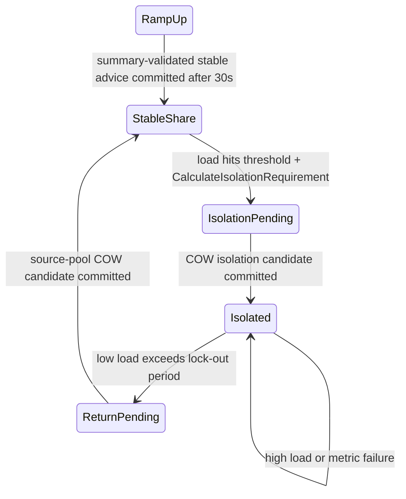
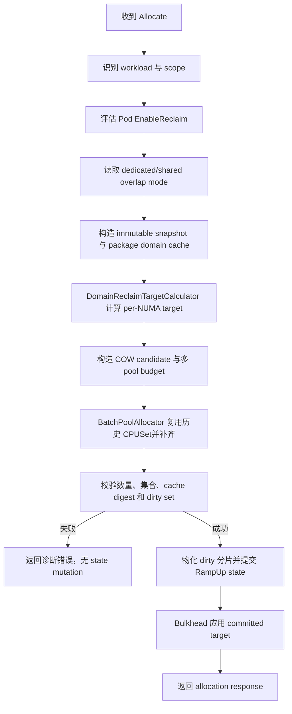
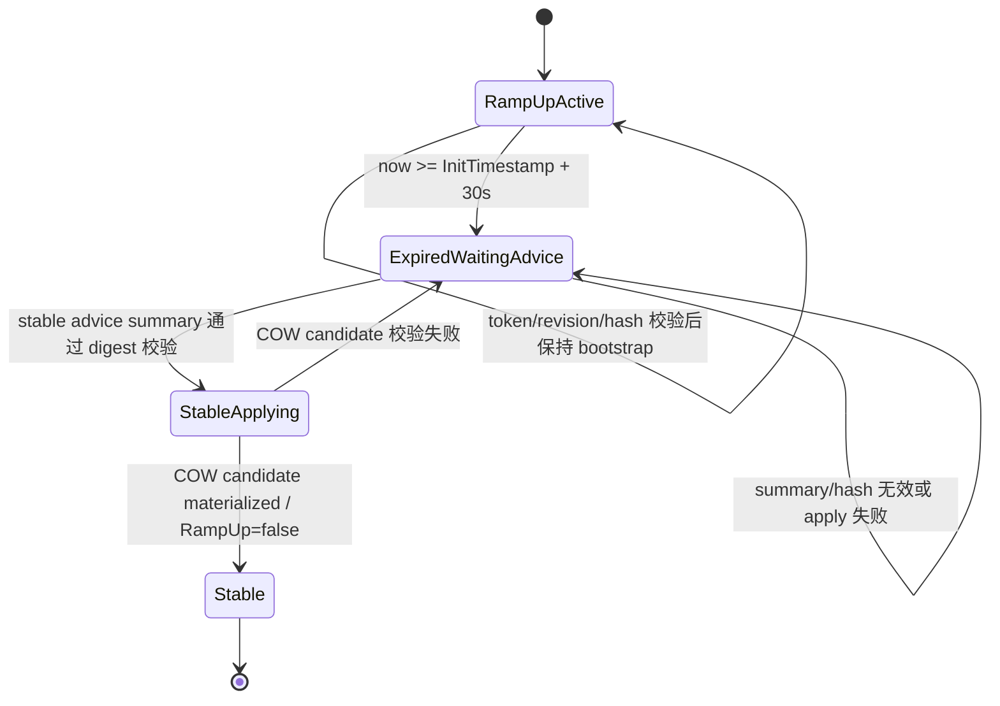
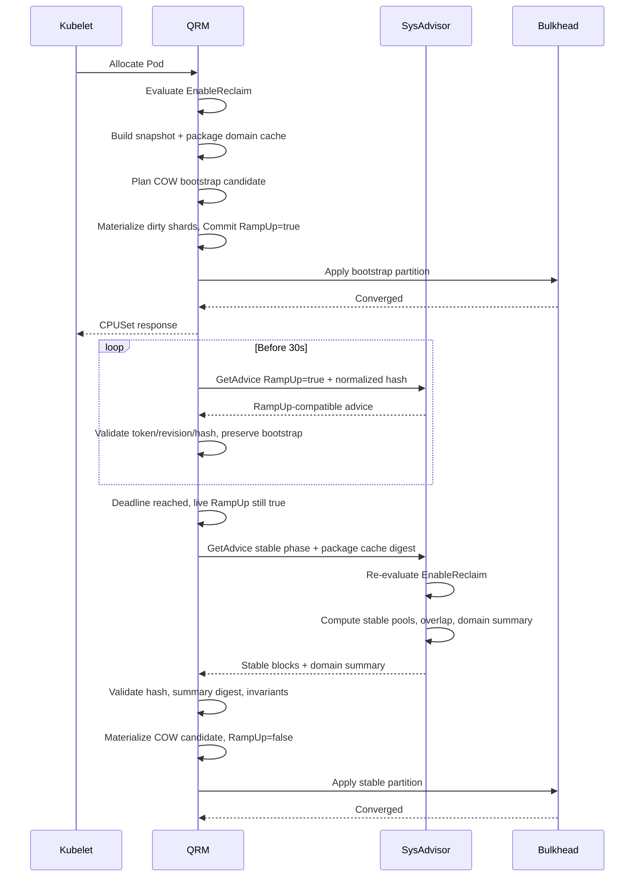

# RampUp Reclaim 混部策略完整技术方案

## 文档状态

- 文档类型：详细技术设计
- 目标组件：Katalyst QRM、SysAdvisor CPU Advisor、Provision Assembler、Bulkhead CPUSet Topology
- 适用 workload：
  - NUMA-exclusive DNB
  - 非 NUMA-exclusive DNB
  - SNB
  - 非 NUMA-binding shared
  - shared isolation（小黑屋）
- 评审基线：`feat/ramp-up-reclaim-bulkhead-integration`
- 核心时间参数：`transitionPeriod=30s`
- 初始 reclaim 配置：`InitialRampUpReclaimCPUSetRatio`
- 状态：待评审、待实施

本文是 RampUp reclaim 数量、`EnableReclaim`、dedicated/shared overlap mode、多 pool 和稳定态切换的统一事实源。本文中与以下旧文档冲突的部分，以本文为准：

- `2026-07-30-initial-ramp-up-reclaim-cpuset-design.md`
- `2026-07-30-ramp-up-reclaim-complete-design.md`
- `2026-07-31-ramp-up-even-target-and-duration-design.md`

旧文档仍可作为代码演进背景，但不能直接作为实现依据。

## 项目整体概述

### 背景

Katalyst CPU 管理链路由 QRM、SysAdvisor 和 Bulkhead 三层协作完成：

- QRM 负责 Pod admission、CPUSet 物化、checkpoint 和 kubelet 资源响应。
- SysAdvisor 负责 workload 画像、`EnableReclaim` 判断、稳定态 provision/headroom 和 pool 大小计算。
- Bulkhead 负责把 QRM state 转换为 cgroup CPUSet 拓扑，并按安全顺序收敛。

RampUp 阶段用于在 Pod 刚创建、性能画像尚未稳定时提供确定性的 CPU 隔离。当前代码已具备 `RampUp`、`InitTimestamp`、advisor request、block response、reclaim pool entry 和 bulkhead writer 等基础能力，但不同 workload 的生命周期和数量语义不一致：

| Workload | 当前主要行为 | 主要问题 |
|---|---|---|
| NUMA-exclusive DNB | 首次 allocation 进入 RampUp；首帧 dedicated advice 立即清除 RampUp | 实测约 1.5 秒退出，不满足 30 秒 |
| 非 NUMA-exclusive DNB | RampUp 时按 request 绑核，并优先避开 reclaim | 未结合 Pod 级 `EnableReclaim` 选择保护线 |
| SNB | 现有路径缺少完整统一的 30 秒 RampUp 语义 | 未按 `NUMA capacity - initialTarget` 构造业务预算 |
| 非 NUMA-binding shared | 已有时间型 RampUp，但使用全局宽 CPUSet | 未按每 NUMA initial target、多 pool 和 Pod 级 reclaim 能力规划 |

当前 `CalculateRampUpReclaimTarget` 已将 ratio 派生值改为向下取偶数：

```text
ratioTarget = floor(ratio × eligible)
ratioTarget = ratioTarget - ratioTarget % 2
target = max(reserve, ratioTarget)
```

但它尚未接收 `EnableReclaim`，因此所有 hard-partition allocation 都会使用 ratio，无法表达 `EnableReclaim=false` 时只使用 `reserveForReclaim` 的产品语义。

### 产品规则

本方案基于以下已确认规则：

1. `EnableReclaim` 决定 workload 是否可以贡献超过 `reserveForReclaim` 的 reclaim 资源。
2. overlap mode 不决定是否可混，只决定 reclaim 与业务 CPUSet 的布局模式：
   - dedicated workload 使用 `DedicatedOverlap = !DisableDedicatedCoresOverlapReclaimedCores`；
   - shared workload 使用 `SharedOverlap = AllowSharedCoresOverlapReclaimedCores`；
   - 本文仅在抽象公式中使用 `OverlapMode` 表示“当前 workload class 对应的 overlap mode”，不再把 dedicated/shared 压成一个 domain 级 bool。
3. DNB、SNB 和 shared 的 RampUp 都必须至少保持 30 秒。
4. RampUp 期间冻结 bootstrap 分区，不应用 SysAdvisor 稳定态 candidate。
5. `EnableReclaim=false` 时，RampUp reclaim 数量不使用 initial ratio，默认以 `reserveForReclaim` 为目标。
6. `EnableReclaim=true` 时，RampUp reclaim 数量为：

```text
max(reserveForReclaim, floorEven(initialRatio × eligible))
```

7. RampUp 结束后重新读取最新 Pod 画像，由 SysAdvisor 生成稳定 advice。
8. `EnableReclaim=false` 的 Pod request 必须全量计入 non-reclaim requirement。
9. `DedicatedOverlap` 和 `SharedOverlap` 必须分别作用于对应 workload class 的 RampUp 和稳定态 CPUSet 布局。
10. SNB 和非 NUMA-binding shared 必须支持多 pool；多个 pool 共享一份业务预算，不能重复占用整份 budget。
11. 非 NUMA-exclusive DNB 可以与 SNB 共用同一个 NUMA，并共同参与该 NUMA 的 budget、reclaim 和 overlap 计算。
12. 非 NUMA-binding shared 不能使用任何存在 SNB 或 DNB 的 NUMA；排除粒度是整个 NUMA，不只是已分配给 DNB 的 CPU。
13. RampUp Pod 不参与 isolation 判定；只有稳定态 shared Pod 可进入小黑屋。
14. isolation CPUSet 是硬不可回收资源，不能与 reclaim、source share pool或其他 isolation region overlap；同一 non-exclusive isolation region 的成员共享一个聚合 CPUSet。
15. NUMA-binding isolation 属于 binding ownership；non-binding isolation 跟随 source non-binding pool，只能使用 non-binding NUMA。
16. isolation 必须保留 source pool provenance，从 source pool 的组合 budget 中 carve，退出后优先归还原 source pool。

### 整体目标

本方案建立一套统一状态机和纯规划模型，使四类 workload 在以下维度上行为明确且可验证：

- Pod 级 reclaim 能力；
- reclaim 数量保护线；
- overlap 或隔离布局；
- 30 秒生命周期；
- 稳定态 advice 接管；
- 多 NUMA、多 pool 和混合 Pod；
- checkpoint 恢复、stale response、部分失败和 cgroup 最终一致性。

### 非目标

本次不改变以下既有语义：

- SPD 缺失时 `PodEnableReclaim` 返回 `true`；
- `PerformanceLevelPoor` 或 service baseline 返回 `false`；
- reserve ratio 的配置口径；
- NUMA hint 和 Topology Manager 的选择算法；
- RAMA、DynamicQuota 的稳定态算法本身；
- cgroup v1 无法提供跨文件 ACID 事务的事实。

## 代码结构与现状

### QRM

| 文件 | 当前职责 | 本方案改造点 |
|---|---|---|
| `pkg/agent/qrm-plugins/cpu/dynamicpolicy/policy_allocation_handlers.go` | shared、SNB、DNB admission 和初始选核 | 接入 Pod 级 reclaim policy、统一 bootstrap planner、多 pool budget |
| `pkg/agent/qrm-plugins/cpu/dynamicpolicy/util/ramp_up_reclaim.go` | 计算 initial reclaim target | 增加 `EnableReclaim` 输入并保持 ratio 向下偶数 |
| `pkg/agent/qrm-plugins/cpu/dynamicpolicy/policy.go` | `transitionPeriod`、资源查询和 RampUp 到期 | 改为“到期请求稳定 advice，但 live state 继续保护 bootstrap” |
| `pkg/agent/qrm-plugins/cpu/dynamicpolicy/policy_advisor_handler.go` | request、block 物化、candidate apply | 删除 dedicated 首帧立即退出；校验 request hash、内存 revision和 hard constraints |
| `pkg/agent/qrm-plugins/cpu/dynamicpolicy/state` | PodEntries、MachineState、checkpoint | 不扩展 schema；持久化现有 concrete workload/reclaim CPUSet |

### SysAdvisor

| 文件 | 当前职责 | 本方案改造点 |
|---|---|---|
| `pkg/agent/sysadvisor/plugin/qosaware/resource/helper/helper.go` | `PodEnableReclaim` | 下沉为 QRM/SysAdvisor 共用 evaluator |
| `pkg/agent/sysadvisor/plugin/qosaware/resource/cpu/region` | workload region 和 policy 选择 | 保存 Pod 级 reclaim eligibility，不把 shared pool 简化为单布尔值 |
| `pkg/agent/sysadvisor/plugin/qosaware/resource/cpu/assembler/provisionassembler/assembler_common.go` | reclaim/pool 数量和 overlap metadata | 接收 RampUp phase、多 pool budget、稳定态 policy decision |
| `pkg/agent/sysadvisor/plugin/qosaware/server/cpu_server.go` | internal result 到 advisor blocks | 保持现有 pool/pod overlap metadata；proto 仅允许增加 dedicated overlap disable 字段 |

### Bulkhead

| 文件 | 当前职责 | 本方案改造点 |
|---|---|---|
| `pkg/agent/qrm-plugins/cpu/dynamicpolicy/bulkhead/state` | 构建 partition view | 识别 hard RampUp target 和 overlap mode |
| `pkg/agent/qrm-plugins/cpu/dynamicpolicy/bulkhead/utils/topology` | DAG target、写入和回读 | 禁止静默吞掉 hard target；保持 release-before-acquire |

## 术语与公式

### 基础符号

对 NUMA `n`：

```text
E_n = 本次规划可用的 eligible CPUSet
C_n = |E_n|
R_n = reserveForReclaim[n]
r   = InitialRampUpReclaimCPUSetRatio
I_n = RampUp initial reclaim target
S_n = 稳定态 SysAdvisor reclaim target
```

`E_n` 必须扣除：

- QRM reserve/system CPU；
- forbidden/system pool；
- 不允许当前 workload 使用的 resource package pinned CPU；
- 其他 NUMA-exclusive owner；
- 当前 hint scope 之外的 CPU。

resource package pinned CPUSet 不只是 admission hint，而是 `NUMANodeState.ResourcePackageStates[pkg].PinnedCPUSet` 代表的现有状态事实。若 workload 带 `resource_package=pkg` 且该 NUMA 上存在非空 pinned CPUSet，则该 workload 的 eligible domain 被限制为 `E_n ∩ P_{n,pkg}`；若 workload 不属于该 pinned package，则必须从 `E_n` 扣除 `ΣP_{n,*}`，不能把 pinned CPU 当作普通 shared headroom。

resource package domain 不允许在 planner、hint optimizer、stable compose 中重复全量计算。QRM 在构造 `CPUStateSnapshot` 时生成 per-NUMA cache：

```text
ResourcePackageDomainCache:
    pinnedUnion[n]      = ΣP_{n,*}
    pkgDomain[n][pkg]   = E_n ∩ P_{n,pkg}
    commonDomain[n]     = E_n - pinnedUnion[n]
    revision            = MachineState/resourcePackage revision
```

allocator、hint optimizer 和 stable validator 只能读取该 cache；MachineState 或 `ResourcePackageStates` 变化后整体失效重建。不得在每个 pool、每个 Pod 或每个 region 内重复扫描所有 package CPUSet。

### 向下偶数

```text
floorEven(x) = floor(x) - floor(x) % 2
```

ratio 只对 ratio 派生值向下取偶数。若 `reserveForReclaim` 为奇数且它更大，最终 target 可以是奇数：

```text
ratioTarget = floorEven(r × C_n)

EnableReclaim=false:
    I_n = R_n

EnableReclaim=true:
    I_n = max(R_n, ratioTarget)
```

### target 计算唯一事实源

所有 bootstrap、stable composition 和 Bulkhead validator 使用同一组 per-NUMA target helper，不允许在 DNB、SNB、shared、stable apply 或 Bulkhead 中复制公式：

```text
DomainReclaimTargetCalculator:
    input:
        numaID
        eligibleSize C_n
        reserve R_n
        cap reclaimCap_n
        ratio r
        enableReclaim
        workloadClass
        overlapMode
        currentConcreteReclaim

    output:
        target
        reason
        floorDiagnostics
```

首期实现可以仍落在 `CalculateRampUpReclaimTarget`，但所有调用点必须通过该 helper 或其 per-NUMA wrapper；禁止直接在 handler、assembler、candidate validator 中重写 `max(reserve, floorEven(ratio×eligible))`、non-zero、cap 和 exclusive remainder 规则。

### cap

target 不允许静默 clamp：

```text
I_n > reclaimCap_n -> 规划失败
```

静默 clamp 会导致 QRM、SysAdvisor 和 Bulkhead 对 hard target 的理解不一致。

### 业务预算

```text
OverlapMode=true:
    业务 CPUSet 与 reclaim 可相交；
    业务预算由 workload 类型决定。

OverlapMode=false:
    businessBudget_n = C_n - reclaimTarget_n
```

对于 `EnableReclaim=true` 的 SNB，已确认无论 overlap 模式如何，RampUp 业务总预算均为：

```text
businessBudget_n = C_n - I_n
```

差异仅在 reclaim CPUSet 是否允许与该业务 budget overlap。

## 统一不变量

### 生命周期

```text
RampUpActive:
    now < InitTimestamp + 30s
    live RampUp = true
    bootstrap target 不变

RampUpExpiredWaitingAdvice:
    now >= InitTimestamp + 30s
    request phase = stable
    live RampUp 仍为 true
    bootstrap target 继续生效

Stable:
    当前 stable request 对应的有效 advice 已完整提交
    live RampUp = false
```

### 数量

```text
EnableReclaim=false:
    reclaim 不得因动态 usage 扩大；
    non-reclaim workload request 全量扣除。

EnableReclaim=true:
    RampUp 时 reclaim 保护 I_n；
    稳定态 reclaim 不低于 R_n。
```

当 `EnableRampUpReclaimHardPartition=true` 时，所有参与管理的 NUMA 在全部阶段统一要求：

```text
bootstrap target > 0
stable target > 0
active-entry composition target > 0
Bulkhead committed target > 0
```

因此：

- `EnableReclaim=false && R_n=0`：配置预检或 admission 失败；
- `EnableReclaim=true && max(R_n, ratioTarget)=0`：admission 失败；
- stable advice 返回 0：candidate validator 拒绝；
- 不能只在 bootstrap helper 校验非零。

若需要允许空 reclaim，应关闭 hard-partition feature 并走 legacy writer；本方案不定义 hard-partition 下的空 cgroup 语义。

非 NUMA-exclusive DNB 且：

```text
EnableReclaim=false && DedicatedOverlap=false
```

是显式例外：当 request 无法避开 reclaim 时，DNB request 优先，允许实际 reclaim 暂时低于 `R_n`，但必须记录降级状态和指标。

该例外只允许由单一 `DNBReserveDegradationPolicy` 处理，且必须同时满足：

- workload 为非 NUMA-exclusive DNB；
- `EnableReclaim=false && DedicatedOverlap=false`；
- `R_n > 0` 且当前 committed reclaim size 至少为 1；
- 降级后 reclaim target 仍大于 0；
- 新 admission/candidate 无法在保持 request 的同时维持 `R_n`。

若 `R_n=0`、当前没有可保留 reclaim CPU，或降级会清空 hard-partition reclaim target，必须 fail closed。SNB、non-binding shared、isolation 和 stable composition 不得复用该降级分支。

### 集合

```text
OverlapMode=false:
    workloadCPUSet ∩ reclaimCPUSet = ∅

OverlapMode=true:
    workloadCPUSet ∩ reclaimCPUSet 可以非空
```

`OverlapMode=true` 仅表示“允许”，实际 overlap 必须由 advisor metadata 或 bootstrap planner 明确生成，不能由 QRM 随机推断。`OverlapMode` 在 dedicated 语境下等于 `DedicatedOverlap`，在 shared/SNB/non-binding shared语境下等于 `SharedOverlap`。

overlap metadata 不新增 checkpoint 字段。重启或 Bulkhead strict reconcile 时，QRM 必须从 committed state 确定性重建合法 overlap 声明：

```text
declaredOverlap(owner,reclaim) =
    ownerCPUSet ∩ reclaimCPUSet
    if owner is active RampUp 或 stable advice materialized owner
    and owner class 的 OverlapMode=true
    and owner/reclaim 均来自同一 committed candidate
```

不满足上述条件的交集一律视为非法 overlap。该声明只用于校验和写序，不作为新的持久化事实源；checkpoint仍只保存现有 concrete CPUSet、`RampUp`、`OwnerPoolName` 和 shared overlap bool。

### 原子性

```text
纯 planner 原子
QRM target state 原子提交
cgroup 最终一致
```

不允许：

- 只改 `RampUp` bool；
- 只改 workload entry；
- 只改 reclaim pool；
- 部分 NUMA 成功后提交；
- advice apply 失败后把 live state 回滚到与 cgroup 不一致的旧 target。

## 目标矩阵

### 功能目标

| ID | 场景 | 目标 | 优先级 | 验收标准 |
|---|---|---|---|---|
| F-01 | ratio 计算 | ratio 派生值向下取偶数 | P0 | `96×0.2=19.2 -> 18` |
| F-02 | `EnableReclaim=false` | RampUp target 不使用 ratio | P0 | target 等于 `reserveForReclaim` |
| F-03 | 30 秒 RampUp | 四类 workload 不提前退出 | P0 | `<30s` 不出现 stable commit |
| F-04 | 到期等待 advice | 到期后仍保护 bootstrap | P0 | stable advice 提交前 live `RampUp=true` |
| F-05 | policy 重评估 | 到期后使用最新 SPD/节点配置 | P0 | stable decision 与最新 `PodEnableReclaim` 一致 |
| F-06 | overlap 模式 | overlap 只影响布局 | P0 | 同数量下 true 可交叠，false 必须互斥 |
| F-07 | exclusive DNB | NUMA owner 和 reclaim 关系明确 | P0 | overlap 或隔离矩阵全部通过 |
| F-08 | non-exclusive DNB | request 优先、保护线按矩阵执行 | P0 | request 数量不被静默缩小 |
| F-09 | SNB | 按 NUMA budget 规划 | P0 | Pod 绑定所属 pool，pool 总量不超 budget |
| F-10 | non-binding shared | 按每 NUMA floor 和 pooled budget 规划 | P0 | 每 NUMA floor 和总 budget 同时满足 |
| F-11 | 多 pool | budget 只计算一次并确定性分摊 | P0 | pool 顺序变化不改变结果 |
| F-12 | mixed eligibility | 同 pool 内按 Pod eligibility 分拆 requirement | P0 | false Pod request 全量扣除 |
| F-13 | sidecar | sidecar 跟随 main 生命周期 | P1 | 不重复计算 reservation，不提前退出 |
| F-14 | 动态配置 | RampUp snapshot 冻结，到期重评估 | P1 | 期间热更新不改 bootstrap，稳定态使用新值 |
| F-15 | binding NUMA 共存 | non-exclusive DNB 与 SNB 可在同一 NUMA | P0 | 同一 domain 内统一规划且互不覆盖非法 CPU |
| F-16 | non-binding domain 隔离 | non-binding shared 排除全部 SNB/DNB NUMA | P0 | pool CPUSet 与 binding NUMA CPUSet 交集为空 |
| F-17 | isolation 时序 | RampUp 期间不进入小黑屋 | P0 | `RampUp=true` 不累计 lock-in，不生成 isolation region |
| F-18 | isolation carve | 从 source pool 组合 budget 中切出独立 CPUSet | P0 | isolation/source/reclaim 三者集合关系合法 |
| F-19 | isolation NUMA ownership | binding isolation 排除整个 NUMA；non-binding isolation 跟随 source domain | P0 | advisor/QRM 对 nonBindingNumas 结果一致 |
| F-20 | isolation lock-out | 退出小黑屋后回原 source pool并优先复用 CPU | P1 | owner 恢复，CPUSet 抖动最小 |

### 非功能目标

| ID | 场景 | 目标 | 优先级 | 验收标准 |
|---|---|---|---|---|
| N-01 | 确定性 | 相同 state 得到相同 CPUSet | P0 | map 顺序、重启后结果一致 |
| N-02 | 可恢复性 | checkpoint 恢复 RampUp 分区 | P0 | 重启后 concrete bootstrap CPUSet 不变 |
| N-03 | stale response | 旧 advice 不得结束 RampUp | P0 | request hash/内存 revision 不匹配时拒绝 |
| N-04 | 幂等 | 重复 advice 不产生 CPUSet 抖动 | P0 | 连续相同 response 无 state diff |
| N-05 | 可观测性 | 能解释 target 和阶段 | P1 | metrics/log 包含 policy、phase、NUMA、target |
| N-06 | 性能 | planner 不引入高复杂度 | P1 | 复杂度近似 `O(CPU + pool log pool)` |
| N-07 | 兼容 | 开关关闭保持 legacy | P0 | legacy 单测/E2E 无变化 |
| N-08 | cgroup 安全 | release-before-acquire | P0 | 不出现 parent-superset、empty reclaim 回归 |

### 边界与异常

| ID | 条件 | 目标行为 | 优先级 | 验收标准 |
|---|---|---|---|---|
| E-01 | `eligible<=0` | 拒绝规划 | P0 | 错误包含 workload/NUMA |
| E-02 | ratio 不在 `[0,1]` | 配置拒绝 | P0 | API/CLI/dynamic config 均校验 |
| E-03 | target 为 0 | hard partition 开启时所有类型均拒绝；需要 0 target 时应关闭该 feature | P0 | 不向 v1 writer 下发空 reclaim target |
| E-04 | target 大于 cap | 拒绝，不 clamp | P0 | QRM/SysAdvisor target 不分叉 |
| E-05 | exclusive remainder 小于 request | 拒绝 | P0 | 无部分 state mutation |
| E-06 | DNB request 超容量 | 按矩阵保护 request/floor 或失败 | P0 | 不静默缩小 request |
| E-07 | pool 数量大于 business budget | 拒绝 stable candidate | P0 | 不让多个 pool 全量 overlap |
| E-08 | timestamp 解析失败 | fail closed，保持 RampUp | P0 | 不提前进入 stable |
| E-09 | SPD 查询错误 | fail closed；SPD 不存在保持现有 true 语义 | P0 | 错误类型区分 |
| E-10 | advice 基于旧 request | 拒绝 | P0 | 不清除 RampUp |
| E-11 | block materialization 失败 | 保持 target state并重试 | P0 | checkpoint/cgroup 可解释 |
| E-12 | candidate checkpoint 持久化失败 | 保持旧内存/旧 cgroup，不进入 apply | P0 | 无 applied-but-not-durable 窗口 |
| E-13 | Bulkhead apply 失败 | 保持 committed target | P0 | 下一轮从同一目标重试 |
| E-14 | NUMA 单侧不足 | 整次规划失败 | P0 | 不跨 NUMA 借 floor |
| E-15 | active RampUp 数量变化 | 每 NUMA保护线取 concrete state，不按 Pod 累加 | P0 | 多 Pod 不放大 initial target |
| E-16 | pool 删除/新增 | 清理旧 overlap metadata | P1 | 无 stale pool/block |
| E-17 | 首个 binding workload 进入 non-binding NUMA | 迁移该 NUMA上的 non-binding pools 后再提交 binding allocation | P0 | release-before-acquire，无跨 domain 瞬时 overlap |
| E-18 | 最后一个 binding workload 离开 NUMA | NUMA 仅在 state/advice确认无 SNB/DNB 后回归 pooled domain | P0 | 无 stale binding ownership |
| E-19 | isolation 指标读取失败 | 已隔离保持、未隔离不新进入 | P1 | fail-stable，与现有 isolator 一致 |
| E-20 | isolation 超 source pool 配额 | 不创建新 isolation；已有 isolation 不被随机驱逐 | P1 | max pod/resource ratio 生效 |
| E-21 | isolation requirement 超 budget | 拒绝新 candidate或保持旧 isolation | P0 | 不缩小 reclaim floor，不让 pool overlap |
| E-22 | isolation source pool 删除/改名 | 保持 provenance 或受控回退 | P1 | 不出现 orphan isolation pool |

## Workload 详细矩阵

### NUMA-exclusive DNB

NUMA-exclusive DNB 的业务 cpuset 表达整个 hint NUMA 的业务 ownership。令：

```text
E = eligible NUMA CPUSet
R = reserveForReclaim
I = initial target
S = stable advice reclaim target
```

| `EnableReclaim` | `DedicatedOverlap` | RampUp 业务与 reclaim | RampUp 后 |
|---|---|---|---|
| `false` | `true` | DNB=`E`；reclaim=`R` 且可为 DNB 子集 | 继续 DNB=`E`；reclaim 固定 `R`；忽略超过 `R` 的 candidate |
| `false` | `false` | reclaim=`R`；DNB=`E-R`；两者互斥 | 继续固定 `R`；DNB/reclaim 互斥 |
| `true` | `true` | DNB=`E`；reclaim=`I` 且允许 overlap | 到期后应用 stable advice `S>=R`；按 metadata overlap |
| `true` | `false` | reclaim=`I`；DNB=`E-I`；互斥 | 到期后应用 `S>=R`；重新划分且互斥 |

验收不变量：

```text
DedicatedOverlap=true:
    DNB = E
    reclaim ⊆ E

DedicatedOverlap=false:
    DNB ∩ reclaim = ∅
    DNB ∪ reclaim = E
    |DNB| >= request
```

### 非 NUMA-exclusive DNB

非 exclusive DNB 始终在 RampUp 阶段按 request 数量绑核，不占满整个 NUMA。

| `EnableReclaim` | `DedicatedOverlap` | RampUp 阶段 | RampUp 后 |
|---|---|---|---|
| `false` | `true` | 绑定 request；优先避开 reclaim；不足时从 reclaim 选择 CPU形成显式 overlap，reclaim target保持 `R` | DNB 继续固定 request；SysAdvisor 完整扣除 request；reclaim 目标为 `R` |
| `false` | `false` | 绑定 request；优先避开 reclaim；不足时可把 reclaim降到 1，但 hard-partition 下不得清空；最终互斥 | DNB 继续固定 request；完整扣除 request；优先恢复 `R`，容量冲突时至少保留 1，否则拒绝 |
| `true` | `true` | 绑定 request；优先避开 reclaim；不足时从 reclaim 选择 CPU形成显式 overlap，reclaim target保持 `I` | DNB 大小由 stable advice 决定；reclaim 不低于 `R`；允许 overlap |
| `true` | `false` | 与上一行数量规则一致；reclaim 不得低于 `I`；最终互斥 | DNB 大小由 stable advice 决定；reclaim 不低于 `R`；互斥 |

RampUp 选核：

```text
preferred = eligible - currentReclaim
fromPreferred = topologyTake(preferred, request)
shortfall = request - |fromPreferred|
```

preferred 不足时分两类处理：

```text
DedicatedOverlap=true:
    overlapShortfall = shortfall
    从 reclaim CPUSet 中选择 overlapShortfall 个 CPU
    这些 CPU 同时保留在 reclaim target 中
    通过 PoolOverlapPodContainerInfo 显式表达 overlap
    reclaim target size 不减少

EnableReclaim=false && DedicatedOverlap=false:
    maxStealable = currentReclaimSize - 1
    request > eligible - 1 时拒绝

EnableReclaim=true && DedicatedOverlap=false:
    maxStealable = currentReclaimSize - I
```

`DedicatedOverlap=true` 下“抢占 reclaim CPU”表示业务复用同一 CPU，不是把 CPU 从 reclaim target 中删除。

### SNB

SNB Pod 绑定所属 SNB pool 的 cpuset，不直接绑定自身 request 数量。一个 NUMA 可以存在多个 SNB pool。

定义：

```text
B = RampUp 业务总 budget
Q_i = pool i 的 quantity
P_i = pool i 的目标 CPU 数
```

| `EnableReclaim` | `SharedOverlap` | RampUp 阶段 | RampUp 后 |
|---|---|---|---|
| `false` | `true` | reclaim=`R`；业务 budget=`C`；多个 pool 按完整 request 分摊；reclaim 可 overlap | false Pod request 全量扣除；reclaim 固定 `R`；pool 使用 stable request/advice |
| `false` | `false` | reclaim=`R`；业务 budget=`C-R`；pool 在 budget 内分摊；与 reclaim 互斥 | reclaim 固定 `R`；pool 按稳定 requirement 分配；互斥 |
| `true` | `true` | reclaim=`I`；业务 budget=`C-I`；pool 分摊 budget；reclaim 可以 overlap | stable advice 决定 pool/reclaim；reclaim `>=R`；允许 overlap |
| `true` | `false` | reclaim=`I`；业务 budget=`C-I`；pool 分摊 budget；与 reclaim 互斥 | stable advice 决定 pool/reclaim；reclaim `>=R`；互斥 |

已确认规则：

```text
EnableReclaim=true:
    无论 SharedOverlap true/false，
    RampUp 业务总 budget 都是 C-I。
```

`SharedOverlap` 只决定 reclaim 是否可与这些 pool CPUSet 相交。

### Binding NUMA 共存

同一 NUMA 可以同时存在：

- 一个或多个非 NUMA-exclusive DNB；
- 一个或多个 SNB pool；
- 该 NUMA 的 reclaim pool。

NUMA-exclusive DNB 仍独占整个 NUMA domain，不能与 SNB 或其他 DNB 共存。

对每个真实 NUMA 构造统一 binding domain：

```text
BindingNUMAs =
    NUMAs(SNB)
    ∪ NUMAs(non-exclusive DNB)
    ∪ NUMAs(exclusive DNB)
    ∪ NUMAs(binding isolation)
```

非 exclusive DNB 与 SNB 共存时，reclaim target 只计算一次，DNB 和 SNB 不能分别保留一份 `I_n`。dedicated/shared overlap mode 仍分别生效：

```text
dedicatedOverlap =
    !DisableDedicatedCoresOverlapReclaimedCores

sharedOverlap =
    AllowSharedCoresOverlapReclaimedCores
```

同一 NUMA 可以同时满足：

```text
DNB ∩ reclaim != ∅
SNB ∩ reclaim = ∅
```

或相反。不能把两套配置压成一个 domain overlap bool。

规划顺序：

1. 计算 NUMA 级唯一 RampUp reclaim target `T_n`。
2. 规划非 exclusive DNB request CPUSet，DNB 之间及 DNB/SNB 之间必须互斥。
3. 按 shared workload 语义计算 SNB 总 budget。
4. 从 SNB budget 中扣除全部 DNB request。
5. 从剩余 budget carve NUMA-binding isolation。
6. 将最终剩余 budget 在多个 SNB source pool 间确定性分配。
7. 分别按 dedicated/shared overlap mode 生成 metadata；isolation 始终 non-overlap。

```text
if any active RampUp DNB/SNB has EnableReclaim=true:
    T_n = I_n
else:
    T_n = R_n

if any active RampUp SNB has EnableReclaim=true:
    snbDomainBudget = C_n - T_n
else if sharedOverlap=false:
    snbDomainBudget = C_n - T_n
else:
    snbDomainBudget = C_n

SNBBudget =
    snbDomainBudget
    - Σ nonExclusiveDNBRequest
    - Σ bindingIsolationRequirement
```

`T_n` 等于所有 active workload 目标的最大值，不能相加。若任一 reclaim-enabled workload需要 ratio target，整个 NUMA reclaim pool使用 `I_n`。

如果 DNB 实际 CPU 与 reclaim overlap，它仍按完整 request 扣除 `SNBBudget`，因为 DNB 与 SNB 本身不允许 overlap。这样不会因 DNB/reclaim overlap 而把同一 CPU再次分给 SNB。SNB 是否能与 reclaim overlap独立由 `sharedOverlap` 决定。

容量不足时：

```text
Σ DNB request > C_n:
    按 DNB 矩阵处理 reclaim overlap/降级；
    仍不足则拒绝

SNBBudget < 非空 SNB pool 数量:
    拒绝 candidate
```

稳定态同样先聚合 DNB requirement，再分配 SNB pool；SysAdvisor 不能在 dedicated assembler 和 share assembler 中分别消费整份 NUMA capacity。

### 非 NUMA-binding shared

non-binding shared 使用未被 binding domain 排除的 NUMA 集合：

```text
N_all = 节点全部 NUMA
N_binding =
    NUMAs(SNB)
    ∪ NUMAs(any DNB)
    ∪ NUMAs(binding isolation)
N = N_all - N_binding
C = Σ C_n
R = Σ R_n
I = Σ I_n
```

排除规则是整个 NUMA：

```text
∀n ∈ N_binding:
    nonBindingSharedCPUSet ∩ CPUs(n) = ∅
```

不能只从 non-binding pool 中扣除 DNB 已绑定的几个 CPU；只要 NUMA 上存在 SNB 或任意 DNB，该 NUMA 就不能进入 non-binding pooled domain。

| `EnableReclaim` | `SharedOverlap` | RampUp 阶段 | RampUp 后 |
|---|---|---|---|
| `false` | `true` | 各 NUMA reclaim=`R_n`；业务总 budget=`C`；多个 pool 分摊；允许 overlap | false Pod request 全量扣除；各 NUMA reclaim 固定 reserve |
| `false` | `false` | 各 NUMA reclaim=`R_n`；业务总 budget=`C-R`；pool 分摊且与 reclaim 互斥 | 各 NUMA reclaim 固定 reserve；pool/reclaim 互斥 |
| `true` | `true` | 各 NUMA reclaim=`I_n`；业务总 budget=`C-I`；pool 分摊；允许 overlap | stable advice 接管；每 NUMA reclaim `>=R_n` |
| `true` | `false` | 各 NUMA reclaim=`I_n`；业务总 budget=`C-I`；pool 分摊；互斥 | stable advice 接管；每 NUMA reclaim `>=R_n`；互斥 |

非 binding 场景不能只检查总量：

```text
∀n:
    reclaim[n] >= 当前阶段 floor[n]
```

不允许 NUMA 0 超额补偿 NUMA 1 的 floor 缺口。

### shared isolation 小黑屋

Isolation 是 shared workload 的稳定态子状态，不是第五种独立 QoS。当前触发器位于：

```text
pkg/agent/sysadvisor/plugin/qosaware/resource/cpu/isolation
```

region 位于：

```text
pkg/agent/sysadvisor/plugin/qosaware/resource/cpu/region/region_isolation.go
```

#### 触发和退出

当前 isolator 只处理：

```text
QoSLevel=shared_cores
RampUp=false
```

负载条件：

```text
nrRunnable > max(request,limit) × IsolationCPURatio
or
nrRunnable > max(request,limit) + IsolationCPUSize
```

达到 `IsolationLockInThreshold` 后进入；低负载持续 `IsolationLockOutPeriodSecs` 后退出。指标读取失败采用 fail-stable：

```text
already isolated -> keep isolated
not isolated     -> do not enter
```

RampUp 与 isolation 状态机：



RampUp 期间：

- 不运行 lock-in 计数；
- 不创建 isolation region；
- 不改变 RampUp entry 的现有 owner pool或 concrete CPUSet；
- isolation force-enable 也延迟到 stable commit之后，避免破坏 30 秒 bootstrap；
- `assignShareContainerToRegions` 必须在 NUMA-binding/non-binding 分支之前统一执行 `ci.RampUp` 门禁，禁止 `IsolationForceEnablePools` 绕过；
- RampUp 期间清零或冻结 lock-in hits，避免 stable 首帧继承历史 hit 立即隔离。

#### requirement

Isolation requirement 统一为：

```text
isolationRequirement =
    max(
        1,
        ceil(Σ max(containerRequest, containerLimit)),
    )
```

`CalculateIsolationRequirement` 是唯一 requirement 入口。region、assembler、QRM safety check、source combined budget 和测试用例都必须调用该 helper，禁止在各模块重复实现 `max(1, ceil(...))`。helper 输入必须同时覆盖 request、limit 和 sidecar fallback；任一调用点只拿 `CPULimit` 或只拿 request 都视为口径分叉。

默认只统计 main container，且只有 main container 可以触发 isolation；`IsolationIncludeSidecarRequirement=true` 时，sidecar才可触发且 requirement 纳入全部 sidecar。`checkTargetContainer`、`checkIsolationSafety`、region min/max、assembler 和 QRM block size必须共用同一 include-sidecar 语义，不能出现“sidecar触发但不计资源”。

首期保持：

```text
upper = lower = isolationRequirement
```

若未来要区分 upper/lower，需单独设计，不在本方案中虚构可降级空间。

#### source pool provenance

不新增 provenance 字段。每轮从现有 entry 派生：

```go
type IsolationSourceRef struct {
    SourcePoolName string // 由现有 annotations + QoSLevel 派生
    DomainKey      string // topology/resource-package 派生
    NUMAID         int    // TopologyAwareAssignments 派生
}
```

相同 name/domain 的 pool 删除后重建视为同一逻辑 source；checkpoint不提供 incarnation generation，本方案不声称区分同名 pool生命周期。

来源：

```text
NUMA-binding shared:
    baseSource = share-NUMA<id>
    source = pkg/baseSource   // 仅当该 NUMA 上 pkg 有非空 pinned CPUSet

non-binding shared:
    source = GetSpecifiedPoolName(
        QoSLevel,
        Annotations[cpu_enhancement_cpuset],
    )
```

NUMA-binding 使用现有 `GetSpecifiedNUMABindingPoolName`；non-binding 使用现有 `GetSpecifiedPoolName`。无法确定 source 时 hard-partition路径 fail closed，不回退 legacy/global available。

resource package source 不能通过新增字段保存。每轮按现有逻辑从 `Annotations[resource_package]`、`CPUStateAnnotationKeyNUMAHint` 和 `MachineState.GetNUMAResourcePackagePinnedCPUSet()` 派生：只有 `pkgName != ""` 且目标 NUMA 上 `pinnedSets[pkgName]` 非空时，才使用 `WrapOwnerPoolName(baseSource, pkgName)` 形成 `pkg/baseSource`；否则仍归入普通 `baseSource`。反向解析只使用 `UnwrapOwnerPoolName`，禁止把 `pkg/baseSource` 当作裸 pool name 参与跨 package 合并。

resource package 与 isolation 的关系：

```text
sourceDomain(pkg/baseSource) = P_{n,pkg}
sourceDomain(baseSource)     = E_n - ΣP_{n,*}
```

binding isolation 从其 source domain 中 carve，不能跨到其他 package 的 pinned CPUSet，也不能在 source domain 不足时回退到普通 shared pool。non-binding isolation 首期不支持 resource package pinned domain；若未来允许 resource package non-binding shared，必须单独设计跨 NUMA pinned domain 和 unpinned capacity gate。

allocation 语义：

```text
sourceCombinedBudget =
    sourceStableTarget + isolationRequirement

先为 source block 预留 combined budget
再从 source 的 non-reclaim 子集中 carve isolation block
source final = combined candidate - isolation
```

候选集合：

```text
isolationCandidates =
    sourceCombinedCandidate
    - candidateReclaimCPUSet
    - allDeclaredReclaimOverlapCPUSet
    - otherIsolationRegionsCPUSet
```

`isolationCandidates` 不足时拒绝整帧 candidate，禁止退回 source 全集或 global available CPU。

必须满足：

```text
isolation ∩ sourceFinal = ∅
isolation ∩ reclaim = ∅
differentIsolationRegionA ∩ differentIsolationRegionB = ∅
```

overlap mode 不适用于 isolation。即使 source share pool允许与 reclaim overlap，isolation block仍必须从 non-reclaimable CPU 中 carve。

`IsolationNonExclusivePools` 下，同一 source pool 的 isolated Pod归入一个 region：

```text
regionRequirement =
    Σ memberPodIsolationRequirement
```

该 region 只分配一个聚合 CPUSet，成员共享它；互斥校验发生在 region 之间，而不是同一 region 成员之间。provenance、historical CPU 和 lock-out 回收也按 region 聚合更新。

退出时：

1. 恢复 `OwnerPoolName=SourcePoolName`。
2. source pool 优先回收该 isolation 的 historical CPUSet。
3. source pool存在且 domain匹配时正常返回。
4. source永久消失或 domain不匹配时进入本轮派生的 `OrphanIsolation`。
5. `OrphanIsolation` 使用确定性 fallback：
   - NUMA-binding：当前 NUMA 的默认 `share-NUMA<n>` pool；
   - non-binding：默认 shared pool；
   - fallback 也不存在或容量不足时保持 isolation并告警，不随机选 pool。
6. fallback 转换使用完整 candidate；成功后更新现有 `OwnerPoolName`，source仍可由 annotations确定性重建。

#### NUMA ownership

NUMA-binding isolation：

- region 使用真实 NUMA；
- 计入 `BindingNUMAs`；
- 与同 NUMA 的 SNB source pool、non-exclusive DNB 和 reclaim 一起规划；
- 其 requirement 在 DNB request之后、普通 SNB pool之前从 business budget扣除；
- non-binding shared 必须排除整颗 NUMA。

non-binding isolation：

- region 使用 `FakedNUMAID`；
- 不单独创建 binding ownership；
- 跟随 source non-binding pool，只能使用 `N_all-N_binding`；
- 当 source pool 因新 SNB/DNB 进入而迁出某 NUMA时，isolation 一并迁出。

binding NUMA 的预算顺序调整为：

```text
NUMA reclaim target
-> non-exclusive DNB request
-> NUMA-binding isolation requirement
-> SNB source pools
```

因此：

```text
SNBBudget =
    snbDomainBudget
    - Σ nonExclusiveDNBRequest
    - Σ bindingIsolationRequirement
```

Isolation 自身不受 `EnableReclaim` 动态扩张；进入 isolation 后，它的 requirement 全量计入 non-reclaim requirement，不贡献 `dynamicReclaimContribution`。

#### 多 source pool

SysAdvisor 运行时配额继续按其内存 `ContainerInfo.OriginOwnerPoolName` 分组；QRM checkpoint侧不依赖该字段：

- `IsolatedMaxPoolResourceRatios` 限制 source pool 的隔离资源比例；
- `IsolatedMaxPoolPodRatios` 限制 source pool 的隔离 Pod 比例；
- `IsolationDisabledPools` 禁止指定 source pool；
- `IsolationForceEnablePools` 仅对 stable Pod生效，且仍必须经过 quota、exact requirement 和 `checkIsolationSafety`；
- 同一 pool 同时出现在 disabled/force-enable 时配置校验失败，不定义隐式优先级；
- `IsolationNonExclusivePools` 允许同一 source identity 的 isolated Pod共用 region。

不同 source pool 的 isolation budget、provenance 和 historical CPUSet 不能混合。资源不足时保持已存在 isolation，拒绝新 lock-in candidate；不能因 map 顺序随机驱逐。

non-exclusive isolation region key：

```text
hash(
    SourcePoolName,
    DomainKey,
    NUMAID/FakedNUMAID,
)
```

不能只使用裸 source name，跨 domain/NUMA时必须创建不同 region。相同 name/domain 重建按同一逻辑 source处理。

## 多 pool 设计

### 权威规划流程

`PlanBindingDomain`、`CarveIsolation` 和 `PlanNonBindingDomain` 是多 pool、binding NUMA、isolation 预算的唯一权威流程。其他章节只描述输入、输出或特殊约束，不再重新定义分配顺序。

```text
PlanBindingDomain:
    1. 聚合 N_binding
    2. 对每个 binding NUMA 调用 DomainReclaimTargetCalculator
    3. 规划 non-exclusive DNB request
    4. 从 shared business budget 扣除 DNB request
    5. 调用 CarveIsolation 处理 binding isolation
    6. 分配 SNB source pools

CarveIsolation:
    1. 从 committed state 派生 source pool/domain
    2. 校验 source quota、exact requirement 和 safety
    3. 只从 source domain carve，不回退全局 available

PlanNonBindingDomain:
    1. 从 N_all 中排除 N_binding
    2. 对剩余 NUMA 调用 DomainReclaimTargetCalculator
    3. 聚合 pooled business budget
    4. 调用 CarveIsolation 处理 non-binding isolation
    5. 分配 non-binding source pools
```

实现和测试应以这三个流程为入口覆盖 DNB/SNB/shared/isolation/resource package 组合，避免 handler、region、assembler 和 Bulkhead validator 各自维护一套流程。

### 分组

```text
SNB:
    group key = real NUMA ID

non-binding shared:
    group key = pooled domain / FakedNUMAID

isolation:
    quota group = OriginOwnerPoolName
    allocation group = source pool + real NUMA/FakedNUMAID
```

以下顺序是 `PlanBindingDomain` / `PlanNonBindingDomain` 的展开说明，不是第二套算法。若与“权威规划流程”冲突，以权威流程为准：

1. 从现有 Pod topology和region entries聚合 `N_binding=NUMAs(SNB)∪NUMAs(any DNB)∪NUMAs(binding isolation)`。
2. 计算每个真实 NUMA 的 reclaim target。
3. 在每个 binding NUMA先规划 non-exclusive DNB。
4. 从统一 business budget 扣除 DNB request。
5. 从对应 SNB source combined budget carve binding isolation。
6. 在剩余 budget 内分配多个 SNB source pool。
7. 从 `N_all` 中完整排除 `N_binding`。
8. 聚合剩余 NUMA 的 non-binding business budget。
9. 从各 source combined budget carve non-binding isolation。
10. 分配多个 non-binding source pool。
11. 分别按 `DedicatedOverlap` / `SharedOverlap` 生成 overlap metadata；isolation 始终独立。

resource package pinned shared pool 在上述流程中作为 package-scoped pool 参与，而不是普通 `share-NUMA<n>` 的标签：

- `GetSharedQuantityMapFromPodEntries` 和 `CountAllocationInfosToPoolsQuantityMap` 必须在 SNB 且 `pkgName` 对应 pinned CPUSet 非空时，把 pool name 包装为 `pkg/share-NUMA<n>`；
- `groupAndAllocatePools` 必须先把 `pkg/*` pool 按 package 分组，并只在 `availableCPUs ∩ P_pkg` 内调用 pool/isolation 分配；
- common pools 的 available 必须扣除 `ΣP_pkg`，避免普通 shared、reclaim 或 isolation 吃掉 package pinned CPU；
- `reclaimOverlapShareRatio` 以最终 owner pool name 为 key，若存在 `pkg/share-NUMA<n>`，必须和裸 `share-NUMA<n>` 分开计算，不能共享比例或历史 CPUSet；
- `applyPoolsAndIsolatedInfo` 写回 shared NUMA-binding entry 时必须保持 wrapped owner pool；只有没有 pinned CPUSet 时才退回裸 owner pool。

这条路径仍只使用现有 `ResourcePackageStates`、`OwnerPoolName`、`Annotations` 和 `TopologyAwareAssignments`。不得为 package identity、package generation 或 package source 新增 `AllocationInfo`/checkpoint/proto字段。

多 pool placement 使用两阶段批量 allocator，禁止每个 pool 反复全量扫描 available CPUSet：

```text
BatchPoolAllocator:
    1. 一次性计算所有 pool quantity 和 deterministic order
    2. 第一阶段保留 historicalCPUSet ∩ domain
    3. 第二阶段用单个 free bitset 补齐缺口
    4. 最后一次性物化 pool -> CPUSet map
```

该 allocator 同时服务 SNB、non-binding shared 和 package-scoped pools。复杂度目标为 `O(CPU + pool log pool)`；不能退化为 `O(pool × CPUSet scan)`。

### quantity 来源

RampUp：

```text
EnableReclaim=false Pod:
    quantity contribution = 完整 request

EnableReclaim=true Pod:
    quantity contribution = request
    但 pool 总 budget 受 I_n 保护线限制
```

RampUp 阶段不持久化 per-Pod decision；因此历史 active RampUp entry 的精细 true/false 归因不能从 checkpoint恢复。为满足 F-12 的安全语义，QRM 在 RampUp mixed domain 中采用保守规则：

```text
known current request:
    使用本次 admission planning 内的 decision

historical active RampUp entry:
    若无法从当前 planning context 确认 enableReclaim=true，
    按 enableReclaim=false 处理，
    即完整 request 计入 non-reclaim requirement
```

该保守规则只影响 RampUp 期间的 business budget，不写入 checkpoint。到期后的 stable mixed eligibility 仍由 SysAdvisor 使用最新 SPD/MetaServer 重新计算。

稳定态：

```text
EnableReclaim=false Pod:
    requirement contribution = 完整 request

EnableReclaim=true Pod:
    requirement contribution = stable policy/advice
```

同一个 pool 可同时包含 true/false Pod。不能使用一个 pool 级 bool 抹平差异：

```text
poolNonReclaimRequirement =
    Σ request(enableReclaim=false)
    + Σ stableRequirement(enableReclaim=true)
```

矩阵中的“`EnableReclaim=false` 时 reclaim 固定为 `R`”描述的是 domain 内只有不可回收 workload 的退化场景。mixed eligibility 下使用 domain 聚合公式，不由任一 Pod 的 bool 直接决定全局 reclaim：

```text
falseRequirement =
    Σ request(enableReclaim=false)

trueStableRequirement =
    Σ stableRequirement(enableReclaim=true)

dynamicReclaimContribution =
    SysAdvisor 只从 enableReclaim=true workload
    的已分配容量与 trueStableRequirement 差值中计算，
    并定义为超过 R 的增量：
    max(0, reclaimableCPUCount - R)

if no enableReclaim=true workload:
    stableReclaimTarget = R
else:
    stableReclaimTarget =
        max(R, R + dynamicReclaimContribution)
```

`dynamicReclaimContribution` 必须是去重后的 domain CPU 数，不是各 overlap pool size 的算术和。SysAdvisor 在计算 true workload 的可回收余量前，先从 domain capacity 中完整扣除：

```text
systemAndStaticRequirement
+ otherPinnedOrIsolatedRequirement
+ falseRequirement
```

随后按 cap、quota、overlap metadata 和 NUMA 边界约束 target。该公式只在 SysAdvisor 内部使用；现有 response 继续输出最终 reclaim target，不新增 dynamic contribution 字段，避免 QRM 重复加 `R`。

结果含义：

- false Pod 只增加 non-reclaim requirement，不会把其他 true Pod 可贡献的 reclaim 全部压回 `R`；
- true Pod 的动态 reclaim 不能使用 false Pod 已全量扣除的 request；
- 多 pool、non-exclusive DNB 与 shared 并存时统一在 domain 聚合；
- NUMA-exclusive DNB 独占 domain，不与其他业务 workload 做 mixed 聚合；
- 每 NUMA先独立计算，再汇总 non-binding pooled domain。

### 确定性比例分配

先为每个 pool 计算不可压缩下界：

```text
L_i =
    max(
        1,
        ceil(Σ request(enableReclaim=false in pool i)),
    )

ΣL_i > B:
    reject candidate
```

剩余预算：

```text
remaining = B - ΣL_i
expandableWeight_i = max(Q_i - L_i, 0)

P_i =
    L_i
    + deterministicProportionalShare(
        remaining,
        expandableWeight_i,
    )
```

因此始终满足：

```text
P_i >= L_i
ΣP_i <= B
```

比例分配余数按以下顺序确定：

1. fractional remainder 较大者优先；
2. 相同时按 pool name 字典序；
3. 不得突破 pool stable target 或 business budget。

若 `B < 非空 pool 数量`，它必然也满足 `ΣL_i>B`，统一拒绝。不能使用“所有 pool 绑定完整 available CPUSet”的旧降级方式，因为 `SharedOverlap` 只允许 pool/reclaim overlap，不自动允许 pool/pool overlap。

### 多 RampUp Pod

`I_n` 是 NUMA reclaim pool 的保护线，不是 Pod 配额：

```text
多个 active RampUp Pod:
    不累加 I_n
    共享同一 concrete reclaim pool target
```

如果 ratio 热更新导致新旧 Pod snapshot 不同，以当前已提交 concrete reclaim CPUSet 为事实源；扩展 target 需要完整重新规划，不能简单相加。

### 错峰 RampUp

单一节点 reclaim pool 与每 Pod 独立 deadline 存在天然冲突。Pod A 到期时，Pod B 可能仍处于前 30 秒；若直接提交整节点 stable candidate，会提前改写 B 的 bootstrap 分区。若等待所有 Pod 到期，持续新建 Pod又可能让 A 永久无法稳定。

不引入 cohort 持久化或时间窗分组。每个 main container独立派生：

```text
deadline(entry) = parse(InitTimestamp) + 30s

closingEntries =
    RampUp=true
    && now >= deadline(entry)

activeEntries =
    RampUp=true
    && now < deadline(entry)
```

规则：

1. candidate 可清除任意 closing entry，但不能修改 active entry 的 workload CPUSet。
2. 只要 NUMA 上还有 active entry，就保留该 NUMA完整 committed reclaim CPUSet。
3. shared/SNB 使用现有 `OwnerPoolName`，不创建临时 cohort pool。
4. DNB 可按 entry独立结束 RampUp，但其 stable target必须与其他 active entry共存。
5. sidecar deadline和 main一致，不独立进入 closing集合。
6. Pod删除只移除自身 entry，不会改变其他 entry 的 deadline或 identity。

每 NUMA的 active 保护集合：

```text
H_n =
    current committed reclaim CPUSet[n]
    when any non-closing RampUp entry remains in NUMA n
```

stable candidate 的有效 reclaim target必须满足：

```text
对应 workload class 的 OverlapMode=false:
    H_n ⊆ candidateReclaim[n]
    activeWorkload[n] ∩ candidateReclaim[n] = ∅

对应 workload class 的 OverlapMode=true:
    currentCommittedReclaim[n] ⊆ candidateReclaim[n]
    active overlap 必须可从 committed state 确定性重建为 declaredOverlap
```

candidate 只清除本次 pending snapshot中 closing entry 的 `RampUp`。其他 entry 的 owner pool、deadline和当前 concrete target保持不变。

新 Pod加入、Pod删除或 entry 转 stable 时，都从现有 state重新派生 active集合。`H_n` 不按 Pod累加。

### stable advice 与 active entry 合成

SysAdvisor 返回整节点 stable advice，QRM 通过纯函数合成未到期 entry 约束：

```go
func composeStableCandidate(
    advice StableAdvice,
    snapshot CPUStateSnapshot,
    closing []ContainerRef,
    active []ContainerRef,
) (*CandidateState, error)
```

步骤：

1. 从 advice 构造 stable pool、DNB 和 reclaim candidate。
2. 排除 `closing` 后从 snapshot聚合 active entry 的 exact workload CPUSet、owner pool、resource package pinned CPUSet和 `H_n`。
3. 将 active workload CPUSet作为 pinned owner，从 stable allocatable domain 中扣除；若 owner pool 是 `pkg/*`，扣除和重算都限定在对应 `P_pkg` 内。
4. 对 `OverlapMode=false` 的 workload，令：

```text
candidateReclaim[n] =
    topologyPreservingUnion(stableReclaim[n], H_n)
```

并围绕该集合重新规划 stable business pool。

5. 对 `OverlapMode=true` 的 workload，保持 active overlap block及其 target；合法 overlap 由 `declaredOverlap` 派生，stable reclaim 数量至少覆盖 active floor。
6. 校验 SysAdvisor 输出的 domain summary、resource package cache digest、cap、NUMA floor 和 block graph；QRM 不重新执行完整多 pool allocator。
7. 合成后超过 cap、挤压 active workload、无法满足 pool minimum 或产生未声明 overlap 时，拒绝本次 closing candidate；不修改任何 live state。
8. 内存 pending request snapshot必须包含：

```text
closing Pod/container keys
active Pod/container keys
normalized request hash
in-memory revision
current overlap bool
```

若 advice 无法在保持 `H_n` 的条件下合成，closing entry保持 RampUp并等待后续周期。最后一个 active entry到期后不再保留旧 `H_n`，可一次性切换完整 stable target。

SysAdvisor stable advice 必须携带 QRM 可本地重算的轻量 summary，而不是要求 QRM 重复完整规划：

```text
StableAdviceDomainSummary:
    perNUMAFloor
    perPoolBudget
    packageDomainDigest
    blockGraphDigest
    overlapModeDigest
```

QRM 只做 `CPUSet intersection/size/digest` 级安全验证；若 summary 与本地 snapshot/cache 不一致，拒绝 advice。这样保持 QRM 的物理安全职责，同时避免 SysAdvisor 与 QRM 各自维护两套稳定态 allocator。

resource package hint optimizer 的语义必须与 planner一致：

- 对带 `resource_package=pkg` 的请求，单 NUMA hint 需要同时满足 package allocatable logical quota和当前已分配 request 之差；
- 只要节点上存在任意 pinned package，未命中 pinned package 的请求还必须满足 `unpinnedAvailable >= cpuRequest`；
- 命中 pinned package 的请求只在 `P_{n,pkg}` 内计算，不消耗 unpinned capacity；
- 无可行 single-NUMA hint但存在 multi-NUMA hint时，可保留 multi-NUMA fallback；该 fallback 进入 planner 后仍要接受 package/domain/cap完整校验，不能绕过 pinned/common域隔离。

## 架构设计

```mermaid
flowchart LR
    K[Kubelet / ORM] --> QH[QRM Allocation Handler]
    QH --> PE[Pod Reclaim Policy Evaluator]
    QH --> DC[Snapshot + Domain Cache]
    PE --> RP[RampUp Planner / COW Candidate]
    DC --> RP
    RP --> BA[BatchPoolAllocator]
    BA --> VS[Candidate Validator / Digest Check]
    VS --> QS[QRM State / Checkpoint]
    QS --> BH[Bulkhead Reconciler]
    BH --> CG[cgroup cpuset]

    QS --> AR[GetAdvice Request + Normalized Hash]
    AR --> MC[SysAdvisor MetaCache]
    MC --> RG[Regions and Pod Eligibility]
    RG --> PP[Provision / Headroom Policies]
    PP --> PA[Provision Assembler]
    PA --> SR[Stable Advice + Domain Summary]
    SR --> VS
```



模块边界：

- Policy Evaluator 只判断 `EnableReclaim`，不选 CPU。
- RampUp Planner 只接受 immutable snapshot并生成 COW candidate。
- Domain Cache 统一提供 resource package pinned/common域。
- BatchPoolAllocator 统一处理多 pool placement。
- SysAdvisor 只生成稳定 candidate和可校验 summary，不改 QRM live state。
- Validator 检查数量、集合、阶段、summary digest 和 response freshness。
- Bulkhead 只应用 committed state，不修正错误 target。

## 核心流程

### Admission



### 30 秒生命周期



### Advisor 时序



## 详细实现方案

### 共享 Pod reclaim evaluator

当前 `PodEnableReclaim` 位于 SysAdvisor helper，QRM admission 也需要同一判断。建议下沉到中立包：

```text
pkg/agent/utilcomponent/reclaimpolicy
```

接口：

```go
type PodReclaimDecision struct {
    EnableReclaim bool
    Reason        string
    Source        string
}

func EvaluatePodReclaim(
    ctx context.Context,
    metaReader PodMetaReader,
    podUID string,
    nodeEnableReclaim bool,
) (PodReclaimDecision, error)
```

行为保持现状：

```text
node EnableReclaim=false -> false
PerformanceLevelPoor     -> false
service baseline         -> false
SPD 不存在               -> true
其他查询错误             -> error / fail closed
```

QRM 在 admission planning 内使用 decision 生成 concrete workload/reclaim CPUSet，提交后丢弃 decision；SysAdvisor 在 stable advice 时重新评估最新 decision。checkpoint 和 `AllocationInfo` 不保存 decision snapshot。

### RampUp target helper

`CalculateRampUpReclaimTarget` 是 `DomainReclaimTargetCalculator` 的首期 per-NUMA 实现入口。签名调整为：

```go
func CalculateRampUpReclaimTarget(
    eligible int,
    reserve int,
    cap int,
    ratio float64,
    enableReclaim bool,
    exclusive bool,
) (int, error)
```

调用方必须按 NUMA 传入 `ReserveByNUMA[numaID]` 与 `ReclaimCapByNUMA[numaID]`，并把返回的 target/reason/错误透传给 candidate validator。不得在调用方自行 clamp、补 1 或重算 ratio target。

核心逻辑：

```go
target := reserve
if enableReclaim && ratio > 0 {
    ratioTarget := int(math.Floor(ratio * float64(eligible)))
    ratioTarget -= ratioTarget % 2
    target = max(target, ratioTarget)
}

if target <= 0 {
    return 0, ErrEmptyBootstrapTarget
}
if target > cap {
    return 0, ErrBootstrapExceedsCap
}
if exclusive && target >= eligible {
    return 0, ErrEmptyExclusiveRemainder
}
```

### reserve 事实源

QRM 当前使用 `reservedReclaimedCPUSet`，SysAdvisor 使用动态 `reservedForReclaim`。两套 floor 可能不一致。

建议抽取共享纯函数：

```go
func CalculateReserveForReclaimByNUMA(
    conf ReserveConfig,
    topology *machine.CPUTopology,
) (map[int]int, error)
```

要求：

- 保持当前 SysAdvisor ratio/min 配置口径；
- QRM 和 SysAdvisor 使用同一结果；
- 具体 CPUSet 仍由 QRM topology allocator 选择；
- reserve floor 不因 ratio 偶数对齐被改变。

### checkpoint 与运行时状态

硬约束：CPU plugin checkpoint schema 不新增字段，保持现有：

```go
type CPUPluginCheckpoint struct {
    PolicyName                            string
    MachineState                          NUMANodeMap
    NUMAHeadroom                          map[int]float64
    PodEntries                            PodEntries
    AllowSharedCoresOverlapReclaimedCores bool
    Checksum                              checksum.Checksum
}
```

`DisableDedicatedCoresOverlapReclaimedCores` 只允许进入 proto response和QRM运行时内存，不写 checkpoint。

`AllocationInfo` 也不新增字段。只复用现有：

```text
RampUp
InitTimestamp
AllocationResult
OriginalAllocationResult
TopologyAwareAssignments
OriginalTopologyAwareAssignments
RequestQuantity
AllocationMeta.OwnerPoolName
AllocationMeta.Labels
AllocationMeta.Annotations
AllocationMeta.QoSLevel
```

事实源边界：

- concrete reclaim target：现有 reclaim pool entry；
- concrete workload target：现有 PodEntries/MachineState；
- RampUp deadline：`InitTimestamp+30s`；
- source pool：由 `QoSLevel+Annotations+TopologyAwareAssignments` 派生；
- resource package pinned domain：现有 `NUMANodeState.ResourcePackageStates[pkg].PinnedCPUSet`；
- resource package identity：现有 `Annotations[resource_package]` 和 wrapped `OwnerPoolName=pkg/basePool`；
- shared overlap mode：checkpoint 现有 bool；
- dedicated overlap mode：proto response + 运行时内存，checkpoint不保存；
- topology ownership：由现有 `TopologyAwareAssignments` 和 pool entries重建。

不持久化：

```text
policy decision
cohort ID/generation
state/config generation
domain lock
pool incarnation
resource package generation
pending transfer
advice token/hash
```

#### RampUp 冻结

Admission 时仍评估 `EnableReclaim` 和 ratio，但 30 秒内不需要保存 decision。已提交 concrete workload/reclaim CPUSet 本身就是冻结结果：

```text
restart before deadline:
    恢复现有 PodEntries/MachineState
    不重算 bootstrap

restart after deadline:
    live RampUp仍为 true
    重新发起同步 stable GetAdvice
    有效 candidate提交后才清除 RampUp
```

当已有 active RampUp entry 时，新 admission 不重新聚合历史 eligibility：

```text
pin:
    所有既有 active entry 的 exact CPUSet
    所有既有 pool 的 current concrete CPUSet
    current committed reclaim CPUSet

newPodTarget =
    enableReclaim(newPod)
      ? max(R, floorEven(ratio × eligible))
      : R

candidateReclaimTarget =
    max(current concrete target, newPodTarget)
```

规则：

- 历史 entry 不按当前 SPD重评估；
- 不从 `I==R` 反推历史 decision；
- 新 Pod只能扩张当前 target，不能缩小或重新分配既有 active CPUSet；
- 扩张无法在保持现有 entry/pool的条件下完成时拒绝新 admission；
- 历史 false/true Pod的精细 mixed deduction延迟到 stable SysAdvisor阶段。

因此重启后只需要现有 concrete state，不需要恢复 admission decision。代价是 RampUp期间保守保留现有 pool容量，这是明确接受的行为。

#### overlap 配置冻结

- shared class 使用现有 checkpoint bool作为 committed mode；
- dedicated class 使用纯运行时三态：

```go
type RuntimeDedicatedOverlapMode struct {
    State  UnknownCurrentOrDraining
    Current bool
    Target  bool
}
```

- 冷启动且没有 active RampUp DNB：第一帧同步 response建立 `Current`，可对 stable DNB执行完整 candidate；
- 冷启动且存在 active RampUp DNB：第一帧 response只登记 `Target`并进入 draining，保持 active concrete布局，拒绝新 DNB；
- 有对应 class 的 `RampUp=true` entry 时，mode变化只在内存标记 draining，并拒绝该 class新 admission；
- 等全部旧 entry到期后，使用同步 response现有 bool整批 cutover；
- shared cutover更新现有 checkpoint bool；dedicated cutover只更新CPUSet和运行时mode；
- `Unknown` 状态的普通 freshness校验接受第一帧作为初始化，不能拿 bool零值比较；
- `Current/Draining` 状态才执行 current/target bool一致性校验。

#### sidecar

- sidecar 复用 main 的现有 `RampUp` 和 `InitTimestamp`；
- 不参与 active target聚合；
- 不独立结束 RampUp；
- 不新增 policy snapshot字段。

#### 兼容性

checkpoint JSON 结构和 checksum算法不变，不存在 v1/v2迁移：

- 新旧 binary 可读取相同 checkpoint；
- feature关闭继续走 legacy；
- 回滚无需转换 checkpoint；
- 恢复只校验现有字段和 concrete CPUSet不变量。
- 当前开发分支若已把 dedicated overlap bool加入 checkpoint，必须在合入前移除对应字段、getter/setter和持久化测试；该开发中间态不属于发布兼容契约。

### 纯 planner

新增：

```go
type CPUStateSnapshot struct {
    InMemoryRevision uint64
    PodEntries       state.PodEntries
    MachineState     state.NUMANodeMap
    NUMAHeadroom     map[int]float64
    AllowSharedOverlap          bool
    RuntimeDedicatedOverlapMode RuntimeDedicatedOverlapMode
}

type RampUpOverlapPolicy struct {
    DedicatedOverlap bool
    SharedOverlap    bool
}

type RampUpPlanInput struct {
    Base             CPUStateSnapshot
    Request          ResourceRequestSnapshot
    Decision         PodReclaimDecision
    OverlapPolicy    RampUpOverlapPolicy
    ReserveByNUMA    map[int]int
    Ratio            float64
    ReclaimCapByNUMA map[int]int
}

type CPUStateCandidate struct {
    BaseInMemoryRevision uint64
    PodEntries           state.PodEntries
    MachineState         state.NUMANodeMap
    NUMAHeadroom         map[int]float64
    AllowSharedOverlap   bool
}
```

`RuntimeDedicatedOverlapMode` 属于 QRM 运行时 owner，不写 checkpoint，也不进入 `CPUStateCandidate` 持久化字段。planner 只读取 snapshot 中的三态：

- `Unknown`：只允许第一帧同步 response 初始化 dedicated mode，不允许据此规划新的 active DNB；
- `Current`：可按 `Current` 生成 `RampUpOverlapPolicy.DedicatedOverlap`；
- `Draining`：新 dedicated admission fail closed，stable cutover 只在旧 dedicated RampUp 全部退出后由外层 mode manager更新。

planner：

- 不读取 live `p.state`；
- 不调 hook；
- 不写 checkpoint；
- 不写 cgroup；
- 输入 snapshot 视为不可变；
- 输出使用 copy-on-write `CPUStateCandidate`，只复制被修改的 NUMA、pool、PodEntries分片；
- checkpoint commit 前再物化完整现有 schema；
- 失败不产生副作用。

所有 admission、stable advice、Pod 删除、pool GC 和 ownership切换都输出只含现有 checkpoint字段的 `CPUStateCandidate`。candidate 内部可以持有 dirty sets 和共享 CPUSet 引用，但这些只是内存优化，不改变 checkpoint schema。唯一提交入口：

```go
func CommitCandidate(candidate CPUStateCandidate) (CandidateOutcome, error)
```

它在同一锁域内执行内存 revision CAS、全量校验、使用现有 checkpoint结构持久化和 live pointer swap。`InMemoryRevision` 不写 checkpoint；重启后从 1 重新计数，因为旧进程的 in-flight advice已经全部失效。`CandidateOutcome` 是所有写入口共享的唯一结果语义，禁止 admission、stable apply、delete 或 GC 自行解释 checkpoint/cgroup 部分失败。

checkpoint durable-first 不变，但允许在不改变可见语义的前提下降低 fsync 频率：

- admission、stable cutover 必须单 candidate durable commit；
- 同一 reconcile 周期内的 pool GC、已删除 Pod清理、isolation lock-out 可先合并为一个 COW candidate，再执行一次 checkpoint serialize/fsync；
- 合并不得跨越新的 Allocate admission、stable cutover 或 runtime overlap mode cutover；
- 指标必须区分 serialize、fsync 和 total commit latency。

### DNB planner

NUMA-exclusive：

```text
overlap=true:
    DNB = eligible
    reclaim = selected target subset

overlap=false:
    reclaim = selected target
    DNB = eligible - reclaim
```

non-exclusive：

1. 计算 request。
2. 从 `eligible-currentReclaim` 优先选核。
3. 根据矩阵计算可抢占 reclaim 上限。
4. 用 topology allocator 补足 shortfall。
5. 校验 request、floor 和 overlap。
6. 将 DNB CPUSet和完整 request写入所属 real-NUMA binding domain，供 SNB planner扣减。

### shared planner 与多 pool

SNB：

- 以真实 NUMA 为 group；
- 每组只计算一次 reclaim target 和 business budget；
- 先扣除同 NUMA 的全部 non-exclusive DNB request；
- 所有 pool 在剩余 budget 中分配；
- DNB/SNB CPUSet 必须互斥，二者分别与 reclaim 按各自 overlap metadata校验。

non-binding shared：

- binding NUMA 必须聚合 SNB 和所有 DNB topology；
- 整颗排除 binding NUMA，不能只扣除已绑定 CPU；
- 每 NUMA计算 floor；
- 聚合 pooled business budget；
- 多 pool 按 quantity 分配；
- 具体 CPU placement 保持 NUMA floor。

修改现有 proportional helper：

- pool name 作为 tie-break；
- budget 小于 pool 数量时返回错误；
- 不再把完整 available CPUSet赋给每个 pool；
- 优先复用 historical pool CPUSet，减少迁移。

### binding domain ownership

新增纯函数：

```go
type BindingDomainState struct {
    BindingNUMAs            machine.CPUSet
    ExclusiveNUMAs          machine.CPUSet
    NonExclusiveDNBByNUMA   map[int][]ContainerRef
    SNBPoolsByNUMA          map[int][]string
    BindingIsolationByNUMA  map[int][]ContainerRef
    IsolationSources        map[ContainerRef]IsolationSourceRef
}

func BuildBindingDomainState(
    entries state.PodEntries,
) (*BindingDomainState, error)
```

desired binding owners 来自 main container 的 committed topology：

```text
SNB TopologyAwareAssignments
DNB TopologyAwareAssignments
NUMA-binding isolation TopologyAwareAssignments
NUMA-exclusive annotation
```

domain ownership 完全由 candidate 中现有 entries推导，不能仅依赖 `poolsQuantityMap`，否则会漏掉 DNB 或 isolation。

ownership 切换不新增持久化 phase。planner 一次构造最终 desired state：

```text
首个 binding owner进入 NUMA:
    candidate 中移除该 NUMA上的 non-binding source/isolation
    candidate 中加入 DNB/SNB/binding-isolation/reclaim target

最后一个 binding owner离开 NUMA:
    candidate 中移除旧 binding owner
    candidate 按当前 topology重新规划 non-binding source/isolation
```

提交与物化：

1. 使用现有 checkpoint结构 durable commit完整最终 target。
2. Bulkhead 比较 observed cgroup和 committed target，自动构造 donor/receiver graph。
3. 先 shrink 所有 donor child/parent，包括 non-binding isolation。
4. read-back确认释放。
5. 再 grow receiver parent/child。
6. apply失败不回滚 checkpoint；重启后从同一最终 target继续 reconcile。

因此 checkpoint不需要保存 transition phase、witness或 pending request。release-before-acquire 是 Bulkhead 的物化过程，不是 QRM 持久化状态机。

并发 admission 由 QRM 主锁和 `InMemoryRevision` CAS串行化。第二个请求必须基于第一个已提交 candidate重新规划；不得复用旧 snapshot。

### SysAdvisor region 与 requirement

不能把 shared region/pool 简化成单一 `EnableReclaim`。

建议在 region 中保留 per-container eligibility：

```go
type ContainerReclaimProfile struct {
    PodUID          string
    ContainerName   string
    EnableReclaim   bool
    Request         float64
    StableEstimate  float64
}
```

pool requirement：

```text
Σ request(enableReclaim=false)
+
Σ stableRequirement(enableReclaim=true)
```

RampUp container 使用 request，不使用瞬时 usage。

### SysAdvisor isolation 集成

`LoadIsolator` 保留现有 lock-in/lock-out 算法，但输入必须来自当前 request snapshot：

- `RampUp=true` 直接跳过，不累计 hit；
- stable container 才读取 `nrRunnable`；
- source pool 配额按 `OriginOwnerPoolName` 统计；
- 任一 container 触发仍按 Pod 进入 isolation；
- metric error 保持现有状态。

`QoSRegionIsolation`：

- `isNumaBinding` 和 `bindingNumas` 必须进入 `nonBindingNumas` 计算；当前 advisor 忽略 isolation region 的行为需要修正；
- stable requirement 使用统一 `CalculateIsolationRequirement`；
- isolation region 的 `EnableReclaim` 固定为 `false`；
- 不生成 `PoolOverlapInfo` 或 `PoolOverlapPodContainerInfo`；
- provision upper/lower 首期均为 exact requirement。

Assembler 顺序：

```text
reserved reclaim floor
-> dedicated requirements
-> isolation exact requirements
-> shared pool requirements
-> dynamic reclaim contribution
```

source pool与 isolation 需要成对输出：

```text
source block result    = source final target
isolation block result = isolation requirement
```

协议不新增 source 字段。QRM 使用 response 中 isolation 的 Pod/container key，在本地 pending snapshot查找由现有 entry派生的 `IsolationSourceRef`，并要求所有 region成员映射到同一 source name/domain；对应 source block必须存在于同一 response。

QRM 先为：

```text
source result + Σ isolation result
```

分配 combined candidate，再确定性 carve isolation；失败时拒绝整帧 advice，不走无 provenance 的全局 available fallback。

`checkIsolationSafety` 必须改用同一 requirement helper，修复当前仅使用 `CPULimit`、忽略 request fallback和 sidecar配置的口径分叉。

### stable advice contract

硬约束：`cpu.proto` 采用字段白名单，只允许新增：

```proto
message ListAndWatchResponse {
  bool disable_dedicated_cores_overlap_reclaimed_cores = 4;
}

message GetAdviceResponse {
  bool disable_dedicated_cores_overlap_reclaimed_cores = 5;
}
```

该字段在 `GetAdviceResponse` 中作为同步 apply 的事实源，在 `ListAndWatchResponse` 中只用于协议兼容/能力携带，不参与 feature gate 开启后的异步 apply。除此以外，不允许新增 decision、generation、cohort、deadline、source pool、token 或其他 request/response 字段。新功能只允许使用同步 `GetAdvice`；feature gate 开启时禁止回退到异步 `ListAndWatch` apply。

```go
type PendingAdviceSnapshot struct {
    Token                   uint64
    InMemoryRevision        uint64
    InMemoryConfigRevision  uint64
    NormalizedRequestHash   uint64
    EntrySnapshots          map[ContainerRef]AdviceEntrySnapshot
    ClosingEntries          []ContainerRef
    ActiveEntries           []ContainerRef
    AllowSharedOverlap      bool
    DisableDedicatedOverlap bool
    IsolationSources        map[ContainerRef]IsolationSourceRef
}
```

`PendingAdviceSnapshot` 只存在于 QRM 内存，不经过 RPC或checkpoint。同步调用关系提供 request/response 一一对应；内存 revision、config revision和规范化 snapshot 防止调用期间 state 变化。进程重启后 revision重置，但旧进程 RPC已不存在。

freshness 只保留三类独立 fence：

```text
Token:
    区分同一 QRM 进程内的最新 in-flight request

InMemoryRevision:
    防止 state 在解锁 RPC 期间变化

NormalizedRequestHash:
    防止同 revision 内 request 构造口径变化或 ABA config 被误接受
```

`InMemoryConfigRevision`、`EntrySnapshots`、`ClosingEntries`、`ActiveEntries`、overlap mode 和 `IsolationSources` 是 `NormalizedRequestHash` 的输入或 response 校验上下文，不再作为额外的并列 freshness 机制。实现时应先校验 `Token` 与 `InMemoryRevision`；只有二者匹配时才重建 normalized request/hash 并执行 entry/block 级校验。

#### EnableReclaim

`EnableReclaim` 的事实源按阶段划分：

```text
admission:
    QRM 评估并持久化 concrete workload/reclaim CPUSet
    不持久化 decision

stable advice:
    SysAdvisor 是唯一 decision 事实源
    SysAdvisor 使用最新 SPD/MetaServer 计算 requirement、pool size 和 overlap metadata

response apply:
    QRM 不重新判断 stable EnableReclaim
    QRM 不从 block size 反推 decision
    QRM 只验证 reserve/cap/NUMA、block graph、现有 overlap mode 和 active-entry hard constraints
```

SysAdvisor 无需把 decision 回传。`EnableReclaim=false` 的完整 request deduction 和 mixed-pool dynamic contribution由 SysAdvisor 单元/组件测试证明；QRM 负责物理 CPUSet 安全，不试图在缺少 decision 字段时复刻业务判断。

#### Overlap mode

shared overlap 复用原有字段；dedicated overlap 只增加白名单字段：

```proto
// existing
bool allow_shared_cores_overlap_reclaimed_cores = 2;

// the only allowed GetAdviceResponse proto addition; ListAndWatchResponse uses tag 4
bool disable_dedicated_cores_overlap_reclaimed_cores = 5;
```

QRM 保存 request 发出时两类当前 mode、draining target mode和内存 config revision，并把它们纳入 normalized request hash/context。响应返回后：

1. shared bool必须等于 pending mode；dedicated `Unknown` 接受第一帧初始化，`Current` 必须等于 current，draining cutover必须等于 target。
2. QRM 当前 config revision若与 pending snapshot不同，必须导致 normalized hash 不匹配或 context 校验失败。
3. 即使配置在调用期间发生 ABA 变化，`InMemoryRevision` 或 `NormalizedRequestHash` 也会拒绝 response。

#### Entry freshness

现有 request 已按 Pod/container key 携带 `AllocationInfo.ramp_up`：

- QRM 在本地 snapshot 中保存每个 entry 的 live/request phase。
- closing entries由“live `RampUp=true`、request `ramp_up=false`”确定。
- response 的 Pod/container key 必须映射到 pending snapshot 中的同一 entry。
- 只允许清除本地 `ClosingEntries`。
- 其他 active entries 的 owner pool、CPUSet和 hard target原样保留。

真实 overlap 继续使用现有 `Block.overlap_targets`：

```text
对每个 reclaim block b 和声明的 target t:
    CPUSet(b) ⊆ CPUSet(t)
    |CPUSet(b)| = b.result

实际 reclaim ∩ target:
    等于所有指向 target 的 block CPUSet 的 union
```

不能用 block result 求和代替 union，因为同一 block可能声明多个 target。validator 还必须拒绝：

- CPUSet 有交集但没有对应 `overlap_targets`；
- target 指向错误 NUMA、Pod、container 或 pool；
- target entry 已删除；
- overlap target不属于 pending snapshot；
- non-overlap mode 下出现任何 overlap target。

#### Isolation source provenance

不向 response 增加 source 字段。QRM 从 committed `QoSLevel+Annotations+TopologyAwareAssignments` 和 pending snapshot解析 source：

- response isolation entry 的 Pod/container 必须存在于 snapshot；
- source name/domain必须与 snapshot一致；
- in-memory revision 在调用期间变化则拒绝；
- 不允许找不到 source 后回退到全局 available CPU。

### request freshness

同步 `GetAdvice`：

1. 在锁内构造 request 和 `PendingAdviceSnapshot`，递增本地 token。
2. 解锁，使用独立 `context.WithTimeout` 同步调用 `GetAdvice`。
3. response 返回后重新加锁。
4. pending token 必须仍是最新 token。
5. 当前 `InMemoryRevision` 必须与 snapshot相同。
6. 重建规范化 request；`NormalizedRequestHash` 必须完全相同。
7. 使用 hash 输入中的 entry/context snapshot 校验 response key、existing overlap bool、block graph和active-entry hard constraints。
8. 任一不一致则拒绝 response。

RPC 约束：

- 同一 QRM 实例最多一个 in-flight `GetAdvice`；
- timeout 必须小于或等于 `getAdviceInterval`，默认 `min(5s, getAdviceInterval)`；
- timeout/cancel 后使 token 失效并清理 pending snapshot；
- 下一周期重建完整 request；
- timeout 不触发 `ListAndWatch` 或 `GetCheckpoint` apply fallback。

feature gate 开启时：

```text
ListAndWatch disabled
GetCheckpoint/GetAdvice fallback disabled
GetAdvice RPC failure -> 保持 committed state并重试
```

未来若需要恢复异步路径，必须另行设计协议 generation；本方案不支持。

### stable candidate apply

删除：

```go
// ramp-up finishes immediately for dedicated
allocationInfo.RampUp = false
```

新的提交条件：

```text
deadline 已到
response 基于当前 stable-phase request
所有 NUMA target 合法
多 pool budget 合法
block materialization 成功
candidate state 校验成功
```

提交顺序：

```text
plan
-> validate
-> regenerate MachineState
-> validate
-> StoreCandidateState(candidate)
-> fsync + atomic rename committed checkpoint
-> swap in-memory existing state fields
-> Bulkhead apply committed state
-> read-back
```

`RampUp=false` 与 stable reclaim/pool target 在同一次 state commit 中完成。

`StoreCandidateState` 必须直接序列化 candidate snapshot，不能要求先修改 live state。持久化失败时：

```text
不切换 in-memory state
不执行 Bulkhead apply
不确认 admission/stable transition
保留旧 target
```

持久化成功后即使进程在 Bulkhead apply 前崩溃，重启也会加载新 committed target并重新 reconcile。Bulkhead apply 失败时不回滚 checkpoint；新 target仍是唯一事实源。

这不需要额外 cgroup WAL。原子 checkpoint 的语义是：

```text
durable desired state first
in-memory target second
cgroup convergence last
```

该提交协议适用于所有写入口，不只 stable advice：

- Allocate/admission；
- RemovePod/RemoveContainer；
- pool create/delete/GC；
- ownership target切换；
- isolation lock-in/lock-out。

当前 `Allocate` 的“任意 `respErr` 都 `removeContainer`，defer 再 StoreState”模型必须删除。新增 typed outcome：

```go
type CandidateOutcome struct {
    StateCommitted bool
    Converged      bool
}
```

错误处理：

```text
StateCommitted=false:
    可丢弃未提交 candidate

StateCommitted=true && Converged=false:
    禁止 removeContainer 或回滚 checkpoint
    返回 committed-not-converged
    同 Pod/container retry 继续 reconcile 同一 target
```

admission checkpoint 持久化失败必须返回 Allocate error且不修改 live state。Bulkhead 部分写入失败后，durable candidate 保持为唯一目标。

### Bulkhead

Bulkhead 从 committed state 读取：

- reclaim pool concrete CPUSet；
- workload/pool CPUSet；
- shared class 的 `AllowSharedCoresOverlapReclaimedCores`；
- dedicated class 的运行时 `RuntimeDedicatedOverlapMode.Current`；
- active RampUp hard target。

对应 owner class 的 `OverlapMode=false`：

```text
reclaim ∩ business = ∅
```

对应 owner class 的 `OverlapMode=true`：

```text
允许 declaredOverlap 指定的 overlap
禁止无 declaredOverlap 的额外交集
```

`declaredOverlap` 必须按前文的 committed-state 派生规则重建。Bulkhead 不依赖 advisor response 内存对象或 checkpoint新增字段来判断 overlap 合法性。

写入不能假设 reclaim 永远是 donor。RampUp 到稳定态时，reclaim 可能缩小、扩大或换位；多 pool 也可能互相迁移 CPU。

当前 Bulkhead 仅按 `primary/reclaim` 两个聚合 domain 识别 cross-domain leaving，不足以覆盖 primary 内的 pool A→pool B、source→isolation。必须把 transfer graph扩展到具体 owner/cgroup节点：

```text
observed owner CPUSet + target owner CPUSet
-> 对每个 CPU 建立 oldOwner -> newOwner transfer edge
-> 合并为 owner-level donor / receiver / unchanged
-> shrink 所有 donor children
-> shrink donor parents
-> read-back 验证 CPU 已释放
-> grow receiver parents
-> grow receiver children
-> 全域 verify
```

典型方向：

```text
reclaim -> business:
    先 shrink reclaim，再 grow business

business -> reclaim:
    先 shrink business，再 grow reclaim

pool A -> pool B:
    先释放 pool A，再扩 pool B

pkg/share-NUMA<n> -> share-NUMA<n>:
    先释放 package wrapped owner，再扩普通 share owner

share-NUMA<n> -> pkg/share-NUMA<n>:
    先释放普通 share owner，再扩 package wrapped owner
```

同一 transfer cycle 内，任何 receiver 都不能在 donor read-back 成功前 acquire CPU。overlap metadata 明确允许的交集不参与 release，非法临时交集仍视为失败。owner identity 必须使用完整 owner pool name；`pkg/share-NUMA<n>`、`otherPkg/share-NUMA<n>` 和裸 `share-NUMA<n>` 是三个不同 owner，不能通过 `GetOwnerPoolName` 去 package 后再建 transfer edge。

必须增加写序测试：

- pool A → pool B；
- source share → isolation；
- isolation → source share；
- `pkg/share-NUMA<n>` ↔ 裸 `share-NUMA<n>`；
- `pkgA/share-NUMA<n>` ↔ `pkgB/share-NUMA<n>`；
- non-binding pool → DNB/SNB binding owner；
- 同时包含 primary↔reclaim 与 primary内 owner迁移。

apply 失败不回滚 committed target，后续 reconcile 继续收敛。

## 技术选型

### 集中 planner 与分散分支

| 方案 | 优点 | 缺点 | 结论 |
|---|---|---|---|
| 在现有 handler 中继续加条件 | 改动看似小 | 四类 workload、多 pool、阶段和 overlap 组合爆炸；难以原子验证 | 不采用 |
| 纯 planner + validator | 可测试、无副作用、统一不变量 | 初始改造范围较大 | 采用 |

### 本地 policy decision 与最小协议扩展

| 方案 | 优点 | 缺点 | 结论 |
|---|---|---|---|
| 从 block size 推断 `EnableReclaim` | 无协议改动 | reserve、cap、容量不足都可能产生相同 size，存在歧义 | 不采用 |
| 修改 proto 回传 decision/generation/cohort/source | 契约直接 | 超出 proto 字段白名单，升级面大 | 不采用 |
| 仅新增 `disable_dedicated_cores_overlap_reclaimed_cores`，其余使用 QRM 本地 pending snapshot | 最小协议改动，同步调用下可完整 fence | 必须禁用异步 apply fallback | 采用 |

### snapshot 与实时读取

| 方案 | 优点 | 缺点 | 结论 |
|---|---|---|---|
| RampUp 每轮读取最新配置 | 响应快 | 30 秒内 bootstrap 会抖动 | 不采用 |
| admission concrete CPUSet冻结，稳定态重评估 | 不增字段，RampUp可恢复，稳定态使用最新策略 | 无法审计历史decision，只能解释最终CPUSet | 采用 |

### 多 pool 分配

| 方案 | 优点 | 缺点 | 结论 |
|---|---|---|---|
| 每 pool 使用完整 budget | 简单 | 重复计算容量，破坏 pool 隔离 | 不采用 |
| proportional allocator + deterministic tie-break | 兼容现有代码，结果稳定 | 若逐 pool 扫描 CPUSet 会放大开销 | 仅作为 quantity 计算采用 |
| `BatchPoolAllocator` 两阶段分配 | 复用 historical CPUSet，单 free bitset 补齐，复杂度可控 | 需要维护统一入口和 golden test | 采用 |

### candidate 物化

| 方案 | 优点 | 缺点 | 结论 |
|---|---|---|---|
| 每次 planner 全量 clone `PodEntries/MachineState/CPUSet` | 实现直接 | admission/delete/GC 热路径内存和 GC 压力高 | 不采用 |
| 不可变 snapshot + copy-on-write candidate | 只复制 dirty NUMA/pool/entry，checkpoint 前再物化 | 需要 dirty set 管理 | 采用 |

### RampUp phase 表达

| 方案 | 优点 | 缺点 | 结论 |
|---|---|---|---|
| 新增持久化 enum | 状态直观 | schema 和迁移复杂 |
| `RampUp + InitTimestamp` 派生 request phase | 复用现有 checkpoint | 需要严格区分 live phase 和 request phase | 首期采用 |

## 可观测性

### Metrics

```text
ramp_up_reclaim_target{
  workload_type,
  numa,
  enable_reclaim,
  overlap_class,
  overlap_mode,
  phase
}

ramp_up_duration_seconds{
  workload_type,
  result
}

ramp_up_candidate_rejected_total{
  reason
}

ramp_up_reclaim_degraded_total{
  workload_type,
  reason
}

ramp_up_pool_budget_total{domain}
ramp_up_pool_budget_topk{domain,pool}

ramp_up_entries{
  phase
}

ramp_up_oldest_waiting_advice_seconds
ramp_up_in_memory_revision
ramp_up_bulkhead_desired_applied_mismatch
ramp_up_checkpoint_commit_seconds
ramp_up_checkpoint_serialize_seconds
ramp_up_checkpoint_fsync_seconds
ramp_up_checkpoint_bytes
ramp_up_checkpoint_commit_failures_total
ramp_up_stale_response_total
ramp_up_bulkhead_reconcile_seconds
ramp_up_cow_dirty_entries
ramp_up_package_domain_cache_rebuild_total

ramp_up_shadow_diff_cpu_count{
  workload_type,
  domain
}
```

灰度阻断阈值：

```text
unexpected shadow diff count = 0
expired-waiting-advice > 2 × advisorPeriod 的 entry = 0
desired/applied mismatch > 2 个 reconcile 周期的 domain = 0
checkpoint commit failure = 0
Bulkhead reconcile 超过 2 个周期 = 0
```

性能基线在 shadow 阶段以现网 legacy p99 为参照：

```text
planner p99 <= legacy allocation p99 + 10%
GetAdvice candidate build p99 <= legacy + 10%
checkpoint commit p99 <= 50ms
单次 planner allocations/op 与 dirty entry 数线性相关，不与全量 entry 数线性相关
package domain cache rebuild/op 仅在 MachineState 或 ResourcePackageStates revision 变化时发生
```

CI benchmark 至少覆盖：

```text
8 NUMA
512 CPU
2000 Pod
64 pool
2000 active/stable entries
32 isolation region
```

### 日志字段

成功路径默认输出聚合摘要；失败路径输出完整诊断。高基数字段如 pod/container、owner_pool 默认只在失败、debug 或采样日志中输出。

聚合摘要至少包含：

```text
workload_type
numa_scope
eligible
reserve
ratio
ratio_target
enable_reclaim
overlap_class
overlap_mode
business_budget
request
in_memory_revision
phase
dirty_entries
package_cache_revision
```

禁止只输出“allocation failed”。

## 实施计划

### 阶段一：事实源和纯函数

改动：

- 下沉 `PodEnableReclaim` evaluator；
- 抽取 per-NUMA reserve helper；
- 扩展 `CalculateRampUpReclaimTarget`；
- 增加内存 request snapshot，不修改 checkpoint；
- 增加 `ResourcePackageDomainCache` 和 normalized request/hash cache。

里程碑：

- admission decision正确，stable decision由SysAdvisor单一负责；
- `EnableReclaim=false` 不使用 ratio；
- package pinned/common domain cache revision正确失效；
- checkpoint round-trip 通过。

### 阶段二：QRM admission planner

改动：

- exclusive/non-exclusive DNB；
- SNB；
- non-binding shared；
- binding-domain ownership 两阶段转换；
- isolation source-pool carve；
- 多 pool budget；
- COW `CPUStateCandidate` dirty set；
- `BatchPoolAllocator` 两阶段 placement；
- sidecar 同步。

里程碑：

- 四类 RampUp workload 和 isolation carve 单测通过；
- plan 失败无 state mutation；
- COW candidate 只物化 dirty 分片；
- 多 pool allocator复杂度满足 `O(CPU + pool log pool)`；
- 多 NUMA 不跨节点借 floor；
- non-binding pool 不进入任意 binding/isolation NUMA。

### 阶段三：SysAdvisor 稳定态

改动：

- per-container reclaim profile；
- mixed eligibility pool requirement；
- assembler target；
- overlap metadata；
- stable advice domain summary / digest；
- isolation lock-in/lock-out、exact requirement 与 source provenance；
- advisor `nonBindingNumas` 纳入 binding isolation；
- 仅增加 dedicated overlap disable 字段的同步 advice fence与本地 validation。

里程碑：

- false Pod request 全量扣除；
- true Pod 使用 stable policy；
- 多 pool stable advice 可重放；
- QRM 只校验 summary/digest，不重跑完整 stable allocator；
- isolation/source/reclaim block 可确定性重放。

### 阶段四：30 秒状态机和 candidate apply

改动：

- 删除 dedicated 立即退出；
- request phase 派生；
- request freshness；
- token/revision/hash 三层 fence；
- stable COW candidate 原子提交。

里程碑：

- `<30s` 不退出；
- `30s` 后首个有效 advice 才退出；
- advice 失败时持续保护 bootstrap。

### 阶段五：Bulkhead

改动：

- hard target validation；
- overlap metadata validation；
- committed-state apply；
- read-back 和 retry。

里程碑：

- cgroup v1/v2 无 parent-superset 回归；
- overlap/隔离模式均收敛；
- apply 失败可恢复。

### 阶段六：真实节点验证

场景：

- 四类 RampUp workload和 isolation；
- `EnableReclaim × DedicatedOverlap` 与 `EnableReclaim × SharedOverlap` 组合；
- 单 pool/多 pool；
- SPD Poor、baseline、无 SPD；
- 30 秒时间；
- RampUp→Stable→Isolation→SourcePool 完整时序；
- DNB+SNB+binding isolation 同 NUMA；
- non-binding shared 排除全部 binding NUMA；
- restart；
- high-churn；
- final reset。

里程碑：

```text
RampUp 持续时间 >=30s
正常 advisor 周期下 <=30s + 2×advisorPeriod + samplingJitter
strict node check 通过
remaining Pod=0
final reset=0
```

## 测试设计

### 单元测试

`CalculateRampUpReclaimTarget`：

- ratio 奇数结果向下偶数；
- reserve 胜出；
- `EnableReclaim=false` 忽略 ratio；
- target 0；
- target 超 cap；
- exclusive remainder 为空。

policy evaluator：

- node disabled；
- SPD Poor；
- baseline；
- SPD 缺失；
- MetaServer 错误。

multi pool：

- quantity 相同 tie-break；
- ceil 后超预算；
- budget 小于 pool 数量；
- mixed true/false Pod；
- pool 新增/删除。

binding domain：

- SNB 单独占用 NUMA；
- non-exclusive DNB 单独占用 NUMA；
- SNB 与多个 non-exclusive DNB 共存；
- exclusive DNB 拒绝任何共存；
- 任意 SNB/DNB/binding isolation 存在时，non-binding domain 排除整颗 NUMA；
- 首个 binding owner 进入和最后一个离开；
- stale advice 不能跨 in-memory revision 应用。

isolation：

- RampUp Pod 不触发 isolation；
- lock-in threshold、lock-out period和 metric error fail-stable；
- requirement 使用 `ceil(sum(max(request,limit)))`；
- source pool disabled/force-enable/non-exclusive 配置；
- source combined budget carve；
- isolation region/source/reclaim 互斥；不同 isolation region互斥，同 region成员共享；
- binding/non-binding isolation domain；
- 多 source pool provenance 和 deterministic order；
- lock-out 优先归还 historical CPU；
- source name/domain mismatch 走确定性 fallback或拒绝。

### 组件测试

| 组件 | 重点 |
|---|---|
| QRM planner | 四类 workload、isolation carve、binding ownership、无副作用 |
| SysAdvisor assembler | stable target、完整 request deduction、isolation exact requirement、overlap metadata |
| cpu_server | request-scoped evaluator、现有 overlap bool 和 block graph |
| candidate validator | stale response、in-memory revision、hard target |
| Bulkhead | overlap/隔离、写序、回读 |

### 时间测试

使用注入 clock，不能在单测中 sleep 30 秒：

```text
t=0       admission，RampUp=true
t=29.999  request phase 仍为 RampUp
t=30.000  request phase 变为 stable，live 仍 RampUp=true
t=30+     无效 advice，live 不变
t=30+     有效 advice，原子提交 Stable
```

### E2E 矩阵

| Workload | ER | RO | Pool | 关键断言 |
|---|---:|---:|---|---|
| Exclusive DNB | 0 | 1 | N/A | DNB=eligible，reclaim=reserve subset |
| Exclusive DNB | 0 | 0 | N/A | DNB/reclaim 分区，reclaim=reserve |
| Exclusive DNB | 1 | 1 | N/A | 30 秒 initial target overlap，后 stable |
| Exclusive DNB | 1 | 0 | N/A | 30 秒 initial target 隔离，后 stable |
| DNB | 0 | 1 | N/A | request 固定，抢占不低于 reserve |
| DNB | 0 | 0 | N/A | request 固定，容量冲突可低于 reserve并报警 |
| DNB | 1 | 1/0 | N/A | RampUp 不低于 initial target，后 advice 接管 |
| SNB | 0/1 | 0/1 | 单/多 | business budget、pool 分摊、30 秒 |
| Shared | 0/1 | 0/1 | 单/多 | 每 NUMA floor、pooled budget、30 秒 |
| DNB + SNB | mixed | 0/1 | 多 | 同 NUMA统一 budget；DNB request先扣；SNB pool 使用剩余 budget |
| DNB/SNB + non-binding shared | mixed | 0/1 | 多 | non-binding shared 与全部 binding NUMA CPUSet 无交集 |
| binding ownership transition | mixed | 0/1 | 多 | 最终 target durable-first；Bulkhead整 NUMA release-before-acquire |
| RampUp shared → isolation | mixed | 0/1 | 单/多 | 30 秒内不隔离；stable 后按 threshold lock-in |
| binding isolation + DNB + SNB | mixed | 0/1 | 多 | 同 NUMA budget顺序、isolation与各方互斥 |
| non-binding isolation | mixed | 0/1 | 多 | 跟随 source pool，完全避开 binding NUMA |
| isolation lock-out | mixed | 0/1 | 多 | 返回原 source pool并优先复用 historical CPU |

## 风险评估

| 风险 | 影响 | 概率 | 应对 |
|---|---|---:|---|
| SysAdvisor stable decision错误 | target 分叉 | 中 | SysAdvisor单一事实源；QRM校验物理 floor/cap/block graph |
| reserve 事实源不一致 | floor 不一致 | 高 | 共享 per-NUMA helper |
| 多 pool rounding 不确定 | 重启后 CPUSet 抖动 | 中 | pool name tie-break、golden test |
| stale advice 清除 RampUp | 提前释放保护线 | 高 | pending request hash和in-memory revision |
| 30 秒到期无 advice | 长时间停留 bootstrap | 中 | 保持安全状态、指标和超时告警 |
| `EnableReclaim` 热更新 | active/stable 语义混乱 | 中 | concrete bootstrap冻结，stable由SysAdvisor重评估 |
| non-exclusive DNB 降级低于 reserve | reclaim 容量下降 | 中 | 仅限指定矩阵、明确 metric、稳定态尝试恢复 |
| cgroup 部分写入 | 临时非法拓扑 | 高 | release-before-acquire、read-back、重试 |
| checkpoint 写失败 | desired state不持久 | 中 | 现有 schema durable-first，失败不切 live state |
| pool 数大于 budget | 无法保持 pool 隔离 | 低 | fail closed，不采用全量 overlap 降级 |
| mixed eligibility 聚合错误 | 不可回收 Pod 被回收 | 高 | per-container profile，不用 pool 单 bool |
| NUMA floor 被总量掩盖 | 单 NUMA 无 reclaim | 高 | 逐 NUMA validator |
| ratio/reclaim cap 冲突 | 无法构造 target | 中 | 不 clamp，配置期诊断和 admission error |
| 仅按 SNB pool 识别 binding NUMA | non-binding shared 进入 DNB/isolation NUMA | 高 | BindingNUMAs 聚合 SNB、所有 DNB 和 binding isolation |
| DNB/SNB 分别消费完整 NUMA budget | 超卖、pool target 不可物化 | 高 | real-NUMA domain 统一 planner，先 DNB 后 SNB |
| ownership 切换时 stale advice | 已排除 NUMA被重新加入旧 pool | 高 | candidate commit递增内存 revision，旧 response拒绝 |
| isolation requirement 口径分叉 | advisor成功但QRM容量不足 | 高 | isolator/safety/region/assembler 共用 helper |
| isolation source provenance 丢失 | 从错误 pool carve，退出无法归还 | 高 | 从QoSLevel/Annotations/TopologyAwareAssignments派生并在pending snapshot关联 |
| advisor 忽略 binding isolation | non-binding pool size 高估 | 高 | `nonBindingNumas` 排除 binding isolation region |
| isolation 与 reclaim overlap | 小黑屋失去物理隔离 | 高 | assembler不生成 overlap，validator强制交集为空 |

## 发布与回滚

### Feature gate

建议使用现有：

```text
EnableRampUpReclaimHardPartition
```

关闭时保持 legacy。开启时要求 QRM、SysAdvisor 和 adapter 版本同时支持 policy contract。

现有 negotiation feature gate 只表示“双方支持 dedicated overlap disable 字段、同步 `GetAdvice` 和本方案语义”，不承担灰度阶段控制。增加本地动态配置：

```go
type RampUpReclaimRolloutStage string

const (
    RolloutDisabled  RampUpReclaimRolloutStage = "disabled"
    RolloutShadow    RampUpReclaimRolloutStage = "shadow"
    RolloutActive    RampUpReclaimRolloutStage = "active"
    RolloutStrict    RampUpReclaimRolloutStage = "strict"
)
```

进入 `Active` 及以上前，QRM 必须确认 SysAdvisor mutual feature gate；否则保持 legacy。SysAdvisor 不使用独立 rollout stage：它是否执行新语义由当前同步 request 的 negotiated feature gate决定，因此 QRM 无需从 proto获取对端 stage。

### 灰度

1. `Shadow`：只计算并上报 diff，checkpoint写法不变。
2. `Active`：原子开启 admission planner、SysAdvisor稳定计算、同步 advice fence和30秒 transition。checkpoint schema始终不变。
3. `Strict`：开启 Bulkhead hard validation。
4. 扩大节点范围。

每阶段必须定义观察窗口和阻断阈值。stage降级不涉及 checkpoint转换。

### 回滚

- 停止新 Pod进入新 planner；
- 已 active RampUp Pod 保持 concrete bootstrap state直到删除或受控迁移；
- 停止新的同步 advice apply，等待当前 in-flight RPC结束或 timeout；
- checkpoint schema未变化，可直接由旧 binary读取；
- 旧 binary恢复既有 concrete PodEntries/MachineState；
- 若旧 binary不理解新布局语义，先 drain active RampUp/isolation测试 Pod再回滚；
- final reset 需要先 drain 本轮测试 Pod/state。

## 验收标准

方案完成的最低条件：

1. 四类 workload 全部覆盖 `EnableReclaim × DedicatedOverlap/SharedOverlap × RampUp/Stable`。
2. ratio target 为 `floorEven(ratio×eligible)`。
3. `EnableReclaim=false` 不使用 ratio。
4. RampUp 不短于 30 秒。
5. stable advice 提交前 bootstrap CPUSet 不变。
6. false Pod request 全量进入 non-reclaim requirement。
7. 多 pool 共享单一 budget且确定性分配。
8. overlap metadata 与最终 CPUSet 交集一致。
9. non-overlap 每 NUMA无交集。
10. stale/invalid advice 不清除 RampUp。
11. checkpoint 重启后恢复同一 bootstrap target。
12. Bulkhead strict node check、sched-domain、schedstat 通过。
13. E2E Pod 清零，final reset 成功。
14. non-exclusive DNB 与 SNB 可在同一 NUMA按统一 budget 收敛。
15. non-binding shared/isolation 与所有 binding NUMA无交集。
16. dedicated/shared overlap mode 在同一 NUMA独立生效。
17. isolation 在 RampUp 期间不触发，稳定态可 lock-in/lock-out。
18. isolation region 与 source/reclaim互斥，不同 isolation region互斥；同一 non-exclusive region成员共享聚合 CPUSet。
19. isolation advice 保留 source pool provenance，退出后回原 pool。
20. binding ownership最终 target可从现有 checkpoint恢复，Bulkhead donor-first reconcile可跨重启继续。

## 结论

本改造不是单一 ratio 公式或 dedicated 分支修复，而是 QRM admission、SysAdvisor 稳定计算、advisor 数据契约、多 pool 分配和 Bulkhead apply 的联合状态机。

核心设计决定是：

1. `EnableReclaim` 决定 reclaim 数量能否超过 reserve。
2. `DedicatedOverlap` 和 `SharedOverlap` 分别决定对应 workload class 的 CPUSet overlap 或隔离，不能压成单个 domain bool。
3. RampUp 以 admission时已提交的 concrete workload/reclaim CPUSet冻结，不新增 policy snapshot字段。
4. 30 秒到期只切换 advice request phase，不立即释放 live bootstrap。
5. stable advice 使用最新 Pod policy，并在完整 candidate commit 时清除 RampUp。
6. shared 多 pool 共享一份 business budget，mixed eligibility 按 Pod request聚合。
7. binding NUMA统一容纳 DNB、SNB、binding isolation 和 reclaim，non-binding domain只使用其 NUMA补集。
8. isolation 是 stable shared 的 exact non-reclaim carve，保留 source pool provenance。
9. QRM state 是 Bulkhead 唯一目标事实源，Bulkhead 不修正错误 target。

按此方案实施后，RampUp 阶段的数量、布局和持续时间都可由 state 直接解释；稳定态由 SysAdvisor 接管但不能越过 reserve、request 和 NUMA 边界；异常时系统保持已有安全分区，而不是提前释放或部分切换。
